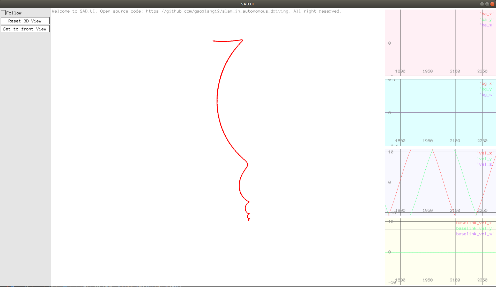
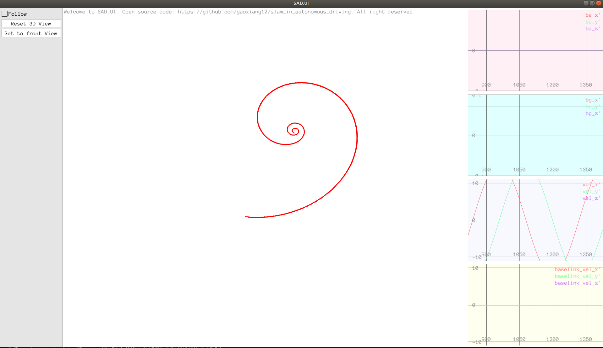
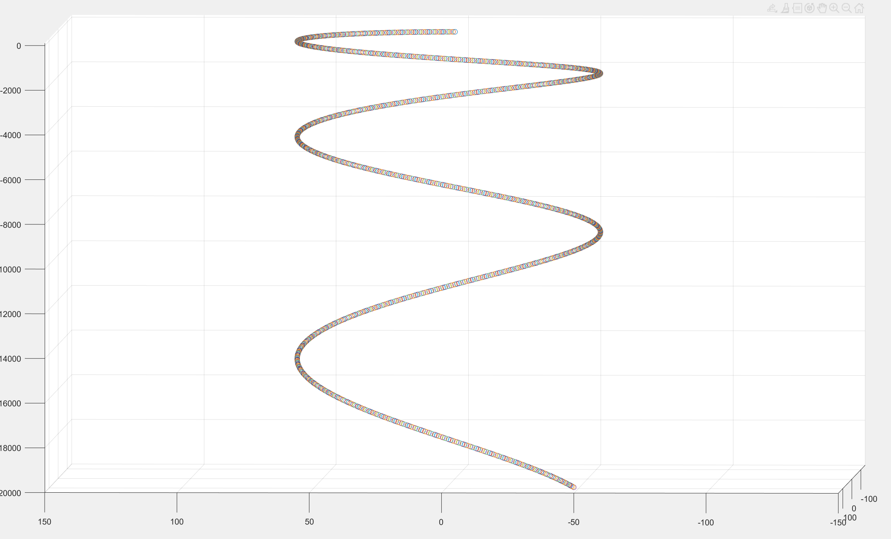

[TOC]

### 1 分别使用左右扰动模型，计算$\frac{\partial(\boldsymbol{R^{-1} p})}{\partial\boldsymbol R}$。

答：

- 左扰动

$$
\begin{align}
    \frac{\partial(\boldsymbol{R^{-1} p})}{\partial\boldsymbol\phi} 
    &= \lim_{\boldsymbol\phi\rightarrow0}\frac{(\mathrm{exp}(\boldsymbol\phi^\wedge)\boldsymbol R)^{-1} \boldsymbol p - \boldsymbol{R^{-1} p}}{\boldsymbol\phi}\\
    &= \lim_{\boldsymbol\phi\rightarrow0}\frac{\boldsymbol R^{-1}\mathrm{exp}(\boldsymbol\phi^\wedge)^{-1} \boldsymbol p - \boldsymbol{R^{-1} p}}{\boldsymbol\phi}\\
    &= \lim_{\boldsymbol\phi\rightarrow0}\frac{\boldsymbol R^{-1}\mathrm{exp}(-\boldsymbol\phi^\wedge) \boldsymbol p - \boldsymbol{R^{-1} p}}{\boldsymbol\phi}\\
    &\approx\lim_{\boldsymbol\phi\rightarrow0}\frac{\boldsymbol R^{-1}(\boldsymbol I - \boldsymbol\phi^\wedge) \boldsymbol p- \boldsymbol{R^{-1} p}}{\boldsymbol\phi}\\
    &=\lim_{\boldsymbol\phi\rightarrow0}\frac{-\boldsymbol R^{-1}\boldsymbol\phi^\wedge\boldsymbol p }{\boldsymbol\phi}\\
    &=\lim_{\boldsymbol\phi\rightarrow0}\frac{\boldsymbol{R^{-1}p}^\wedge\cancel{\boldsymbol\phi}}{\cancel{\boldsymbol\phi}}\\
    &=\boldsymbol{R^{-1}p}^\wedge\\
\end{align}\tag{1}
$$

- 右扰动

$$
\begin{align}
    \frac{\partial(\boldsymbol{R^{-1} p})}{\partial\boldsymbol\phi} 
    &= \lim_{\boldsymbol\phi\rightarrow0}\frac{(\boldsymbol R\mathrm{exp}(\boldsymbol\phi^\wedge))^{-1} \boldsymbol p - \boldsymbol{R^{-1} p}}{\boldsymbol\phi}\\
    &= \lim_{\boldsymbol\phi\rightarrow0}\frac{\mathrm{exp}(\boldsymbol\phi^\wedge)^{-1}\boldsymbol R^{-1} \boldsymbol p - \boldsymbol{R^{-1} p}}{\boldsymbol\phi}\\
    &= \lim_{\boldsymbol\phi\rightarrow0}\frac{\mathrm{exp}(-\boldsymbol\phi^\wedge) \boldsymbol R^{-1}\boldsymbol p - \boldsymbol{R^{-1} p}}{\boldsymbol\phi}\\
    &\approx\lim_{\boldsymbol\phi\rightarrow0}\frac{(\boldsymbol I - \boldsymbol\phi^\wedge)\boldsymbol{R^{-1} p}- \boldsymbol{R^{-1} p}}{\boldsymbol\phi}\\
    &=\lim_{\boldsymbol\phi\rightarrow0}\frac{-\boldsymbol\phi^\wedge\boldsymbol R^{-1}\boldsymbol p}{\boldsymbol\phi}\\
    &=\lim_{\boldsymbol\phi\rightarrow0}\frac{(\boldsymbol R^{-1}\boldsymbol p)^\wedge\cancel{\boldsymbol\phi}}{\cancel{\boldsymbol\phi}}\\
    &=(\boldsymbol R^{-1}\boldsymbol p)^\wedge\\
\end{align}\tag{2}
$$

### 2 分别使用左右扰动模型，计算$\frac{\partial(\boldsymbol{R_1 R_2^{-1}})}{\partial\boldsymbol R_2}$。

答：

- **左扰动**

$$
\begin{align}
    \frac{\partial(\mathrm{Log}(\boldsymbol R_1 \boldsymbol R_2^{-1}))}{\partial\boldsymbol R_2}
    &= \lim_{\boldsymbol\phi\rightarrow0}\frac{\mathrm{Log}\left(\boldsymbol R_1(\mathrm{Exp}(\boldsymbol\phi)\boldsymbol R_2)^{-1}\right) - \mathrm{Log}(\boldsymbol R_1\boldsymbol R_2^{-1}）}{\boldsymbol\phi}\\
    &= \lim_{\boldsymbol\phi\rightarrow0}\frac{\mathrm{Log}\left(\boldsymbol R_1\boldsymbol R_2^{-1}\mathrm{Exp}(\boldsymbol\phi)^{-1}\right) - \mathrm{Log}\left(\boldsymbol R_1\boldsymbol R_2^{-1}\right)}{\boldsymbol\phi}\\
    &= \lim_{\boldsymbol\phi\rightarrow0}\frac{\mathrm{Log}\left(\boldsymbol R_1\boldsymbol R_2^{-1}\mathrm{Exp}(-\boldsymbol\phi)\right) - \mathrm{Log}\left(\boldsymbol R_1\boldsymbol R_2^{-1}\right)}{\boldsymbol\phi}\\
    (\mathrm{BCH}一阶近似)&\approx \lim_{\boldsymbol\phi\rightarrow0}\frac{\cancel{\mathrm{Log}(\boldsymbol R_1\boldsymbol R_2^{-1})}+\boldsymbol J_r^{-1}(\boldsymbol R_1\boldsymbol R_2^{-1})\mathrm{Log}(\mathrm{Exp}(-\boldsymbol\phi)) - \cancel{\mathrm{Log}\left(\boldsymbol R_1\boldsymbol R_2^{-1}\right)}}{\boldsymbol\phi}\\
    &= \lim_{\boldsymbol\phi\rightarrow0}\frac{\boldsymbol J_r^{-1}(\boldsymbol R_1\boldsymbol R_2^{-1})(-\boldsymbol\phi)}{\boldsymbol\phi}\\
    &= -\boldsymbol J_r^{-1}(\boldsymbol R_1\boldsymbol R_2^{-1})
\end{align}\tag{3}
$$

- 右扰动
$$
\begin{align}
    \frac{\partial(\mathrm{Log}(\boldsymbol R_1 \boldsymbol R_2^{-1}))}{\partial\boldsymbol R_2}
    &= \lim_{\boldsymbol\phi\rightarrow0}\frac{\mathrm{Log}\left(\boldsymbol R_1(\boldsymbol R_2\mathrm{Exp}(\boldsymbol\phi))^{-1}\right) - \mathrm{Log}(\boldsymbol R_1\boldsymbol R_2^{-1}）}{\boldsymbol\phi}\\
    &= \lim_{\boldsymbol\phi\rightarrow0}\frac{\mathrm{Log}\left(\boldsymbol R_1\mathrm{Exp}(\boldsymbol\phi)^{-1}\boldsymbol R_2^{-1}\right) - \mathrm{Log}(\boldsymbol R_1\boldsymbol R_2^{-1}）}{\boldsymbol\phi}\\
    &= \lim_{\boldsymbol\phi\rightarrow0}\frac{\mathrm{Log}\left(\boldsymbol R_1\boldsymbol R_2^\top\boldsymbol R_2\mathrm{Exp}(-\boldsymbol\phi)\boldsymbol R_2^\top\right) - \mathrm{Log}(\boldsymbol R_1\boldsymbol R_2^{-1}）}{\boldsymbol\phi}\\
    (伴随性质)&= \lim_{\boldsymbol\phi\rightarrow0}\frac{\mathrm{Log}\left(\boldsymbol R_1\boldsymbol R_2^\top\mathrm{Exp}(-\boldsymbol R_2\boldsymbol\phi)\right) - \mathrm{Log}(\boldsymbol R_1\boldsymbol R_2^{-1}）}{\boldsymbol\phi}\\
    (\mathrm{BCH}一阶近似)&\approx \lim_{\boldsymbol\phi\rightarrow0}\frac{\cancel{\mathrm{Log}(\boldsymbol R_1\boldsymbol R_2^{-1})}+\boldsymbol J_r^{-1}(\boldsymbol R_1\boldsymbol R_2^{-1})\mathrm{Log}(\mathrm{Exp}(-\boldsymbol R_2\boldsymbol\phi)) - \cancel{\mathrm{Log}\left(\boldsymbol R_1\boldsymbol R_2^{-1}\right)}}{\boldsymbol\phi}\\
    &= \lim_{\boldsymbol\phi\rightarrow0}\frac{\boldsymbol J_r^{-1}(\boldsymbol R_1\boldsymbol R_2^{-1})(-\boldsymbol R_2\boldsymbol\phi)}{\boldsymbol\phi}\\
    &= -\boldsymbol J_r^{-1}(\boldsymbol R_1\boldsymbol R_2^{-1})\boldsymbol R_2
\end{align}\tag{4}
$$


### 3 将实践环节中的运动学修改成带且一定角速度的平抛运动。车辆受固定的Z轴角速度影响，具有一定的初始水平速度，同时受−Z向的重力加速度影响。请修改程序，给出动画演示。

答：

在修改后的代码中，**添加了一个新的GFlags参数gravity来表示重力加速度**。然后新建一个世界坐标系下的加速度向量，第三个分量存放负的FLAGS_gravity值；在主循环中，先将本体系速度转换到世界系下$\mathbf v_k^w = \mathbf R_b^w \mathbf v_k^b$；然后使用公式$\mathbf p_{b_{k+1}}^w = \mathbf p_{b_k}^w+\mathbf v_k^w\Delta t +\frac{1}{2}\mathbf a^w\Delta t^2$**更新世界坐标系下的位置，使用的速度和加速度都是世界系下的**；**在更新本体系下速度之前，需要先将世界系下加速度转换到本体系中**$\mathbf a_k^b = {\mathbf R_{b_k}^w}^\top\mathbf a^w$；**然后更新速度**，$\mathbf v_{k+1}^b = \mathbf v_k^b +\mathbf a_k^b\Delta t$；最后是更新旋转矩阵$\mathbf R_{b_{k+1}}^w = \mathbf R_{b_k}^w\mathrm{Exp}(\boldsymbol\omega\Delta t)$。

#### 3.1 课程代码修改

```C++
DEFINE_double(angular_velocity, 10.0, "角速度（角度）制");
DEFINE_double(linear_velocity, 5.0, "车辆前进线速度 m/s");
DEFINE_bool(use_quaternion, false, "是否使用四元数计算");
DEFINE_double(gravity, 9.81, "重力加速度 m/s^2");           //【新增】重力加速度参数设置
int main(int argc, char** argv) {
    google::InitGoogleLogging(argv[0]);
    FLAGS_stderrthreshold = google::INFO;
    FLAGS_colorlogtostderr = true;
    google::ParseCommandLineFlags(&argc, &argv, true);
    /// 可视化
    sad::ui::PangolinWindow ui;
    if (ui.Init() == false) {
        return -1;
    }
    double angular_velocity_rad = FLAGS_angular_velocity * sad::math::kDEG2RAD;  // 弧度制角速度
    SE3 pose;                                                                    // TWB表示的位姿
    Vec3d omega(0, 0, angular_velocity_rad);                                     // 角速度矢量
    Vec3d v_body(FLAGS_linear_velocity, 0, 0);                                   // 本体系速度
    Vec3d a_world(0, 0, -FLAGS_gravity);                                         // 世界系下加速度向量
    const double dt = 0.05;                                                      // 每次更新的时间

    while (ui.ShouldQuit() == false) {
        // 本体系下的加速度转换到世界系下
        Vec3d v_world = pose.so3() * v_body;
        // 更新自身位置
        pose.translation() += v_world * dt                      // 速度乘以时间，得到位移
                           + 0.5 * a_world * dt * dt;           // 世界系加速度对平移的影响

        Vec3d a_body = pose.so3().inverse() * a_world;          // 世界系下的加速度转换到本体系
        v_body += a_body * dt;                                  // Z方向上添加重力加速度影响

        // 更新自身旋转
        if (FLAGS_use_quaternion) {
            Quatd q = pose.unit_quaternion() * Quatd(1, 0.5 * omega[0] * dt, 0.5 * omega[1] * dt, 0.5 * omega[2] * dt);
            q.normalize();
            pose.so3() = SO3(q);
        } else {
            pose.so3() = pose.so3() * SO3::exp(omega * dt);
        }
        LOG(INFO) << "v_body: " << v_body.transpose();
        LOG(INFO) << "a_body: " << a_body.transpose();
        LOG(INFO) << "pose: " << pose.translation().transpose();
        ui.UpdateNavState(sad::NavStated(0, pose, v_world));
        usleep(dt * 1e6);
    }
    ui.Quit();
    return 0;
}
```

<center>
    
    <div>图1. Pangolin中车辆平抛运动可视化</div>
</center>

<center>
    
    <div>图2. Pangolin中车辆平抛运动可视化（俯视图）</div>
</center>

#### 3.2 Matlab可视化验证

由于pangolin中的可视化效果不够直观，所以在Matlab中重新复现并进行了验证。

代码如下：
```matlab
% 参数设定
angular_velocity_deg = 15.0;                            % 角速度（角度制）
linear_velocity = 15.0;                                 % 车辆前进线速度 m/s
gravity = 9.81;                                         % 重力加速度 m/s^2
angular_velocity_rad = deg2rad(angular_velocity_deg);   % 转换角速度为弧度制
% 初始化位置和速度
pose = eye(4);                                          % 初始化为单位矩阵
omega = [0; 0; angular_velocity_rad];                   % 角速度向量
v_body = [linear_velocity; 0; 0];                       % 本体系速度
a_world = [0; 0; -gravity];                             % 世界系下加速度向量
dt = 0.05;                                              % 时间步长
% 初始化可视化
figure;
scatter3(0, 0, 0);
hold on;axis([-150 150 -150 150 -20000 100]);           % XYZ坐标轴范围设置
% 主循环
while true 
    v_world = pose(1:3, 1:3) * v_body;                  % 本体系转换到世界系
    pose(1:3, 4) = pose(1:3, 4) ...
                 + v_world * dt ...                     % 速度乘以时间
                 + 0.5 * a_world * dt * dt;             % 加速度对位置的影响
    a_body = pose(1:3, 1:3)' * a_world;                 % 世界系加速度转换到本体系
    v_body = v_body + a_body * dt;                      % 添加重力加速度影响
    rotation_matrix = expm(skewSymmetric(omega) * dt);  % 指数映射计算旋转矩阵
    pose(1:3, 1:3) = pose(1:3, 1:3) * rotation_matrix;  % 更新自身旋转
    scatter3(pose(1, 4), pose(2, 4), pose(3, 4));       % 更新可视化
    drawnow;
    pause(dt);                                          % 等待一段时间
end
% 计算反对称矩阵
function S = skewSymmetric(v)                           
    S = [    0, -v(3),  v(2);
         v(3),     0, -v(1);
        -v(2),  v(1),     0];
end
```


<center>
    
    <div>图3. Matlab中车辆平抛运动可视化效果验证</div>
</center>

<center>
    
    <div>图4. Matlab中车辆平抛运动可视化效果验证（俯视图）</div>
</center>

**演示视频见mp4文件。**

### 4 自行寻找相关材料，说明高斯牛顿法和Levenberg-Marquardt在处理非线性迭代时的差异

答：

#### 4.1 高斯牛顿法

**高斯-牛顿法（Gauss-Newton，GN）** 是一个迭代优化方法，它通过在每个迭代步骤中使用当前参数值对模型函数进行线性化，来求解非线性最小二乘问题。在每次迭代中，它都会解决一个线性的最小二乘问题，以获取参数的更新。**这种方法的优点是计算效率高，但是对初始参数值的选择非常敏感，如果初始值选择不好，可能会导致算法不收敛或者收敛到局部最优**。它的思想是将$f(x)$进行一阶泰勒展开。

$$
f(x+\Delta x)\approx f(x)+J(x)^\top\Delta x \tag{7}
$$

$J(x)^\top$是$f(x)$关于$x$的导数，目标是寻找增量$\Delta x$，使得$\|f(x+\Delta x)\|^2$达到最小。

$$\Delta x^*=\arg\min_{\Delta x}\frac{1}{2}\|f(x)+J(x)^\top\Delta x\|^2\tag{8}$$

通过展开上式，并令关于$\Delta x$的导数为0：

$$J(x)f(x)+J(x)J(x)^\top \Delta x=0\tag{9}$$

移项后可得：

$$\underbrace{J(x)J(x)^\top }_{H(x)}\Delta x = \underbrace{-J(x)f(x)}_{g(x)}\tag{10}$$

上式就是高斯牛顿GN的增量方程。

**GN算法步骤**：

1. 给定初始值$x_0$。
2. 对于第$k$次迭代，计算雅各比矩阵$J(x_k)$和误差$f(x_k)$。
3. 求解增量方程：$H\Delta x = g$
4. 若$\Delta x$足够小，则停止。否则，令$x_{k+1} = x_k + \delta x_k$，返回第二步继续迭代。

为了求解增量方程，需要求解$H^{-1}$，这需要$H$矩阵可逆，但实际数据中，计算得到的$JJ^\top$却只有半正定性。也就是说，在使用高斯牛顿法时，可能出现$JJ^\top$为**奇异矩阵或病态（ill-condition）**的情况，此时**增量的稳定性较差，导致算法不收敛**。直观地说，原函数在这个点的局部近似不像一个二次函数。更严重的是，就算我们假设$H$矩阵非奇异也非病态，如果我们求出来的步长$\Delta x$太大，也会**导致我们采用的局部近似式不够准确**。这样又来甚至**无法保证它的迭代收敛**，哪怕是让目标函数变得更大都是有可能的。尽管高斯牛顿GN法有这些缺点，但是它依然算是非线性优化方面一种简单有效的方法.

#### 4.2 列文伯格-马夸尔特LM法

高斯牛顿法中采用的近似二阶泰勒展开只能在展开点附近有较好的近似效果，所以我们很自然地想到应该给$\Delta x$添加一个范围，称为**信赖区域（Trust Region）**。这个范围定义了在什么情况下二阶是有效的，这类方法也称为信赖区域方法。在信赖区域内，我们认为近似是有效的；出了这个区域，近似可能会出问题。

根据近似模型跟实际函数之间的差异来确定信赖区域是一种比较好的方法。通过定义一个指标 $\rho$ 来刻画近似的好坏程度。

$$\rho=\frac{f(x+\Delta x)-f(x)}{J(x)^\top\Delta x}\tag{11}$$

其中，$\rho$的分子是实际函数下降的值，分母是近似模型下降的值。如果$\rho$接近于1，则近似是好的。如果$\rho$太小，说明实际减小的值远小于近似减小的值，则认为近似比较差，需要缩小近似范围。反之，如果$\rho$比较大，则说明实际下降的比预计的更大，可以放大近似范围。

**改进了GN方法的LM算法步骤**：

1. 给定初始值$x_0$，以及初始优化半径$\mu$。
2. 对于第$k$次迭代，在高斯牛顿法基础上加上信赖区域，并求解：
    $$\min_{\Delta x_k}\frac{1}{2}\|f(x_k)+J(x_k)^\top\Delta x_k\|^2\quad s.t.\quad \|D\Delta x_k\|^2\leq\mu$$
3. 然后计算指标$\rho$值。
4. 若$\rho>\frac{3}{4}$，则$\mu = 2\mu$。
5. 若$\rho<\frac{1}{4}$，则$\mu = \frac{1}{2}\mu$。
6. 如果$\rho$大于某个设定阈值，则认为近似可行。令$x_{k+1}=x_k+\Delta x_k$。
7. 判断算法是否收敛。若不收敛，则返回第2步，否则结束。

在LM算法中，需要求解第2步中的优化问题来获得梯度，该子问题是带不等式约束的优化问题，可以用拉格朗日乘子将约束放在目标函数中，构成拉格朗日函数：

$$\mathcal L(\Delta x_k,\lambda)=\frac{1}{2}\|f(x_k)+J(x)^\top\Delta x_k\|^2+\frac{\lambda}{2}(\|D\Delta x_k\|^2-\mu)\tag{12}$$

令上式关于$\Delta x$的导数为0，可得：

$$
\begin{align}
    \mathcal L(\Delta x_k,\lambda)'|_{\Delta x}&=\left(\frac{1}{2}\|f(x_k)+J(x)^\top\Delta x_k\|^2+\frac{\lambda}{2}(\|D\Delta x_k\|^2-\mu)\right)'|_{\Delta x}\notag\\&=\left( \frac{1}{2}(f(x_k)^\top f(x_k)+2f(x_k)J(x_k)^\top \Delta x_k+\Delta x_k^\top J(x_k)J(x_k)^\top \Delta x_k) +\frac{\lambda}{2}\Delta x_k^\top D^\top D\Delta x_k-\frac{\lambda}{2}\mu\right)'|_{\Delta x} \notag\\&=f(x_k)J(x_k)^\top +\Delta x_k^\top J(x_k)J(x_k)^\top +\lambda\Delta x_k^\top D^\top D\notag\\&=\left(J(x_k)f(x_k)^\top +J(x_k)J(x_k)^\top \Delta x_k+\lambda D^\top D\Delta x_k\right)^\top \notag\\&=\left(J(x_k)f(x_k)^\top +(J(x_k)J(x_k)^\top +\lambda D^\top D)\Delta x_k\right)^\top \notag\\&=0\notag
\end{align}\tag{13}
$$

移项后可得：

$$(\underbrace{J(x_k)J(x_k)^\top }_{H}+\lambda D^\top D)\Delta x_k=\underbrace{-J(x_k)f(x_k)^\top }_g\tag{14}$$

它的核心仍是计算增量的线性方程：

$$(H+\lambda D^\top  D)\Delta x_k=g\tag{15}$$

相比较高斯牛顿法，增量方程多了一项$\lambda D^TD$。考虑它的简化形式，即$D=I$，那么相当于求解：

$$(H+\lambda I)\Delta x_k=g\tag{16}$$

一方面，当参数$\lambda$比较小时，$H$占据主要地位，这说明二次近似模型在该范围内是比较好的，列文伯格-马夸尔特方法更接近于高斯牛顿法。另一方面，当$\lambda$比较大时，$\lambda I$占据主要地位，列文伯格-马夸尔特方法更加接近于一阶梯度下降法（最速下降法），这说明附近的二次近似不够好。**列文伯格-马夸尔特方法的求解方式，可在一定程度上避免线性方程组的系数矩阵的非奇异和病态问题，提供更稳定更准确的增量**$\Delta x$。

**总的来说**，高斯-牛顿GN法和列文伯格-马夸尔特LM法都是非线性最小二乘问题的迭代优化方法，**LM法在一定程度上修正了GN法存在算法不收敛以及收敛到局部最优问题**。一般认为LM法比GN法更为鲁棒，对初始参数值的选择更为稳健，更能处理非线性问题，但LM需要更多的计算资源，收敛速度可能比GN更慢，也被称为 **阻尼牛顿法（Damped Newton Method）** 特别是当问题的维度非常大时。实际问题中，通常选择高斯牛顿法或列文伯格-马夸尔特方法中的一种作为梯度下降策略。**当问题性质比较好的时候，用高斯牛顿GN法。如果问题接近病态，则用列文伯格-马夸尔特LM方法**。


### 5 参考资料

1. **《视觉SLAM十四讲》**
2. **Quaternion kinematics for the error-state Kalman filter, Joan Solà, 2017**
3. **Indirect Kalman Filter for 3D Attitude Estimation: A Tutorial for Quaternion Algebra, Nikolas Trawny and Stergios I. Roumeliotis, 2005**
4. **https://github.com/gaoxiang12/slam_in_autonomous_driving**