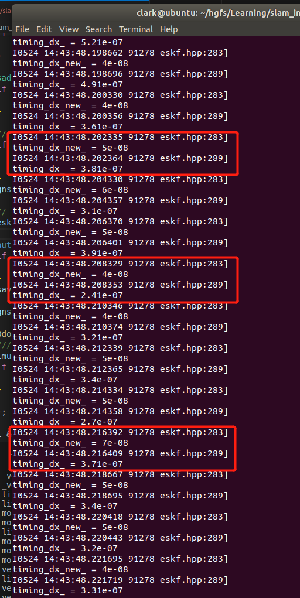
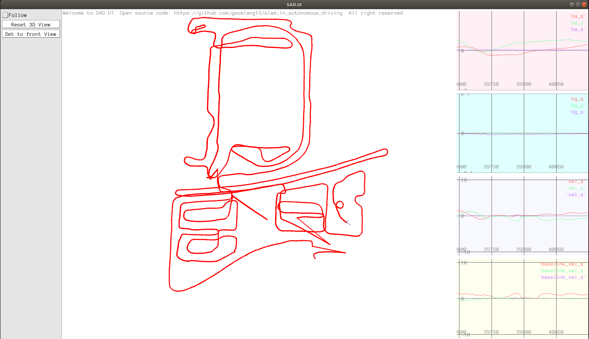
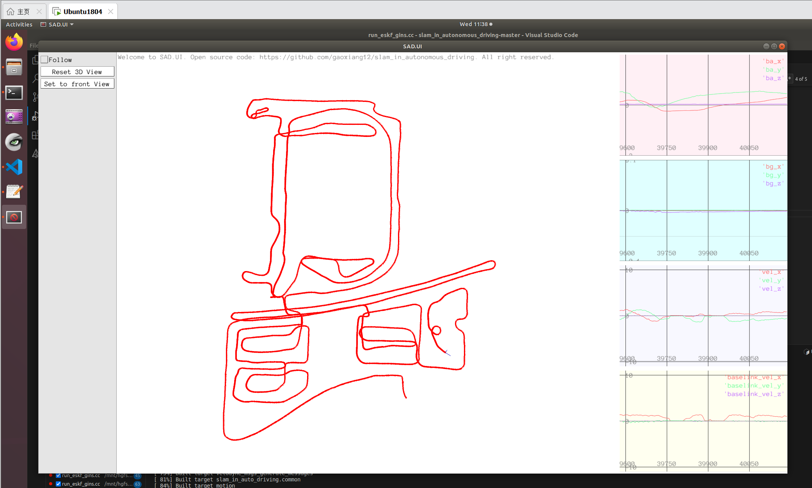

[TOC]

## 1. 证明：若某个高斯随机变量为零均值，协方差为对角线矩阵且大小相同（各向同性），那么在乘任意旋转矩阵以后，其均值仍为零，且协方差不变；

答：

假设一个零均值的高斯随机变量为$\boldsymbol X$，协方差矩阵是对角线上的元素大小相同的矩阵，那么可以写为：

$$\mathbb{E}(\boldsymbol X) = \boldsymbol 0,\qquad \mathbb{Cov}(\boldsymbol X) = \sigma^2\boldsymbol I\tag{1}$$

其中$\sigma^2$是**协方差矩阵对角线上的元素大小**，$\boldsymbol I$是**单位矩阵**。

现在，**用任意旋转矩阵乘以该随机变量**，得到新的随机变量：$\boldsymbol{Y = RX}$

那么，

$$\mathbb{E}(\boldsymbol Y) = \mathbb{E}(\boldsymbol{RX}) = \boldsymbol R\mathbb{E}(\boldsymbol X) = \boldsymbol R\boldsymbol 0 = \boldsymbol 0\tag{2}$$

因此，$\boldsymbol Y$的均值仍为零。

然后，$\boldsymbol Y$的协方差矩阵为：

$$
\begin{align}
    \mathbb{Cov}(\boldsymbol Y) &= \mathbb{E}\left[(\boldsymbol{Y} - \mathbb{E}(\boldsymbol Y))(\boldsymbol{Y} - \mathbb{E}(\boldsymbol Y))^\top\right] \notag\\
    (\boldsymbol Y均值为0)&= \mathbb{E}\left[(\boldsymbol{RX} - \boldsymbol 0)(\boldsymbol{RX} - \boldsymbol 0)^\top\right] \notag\\
    &= \mathbb{E}\left[\boldsymbol{RXX^\top R^\top}\right] \notag\\
    &= \boldsymbol R\mathbb{E}\left[\boldsymbol{XX^\top}\right]\boldsymbol R^\top \notag\\
    &= \boldsymbol R\mathbb{E}\left[\left(\boldsymbol{X} - \mathbb{E}(\boldsymbol X)\right)\left(\boldsymbol{X} - \mathbb{E}(\boldsymbol X)\right)^\top\right]\boldsymbol R^\top \notag\\
    &= \boldsymbol R\mathbb{Cov}(\boldsymbol X)\boldsymbol R^\top \notag\\
    &= \boldsymbol R\sigma^2\boldsymbol I\boldsymbol R^\top \notag\\
    &= \sigma^2\boldsymbol R\boldsymbol R^\top \notag\\
    (旋转矩阵\boldsymbol R的性质)&= \sigma^2\boldsymbol I \notag\\
    &= \mathbb{Cov}(\boldsymbol X)
\end{align}\tag{3}
$$

因此，$\boldsymbol Y$的协方差矩阵不变。

**证毕。**

总之，**零均值，协方差为对角线矩阵且大小相同（各向同性）的高斯随机变量在乘以任意旋转矩阵之后，其均值仍为零，且协方差不变。**

## 2. 在运动过程代码中，将F矩阵拆开，分别为每种状态变量实现运动方程。请给出公式和代码实现的说明

答：


这里考察的是，由于矩阵$\boldsymbol F$比较稀疏，有很多零矩阵，采用高博新书中 **公式（3.48a）** 中矩阵相乘的形式会比较耗时，可以**考虑将矩阵相乘替换为分别使用6个变量各自的运动方程**，也可以利用$\boldsymbol F$进行反推，如下所示：

$$
\begin{align}
    \delta\boldsymbol x_{\mathrm{pred}} &= \boldsymbol F\delta\boldsymbol x\notag\\
    &=\begin{bmatrix}\boldsymbol I&\boldsymbol I\Delta t&\boldsymbol 0&\boldsymbol 0&\boldsymbol 0&\boldsymbol 0\\\boldsymbol 0&\boldsymbol I&-\boldsymbol R(\tilde{\boldsymbol a}-\boldsymbol b_a)^\wedge \Delta t&\boldsymbol 0&-\boldsymbol R\Delta t&\boldsymbol I\Delta t\\\boldsymbol 0&\boldsymbol 0&\mathrm{Exp}(-(\tilde{\boldsymbol \omega}-\boldsymbol b_g)\Delta t)&-\boldsymbol I\Delta t&\boldsymbol 0&\boldsymbol 0\\\boldsymbol 0&\boldsymbol 0&\boldsymbol 0&\boldsymbol I&\boldsymbol 0&\boldsymbol 0\\\boldsymbol 0&\boldsymbol 0&\boldsymbol 0&\boldsymbol 0&\boldsymbol I&\boldsymbol 0\\\boldsymbol 0&\boldsymbol 0&\boldsymbol 0&\boldsymbol 0&\boldsymbol 0&\boldsymbol I \end{bmatrix}\begin{bmatrix}
    \delta\boldsymbol p\\\delta\boldsymbol v\\\delta\boldsymbol\theta\\\delta\boldsymbol b_g\\\delta\boldsymbol b_a\\\delta\boldsymbol g
    \end{bmatrix}\notag\\
    &=\begin{bmatrix}
    \delta\boldsymbol p+\delta\boldsymbol v\Delta t\\\delta\boldsymbol v-\boldsymbol R(\tilde{\boldsymbol a}-\boldsymbol b_a)^\wedge\delta\boldsymbol\theta\Delta t-\boldsymbol R\delta\boldsymbol b_a\Delta t+\delta\boldsymbol g\Delta t\\\mathrm{Exp}(-(\tilde{\boldsymbol \omega}-\boldsymbol b_g)\Delta t)\delta\boldsymbol\theta-\delta\boldsymbol b_g\Delta t\\
    \delta\boldsymbol b_g\\\delta\boldsymbol b_a\\\delta\boldsymbol g
    \end{bmatrix}\notag\\
\end{align}\tag{4}
$$

上式对应的代码实现如下所示：

```c++
// error state 递推
// 计算运动过程雅可比矩阵 F，见公式(3.47)
// F实际上是稀疏矩阵，也可以不用矩阵形式进行相乘而是写成散装形式，这里为了教学方便，使用矩阵形式
Mat18T F = Mat18T::Identity();                                                 // 主对角线
F.template block<3, 3>(0, 3) = Mat3T::Identity() * dt;                         // p 对 v
F.template block<3, 3>(3, 6) = -R_.matrix() * SO3::hat(imu.acce_ - ba_) * dt;  // v 对 theta
F.template block<3, 3>(3, 12) = -R_.matrix() * dt;                             // v 对 ba
F.template block<3, 3>(3, 15) = Mat3T::Identity() * dt;                        // v 对 g
F.template block<3, 3>(6, 6) = SO3::exp(-(imu.gyro_ - bg_) * dt).matrix();     // theta 对 theta
F.template block<3, 3>(6, 9) = -Mat3T::Identity() * dt;                        // theta 对 bg

// 【第二题的实现】
Vec18T dx_new_ = Vec18T::Zero();
auto starttime = system_clock::now(); 
dx_new_.template block<3, 1>(0, 0)  = dx_.template block<3, 1>(0, 0) 
                                    + dx_.template block<3, 1>(3, 0) * dt;
dx_new_.template block<3, 1>(3, 0)  = dx_.template block<3, 1>(3, 0) 
                                    + F.template block<3, 3>(3, 6) * dx_.template block<3, 1>(6, 0)
                                    + F.template block<3, 3>(3, 12) * dx_.template block<3, 1>(12, 0)
                                    + dx_.template block<3, 1>(15, 0) * dt; 
dx_new_.template block<3, 1>(6, 0)  = F.template block<3, 3>(6, 6) * dx_.template block<3, 1>(6, 0)
                                    - dx_.template block<3, 1>(9, 0) * dt;
// dx_的其余三个状态（delta bg, delta ba, delta g）保持不变
dx_new_.template block<3, 1>(9, 0)  = dx_.template block<3, 1>(9, 0);
dx_new_.template block<3, 1>(12, 0) = dx_.template block<3, 1>(12, 0);
dx_new_.template block<3, 1>(15, 0) = dx_.template block<3, 1>(15, 0);
duration<double> diff = system_clock::now()- starttime; // 【计算分块计算形式的耗时】                          
LOG(INFO) << "\ntiming_dx_new_ = "<<diff.count();       
// mean and cov prediction
starttime = system_clock::now();
dx_ = F * dx_;  // 这行其实没必要算，dx_在重置之后应该为零，因此这步可以跳过，但F需要参与Cov部分计算，所以保留
diff = system_clock::now()- starttime;                  // 【计算矩阵相乘形式的耗时】
LOG(INFO) << "\ntiming_dx_ = "<<diff.count();           
```

计算耗时如下图所示

<center>
    
    <div>图1. 将各个变量的运动过程分别列写方程与矩阵相乘形式的耗时对比</div>
</center>

**可以发现将各个变量的运动过程分别列写方程，计算耗时方面有了明显变化，比直接矩阵相乘形式效率提升8倍左右**。


## 3. 推导左乘模型下的ESKF运动方程、噪声方程，并给出代码实现。

答：

$\boldsymbol R$的导数方程不变，为:
$$
\begin{align}
    \dot{\boldsymbol R}_t &= \boldsymbol R_t(\tilde{\boldsymbol\omega}-\boldsymbol b_{gt}-\boldsymbol\eta_g)^\wedge\notag\\
\dot{\boldsymbol R} &= \boldsymbol R(\tilde{\boldsymbol\omega}-\boldsymbol b_g)^\wedge
\end{align}\tag{5}
$$

**名义状态变量的离散时间运动方程保持不变**，为：
$$
\begin{align}
    \boldsymbol p(t+\Delta t) &= \boldsymbol p(t) + \boldsymbol v\Delta t + \frac{1}{2}(\boldsymbol R(\tilde{\boldsymbol a}-\boldsymbol b_a))\Delta t^2+\frac{1}{2}\boldsymbol g\Delta t^2\notag\\
    \boldsymbol v(t+\Delta t) &= \boldsymbol v(t) + \boldsymbol R(\tilde{\boldsymbol a}-\boldsymbol b_a)\Delta t+\boldsymbol g\Delta t\notag\\
    \boldsymbol R(t+\Delta t) &= \boldsymbol R(t)\mathrm{Exp}((\tilde{\boldsymbol \omega}-\boldsymbol b_g)\Delta t)\notag\\
    \boldsymbol b_g(t+\Delta t) &= \boldsymbol b_g(t)\notag\\
    \boldsymbol b_a(t+\Delta t) &= \boldsymbol b_a(t)\notag\\
    \boldsymbol g(t+\Delta t) &= \boldsymbol g(t)\notag\\
\end{align}\tag{6}
$$

### 3.1 误差状态归入名义状态步骤中的旋转部分

误差状态方程中**旋转部分改为左乘**，其它不变：

$$
\boldsymbol R_t = \delta\boldsymbol {RR} = \mathrm{Exp}(\delta \boldsymbol\theta)\boldsymbol R\tag{7}
$$

对应修改的代码部分为eskf.hpp中的**UpdateAndReset()函数**：

```c++
/// 更新名义状态变量，重置error state
void UpdateAndReset() {
    p_ += dx_.template block<3, 1>(0, 0);
    v_ += dx_.template block<3, 1>(3, 0);

    // R_ = R_ * SO3::exp(dx_.template block<3, 1>(6, 0));
    // 【我的左乘模型修改 1】
    R_ = SO3::exp(dx_.template block<3, 1>(6, 0)) * R_;

    if (options_.update_bias_gyro_) {
        bg_ += dx_.template block<3, 1>(9, 0);
    }

    if (options_.update_bias_acce_) {
        ba_ += dx_.template block<3, 1>(12, 0);
    }

    g_ += dx_.template block<3, 1>(15, 0);

    ProjectCov();
    dx_.setZero();
}
```


### 3.2 雅各比矩阵$\boldsymbol F$中的速度与旋转部分

- **误差状态的旋转项**

上式两侧分别求时间导数，并结合**公式（5）**，可得：

$$
\begin{align}
    \boldsymbol R_t(\tilde{\boldsymbol\omega}-\boldsymbol b_{gt}-\boldsymbol\eta_g)^\wedge &= \boxed{\dot{\boldsymbol R}_t} = \dot{\mathrm{Exp}(\delta \boldsymbol\theta)}\boldsymbol R + \mathrm{Exp}(\delta \boldsymbol\theta)\dot{\boldsymbol R} \notag\\
    \mathrm{Exp}(\delta \boldsymbol\theta)\boldsymbol R(\tilde{\boldsymbol\omega}-\boldsymbol b_{gt}-\boldsymbol\eta_g)^\wedge&=\qquad = \mathrm{Exp}(\delta \boldsymbol\theta)\delta\dot{\boldsymbol\theta}^\wedge\boldsymbol R + \mathrm{Exp}(\delta \boldsymbol\theta)\boldsymbol R(\tilde{\boldsymbol\omega}-\boldsymbol b_g)^\wedge \notag\\
    \mathrm{Exp}(\delta \boldsymbol\theta)\boldsymbol R(\tilde{\boldsymbol\omega}-\boldsymbol b_{gt}-\boldsymbol\eta_g)^\wedge\boldsymbol{R^\top R}&= 伴随= \mathrm{Exp}(\delta \boldsymbol\theta)\delta\dot{\boldsymbol\theta}^\wedge\boldsymbol R + \mathrm{Exp}(\delta \boldsymbol\theta)\boldsymbol R(\tilde{\boldsymbol\omega}-\boldsymbol b_g)^\wedge\boldsymbol{R^\top R} \notag\\
    \mathrm{Exp}(\delta \boldsymbol\theta)(\boldsymbol R(\tilde{\boldsymbol\omega}-\boldsymbol b_{gt}-\boldsymbol\eta_g))^\wedge \boldsymbol R&= \qquad = \mathrm{Exp}(\delta \boldsymbol\theta)\delta\dot{\boldsymbol\theta}^\wedge\boldsymbol R + \mathrm{Exp}(\delta \boldsymbol\theta)(\boldsymbol R(\tilde{\boldsymbol\omega}-\boldsymbol b_g))^\wedge \boldsymbol R\notag\\
\end{align} \tag{8}
$$

等式左右消掉$\mathrm{Exp}(\delta \boldsymbol\theta)$与$\boldsymbol R$，可得：

$$
\begin{align}
    \delta\dot{\boldsymbol\theta}^\wedge &= (\boldsymbol R(\tilde{\boldsymbol\omega}-\boldsymbol b_{gt}-\boldsymbol\eta_g))^\wedge - (\boldsymbol R(\tilde{\boldsymbol\omega}-\boldsymbol b_g))^\wedge\notag\\
    &= \left(\boldsymbol R(\tilde{\boldsymbol\omega}-\boldsymbol b_{gt}-\boldsymbol\eta_g) - \boldsymbol R(\tilde{\boldsymbol\omega}-\boldsymbol b_g)\right)^\wedge\notag\\
    &= \left(\boldsymbol R(-\delta\boldsymbol b_g-\boldsymbol\eta_g) \right)^\wedge
\end{align}\tag{9}
$$

因此，可得：

$$
\begin{align}
    \delta\dot{\boldsymbol\theta} &= -\boldsymbol R\delta\boldsymbol b_g-\boldsymbol R\boldsymbol\eta_g\notag\\
    (第一题结论)&= -\boldsymbol R\delta\boldsymbol b_g-\boldsymbol\eta_g
\end{align}\tag{10}
$$

**上式第二行用到了第一题中的结论，因为$\boldsymbol\eta_g$是一个零均值高斯白噪声，其与任意旋转矩阵相乘仍然是一个零均值高斯白噪声。**

- **误差状态的速度项**

真实情况下速度的导数为：

$$
\dot{\boldsymbol v}_t = \boldsymbol R_t(\tilde{\boldsymbol a}-\boldsymbol b_{at}-\boldsymbol\eta_a)+\boldsymbol g_t\tag{11}
$$

同样地，名义状态变量的速度导数为：

$$
\dot{\boldsymbol v} = \boldsymbol R(\tilde{\boldsymbol a}-\boldsymbol b_a)+\boldsymbol g\tag{12}
$$


误差状态方程中，速度分量为：

$$
\boldsymbol v_t = \boldsymbol v+\delta\boldsymbol v\tag{13}
$$

那么对公式（13）两侧求时间导数，结合**公式（11）和（12）**，可得：

$$
\begin{align}
    \boldsymbol R_t(\tilde{\boldsymbol a}-\boldsymbol b_{at}-\boldsymbol\eta_a)+\boldsymbol g_t &= \boxed{\dot{\boldsymbol v}_t} = \dot{\boldsymbol v}+\delta\dot{\boldsymbol v}\notag\\
    \mathrm{Exp}(\delta \boldsymbol\theta)\boldsymbol R(\tilde{\boldsymbol a}-\boldsymbol b_a-\delta\boldsymbol b_a-\boldsymbol\eta_a)+\boldsymbol g + \delta\boldsymbol g &= \ \ \quad =\boldsymbol R(\tilde{\boldsymbol a}-\boldsymbol b_a)+\boldsymbol g+\delta\dot{\boldsymbol v}\notag\\
    (\boldsymbol I+\delta\boldsymbol\theta^\wedge)\boldsymbol R(\tilde{\boldsymbol a}-\boldsymbol b_a-\delta\boldsymbol b_a-\boldsymbol\eta_a)+\boldsymbol g + \delta\boldsymbol g &\approx\notag\\
    \boldsymbol R\tilde{\boldsymbol a}-\boldsymbol R\boldsymbol b_a-\boldsymbol R\delta\boldsymbol b_a-\boldsymbol R\boldsymbol\eta_a+\boldsymbol{RR^\top}\delta\boldsymbol\theta^\wedge\boldsymbol R(\tilde{\boldsymbol a}-\boldsymbol b_a-\delta\boldsymbol b_a-\boldsymbol\eta_a) +\boldsymbol g + \delta\boldsymbol g &=\notag\\
    \boldsymbol R\tilde{\boldsymbol a}-\boldsymbol R\boldsymbol b_a-\boldsymbol R\delta\boldsymbol b_a-\boldsymbol R\boldsymbol\eta_a+\underbrace{\boldsymbol R(\boldsymbol R^\top\delta\boldsymbol\theta)^\wedge\tilde{\boldsymbol a}}_{向量叉乘性质}-\underbrace{\boldsymbol R(\boldsymbol R^\top\delta\boldsymbol\theta)^\wedge\boldsymbol b_a}_{向量叉乘性质}-\underbrace{\cancel{\boldsymbol R(\boldsymbol R^\top\delta\boldsymbol\theta)^\wedge\delta\boldsymbol b_a}}_{二阶小量\approx0}-\underbrace{\cancel{\boldsymbol R(\boldsymbol R^\top\delta\boldsymbol\theta)^\wedge\boldsymbol\eta_a}}_{二阶小量\approx0} +\boldsymbol g + \delta\boldsymbol g &=\notag\\
    \boldsymbol R\tilde{\boldsymbol a}-\boldsymbol R\boldsymbol b_a-\boldsymbol R\delta\boldsymbol b_a-\boldsymbol R\boldsymbol\eta_a-\underbrace{\boldsymbol R\tilde{\boldsymbol a}^\wedge\boldsymbol R^\top}_{伴随性质}\delta\boldsymbol\theta+\underbrace{\boldsymbol R\boldsymbol b_a^\wedge\boldsymbol R^\top}_{伴随性质}\delta\boldsymbol\theta +\boldsymbol g + \delta\boldsymbol g &\approx\notag\\
    \cancel{\boldsymbol R(\tilde{\boldsymbol a}-\boldsymbol b_a)}-\boldsymbol R\delta\boldsymbol b_a-\boldsymbol R\boldsymbol\eta_a-(\boldsymbol R\tilde{\boldsymbol a})^\wedge\delta\boldsymbol\theta+(\boldsymbol R\boldsymbol b_a)^\wedge\delta\boldsymbol\theta +\cancel{\boldsymbol g} + \delta\boldsymbol g &= \ \ \quad =\cancel{\boldsymbol R(\tilde{\boldsymbol a}-\boldsymbol b_a)}+\cancel{\boldsymbol g}+\delta\dot{\boldsymbol v}\notag\\
\end{align}\tag{14}
$$

上式左右两边整理后，可得：

$$
\begin{align}
    \delta\dot{\boldsymbol v} &= -\left[(\boldsymbol R\tilde{\boldsymbol a})^\wedge-(\boldsymbol R\boldsymbol b_a)^\wedge\right]\delta\boldsymbol\theta -\boldsymbol R\delta\boldsymbol b_a-\underbrace{\boldsymbol R\boldsymbol\eta_a}_{=\boldsymbol\eta_a} + \delta\boldsymbol g\notag\\
    &= -\left[\boldsymbol R(\tilde{\boldsymbol a}-\boldsymbol b_a)\right]^\wedge\delta\boldsymbol\theta -\boldsymbol R\delta\boldsymbol b_a-\boldsymbol\eta_a + \delta\boldsymbol g\notag\\
\end{align}\tag{15}
$$

因此，**以左乘李代数为误差变量的状态方程**整理如下：

$$
\begin{align}
\delta\dot{\boldsymbol p}&=\delta\boldsymbol v&\notag\\
\delta\dot{\boldsymbol v} &= -\left[\boldsymbol R(\tilde{\boldsymbol a}-\boldsymbol b_a)\right]^\wedge\delta\boldsymbol\theta -\boldsymbol R\delta\boldsymbol b_a-\boldsymbol\eta_a + \delta\boldsymbol g\notag\\
\delta\dot{\boldsymbol\theta} &=-\boldsymbol R\delta\boldsymbol b_g-\boldsymbol\eta_g\notag\\
\delta\dot{\boldsymbol b}_g &= \boldsymbol\eta_{bg}\notag\\
\delta\dot{\boldsymbol b}_a &= \boldsymbol\eta_{ba}\notag\\
\delta\dot{\boldsymbol g} &= \boldsymbol 0\notag\\
\end{align}\tag{16}
$$

对上式进行积分，那么，**误差状态的离散形式运动学方程**为：

$$
\begin{align}
    \delta\boldsymbol p(t+\Delta t) &= \delta\boldsymbol p + \delta\boldsymbol v\Delta t\notag\\
    \delta\boldsymbol v(t+\Delta t) &= \boxed{\delta\boldsymbol v + (-\left[\boldsymbol R(\tilde{\boldsymbol a}-\boldsymbol b_a)\right]^\wedge\delta\boldsymbol\theta-\boldsymbol R\delta\boldsymbol b_a+\delta \boldsymbol g)\Delta t - \boldsymbol\eta_v}\notag\\
    \delta\boldsymbol \theta(t+\Delta t) &= \boxed{\delta\boldsymbol\theta-\boldsymbol R\delta\boldsymbol b_g\Delta t-\boldsymbol\eta_\theta}\notag\\
    \delta\boldsymbol b_g(t+\Delta t) &= \delta\boldsymbol b_g+\boldsymbol \eta_{bg}\notag\\
    \delta\boldsymbol b_a(t+\Delta t) &= \delta\boldsymbol b_a+\boldsymbol \eta_{ba}\notag\\
    \delta\boldsymbol g(t+\Delta t) &= \delta\boldsymbol g\notag\\
\end{align}\tag{17}
$$

其中，噪声随机变量的标准差为：

$$
\begin{align}
    \sigma(\boldsymbol\eta_v)&=\Delta t\sigma_a(\boldsymbol\eta),\quad
    \sigma(\boldsymbol\eta_\theta)=\Delta t\sigma_g(\boldsymbol\eta)\notag\\
    \sigma(\boldsymbol\eta_{bg})&=\sqrt{\Delta t}\sigma_{bg}, \quad
    \sigma(\boldsymbol\eta_{ba})=\sqrt{\Delta t}\sigma_{ba}\notag\\
\end{align}\tag{18}
$$

因此，修改后的$\boldsymbol F$矩阵如下，其中**框出来的是与原来矩阵不一样的地方**：

$$
\boldsymbol F = \begin{bmatrix}\boldsymbol I&\boldsymbol I\Delta t&\boldsymbol 0&\boldsymbol 0&\boldsymbol 0&\boldsymbol 0\\\boldsymbol 0&\boldsymbol I&\boxed{-\left[\boldsymbol R(\tilde{\boldsymbol a}-\boldsymbol b_a)\right]^\wedge \Delta t}&\boldsymbol 0&-\boldsymbol R\Delta t&\boldsymbol I\Delta t\\\boldsymbol 0&\boldsymbol 0&\boxed{\boldsymbol I}&\boxed{-\boldsymbol R\Delta t}&\boldsymbol 0&\boldsymbol 0\\\boldsymbol 0&\boldsymbol 0&\boldsymbol 0&\boldsymbol I&\boldsymbol 0&\boldsymbol 0\\\boldsymbol 0&\boldsymbol 0&\boldsymbol 0&\boldsymbol 0&\boldsymbol I&\boldsymbol 0\\\boldsymbol 0&\boldsymbol 0&\boldsymbol 0&\boldsymbol 0&\boldsymbol 0&\boldsymbol I \end{bmatrix}\tag{19}
$$

对应修改的代码部分为eskf.hpp中的**Predict()函数**：

```c++
// error state 递推
// 计算运动过程雅可比矩阵 F，见公式(3.47)
// F实际上是稀疏矩阵，也可以不用矩阵形式进行相乘而是写成散装形式，这里为了教学方便，使用矩阵形式

// Mat18T F = Mat18T::Identity();                                                 // 主对角线
// F.template block<3, 3>(0, 3) = Mat3T::Identity() * dt;                         // p 对 v
// F.template block<3, 3>(3, 6) = -R_.matrix() * SO3::hat(imu.acce_ - ba_) * dt;  // v 对 theta
// F.template block<3, 3>(3, 12) = -R_.matrix() * dt;                             // v 对 ba
// F.template block<3, 3>(3, 15) = Mat3T::Identity() * dt;                        // v 对 g
// F.template block<3, 3>(6, 6) = SO3::exp(-(imu.gyro_ - bg_) * dt).matrix();     // theta 对 theta
// F.template block<3, 3>(6, 9) = -Mat3T::Identity() * dt;                        // theta 对 bg

// 【我的左乘模型修改 2】
Mat18T F = Mat18T::Identity();                                                   // 主对角线
F.template block<3, 3>(0, 3) = Mat3T::Identity() * dt;                           // p 对 v
F.template block<3, 3>(3, 6) = -SO3::hat(R_.matrix() * (imu.acce_ - ba_)) * dt;  // v 对 theta
F.template block<3, 3>(3, 12) = -R_.matrix() * dt;                               // v 对 ba
F.template block<3, 3>(3, 15) = Mat3T::Identity() * dt;                          // v 对 g
F.template block<3, 3>(6, 9) = -R_.matrix() * dt;                                // theta 对 bg
```

### 3.3 RTK的旋转观测方程

RTK中的旋转观测方程**也需要改为左乘**：

$$\boldsymbol R_{\mathrm{gnss}} = \mathrm{Exp}(\delta\boldsymbol\theta)\boldsymbol R\tag{20}$$

其中$\boldsymbol R$是该时刻的名义状态，$\delta\boldsymbol\theta$为误差状态。在观测过程中，名义状态$\boldsymbol R$是确定的。将$\boldsymbol R_{\mathrm{gnss}}$直接视为对$\delta\boldsymbol\theta$的观测。**上式两边同时右乘一个$\boldsymbol R$的转置，再取对数映射**，可得：

$$\boldsymbol z_{\delta\boldsymbol\theta} = \boldsymbol h(\delta\boldsymbol\theta) = \mathrm{Log}(\boldsymbol R_{\mathrm{gnss}}\boldsymbol R^\top)\tag{21}$$

$\boldsymbol z_{\delta\boldsymbol\theta}$是对$\delta\boldsymbol\theta$的直接观测，所以它关于$\delta\boldsymbol\theta$的雅各比矩阵为单位阵：

$$\frac{\partial \boldsymbol z_{\delta\boldsymbol\theta}}{\partial \delta\boldsymbol\theta}=\boldsymbol I\tag{22}$$

这样就避免了再从名义状态到误差状态进行转换的过程，可以直接得到对误差状态的雅各比矩阵。原本ESKF中的更新量$\boldsymbol{z-h(x)}$应该写成流形的形式：

$$
\boldsymbol{z-h(x)} = [\boldsymbol p_{\mathrm{gnss}}-\boldsymbol p,\mathrm{Log}(\boldsymbol R_{\mathrm{gnss}}\boldsymbol R^\top)]^\top\tag{23}
$$

对应修改的代码部分为eskf.hpp中的**ObserveSE3()函数**：

```c++
template <typename S>
bool ESKF<S>::ObserveSE3(const SE3& pose, double trans_noise, double ang_noise) {
    /// 既有旋转，也有平移
    /// 观测状态变量中的p, R，H为6x18，其余为零
    Eigen::Matrix<S, 6, 18> H = Eigen::Matrix<S, 6, 18>::Zero();
    H.template block<3, 3>(0, 0) = Mat3T::Identity();  // P部分
    H.template block<3, 3>(3, 6) = Mat3T::Identity();  // R部分（3.66)

    // 卡尔曼增益和更新过程
    Vec6d noise_vec;
    noise_vec << trans_noise, trans_noise, trans_noise, ang_noise, ang_noise, ang_noise;

    Mat6d V = noise_vec.asDiagonal();
    Eigen::Matrix<S, 18, 6> K = cov_ * H.transpose() * (H * cov_ * H.transpose() + V).inverse();

    // 更新x和cov
    Vec6d innov = Vec6d::Zero();
    innov.template head<3>() = (pose.translation() - p_);          // 平移部分

    // innov.template tail<3>() = (R_.inverse() * pose.so3()).log();  // 旋转部分，见公式(3.67)
    // 【我的左乘模型修改 3】
    innov.template tail<3>() = (pose.so3() * R_.inverse()).log();  // 旋转部分，见公式(3.67)

    dx_ = K * innov; // 误差状态更新，见公式(3.51b)
    cov_ = (Mat18T::Identity() - K * H) * cov_;  // 协方差矩阵更新，见公式(3.51d)

    UpdateAndReset();
    return true;
}
```

### 3.4 切空间投影中的雅各比矩阵$\boldsymbol {J_\theta}$部分

设重置前的名义旋转估计为$\boldsymbol R_k$，误差状态为$\delta\boldsymbol\theta$，卡尔曼滤波器的增量计算结果为：$\delta\boldsymbol\theta_k$；**重置后的名义旋转部分由原先的右乘模型改为左乘**：$\mathrm{Exp}(\delta\boldsymbol\theta_k)\boldsymbol R_k = \boldsymbol R^+$，误差状态为$\delta\boldsymbol\theta^+$。由于误差状态被重置，显然$\delta\boldsymbol\theta^+=0$。

实际的重置过程为：

$$\mathrm{Exp}(\delta\boldsymbol\theta^+)\boldsymbol R^+ = \mathrm{Exp}(\delta\boldsymbol\theta^+)\mathrm{Exp}(\delta\boldsymbol\theta_k)\boldsymbol R_k=\mathrm{Exp}(\delta\boldsymbol\theta)\boldsymbol R_k\tag{24}$$

易得：

$$\mathrm{Exp}(\delta\boldsymbol\theta^+)=\mathrm{Exp}(\delta\boldsymbol\theta)\mathrm{Exp}(\delta\boldsymbol\theta_k)^\top=\mathrm{Exp}(\delta\boldsymbol\theta)\mathrm{Exp}(-\delta\boldsymbol\theta_k)\tag{25}$$

$\delta\boldsymbol\theta$为小量，利用**线性化的BCH公式**，可得：

$$
\begin{align}
    \delta\boldsymbol\theta^+ &= \delta\boldsymbol\theta-\delta\boldsymbol\theta_k-\frac{1}{2}\delta\boldsymbol\theta^\wedge\delta\boldsymbol\theta_k+o\left((\delta\boldsymbol\theta)^2\right)\notag\\
    &= \delta\boldsymbol\theta-\delta\boldsymbol\theta_k+\frac{1}{2}\delta\boldsymbol\theta_k^\wedge\delta\boldsymbol\theta+o\left((\delta\boldsymbol\theta)^2\right)
\end{align}\tag{26}
$$

于是，可得：

$$\frac{\partial \delta\boldsymbol\theta^+}{\partial \delta\boldsymbol\theta}\approx \boldsymbol I +\frac{1}{2}\delta\boldsymbol\theta_k^\wedge\tag{27}$$

可以发现与原先的右乘模型相比，符号有变化，因此，重置前后的误差状态相差一个旋转方面的小雅各比矩阵，记作$\boldsymbol {J_\theta} = \boldsymbol I+\frac{1}{2}\delta\boldsymbol\theta_k^\wedge$，那么完整的雅各比矩阵为：

$$
\boldsymbol J_k = \mathrm{diag}(\boldsymbol I_3,\boldsymbol I_3,\boldsymbol {J_\theta},\boldsymbol I_3,\boldsymbol I_3,\boldsymbol I_3)\tag{28}
$$

对应修改的代码部分为eskf.hpp中的**ProjectCov()函数**：

```c++
/// 对P阵进行投影，参考式(3.59)
void ProjectCov() {
    Mat18T J = Mat18T::Identity();
    
    // J.template block<3, 3>(6, 6) = Mat3T::Identity() - 0.5 * SO3::hat(dx_.template block<3, 1>(6, 0));
    // 【我的左乘模型修改 4】
    J.template block<3, 3>(6, 6) = Mat3T::Identity() + 0.5 * SO3::hat(dx_.template block<3, 1>(6, 0));
    
    cov_ = J * cov_ * J.transpose();
}
```

### 3.5 编译过程与运行结果

完成上述代码修改后，由于每次完整编译整个工程比较耗时，因此对项目根目录下src子目录中的CMakeLists.txt文件进行修改，注释掉了ch3之外的后续所有章节，以便加速make编译速度：

```cmake
add_subdirectory(common)
add_subdirectory(ch2)
add_subdirectory(ch3)
# add_subdirectory(ch4)
# add_subdirectory(ch5)
# add_subdirectory(ch6)
# add_subdirectory(ch7)
# add_subdirectory(ch8)
# add_subdirectory(ch9)
# add_subdirectory(ch10)

add_subdirectory(tools)
```

build目录下编译成功后，终端回退到根目录下，运行**仅融合RTK观测的ESKF**，指令为：

```bash
./bin/run_eskf_gins  −−txt_path ./data/ch3/10.txt
```

组合导航结果如下**图2**所示，与右乘模型的结果一致。
<center>
    
    <div>图2. 修改为左乘模型后，仅融合RTK观测的ESKF组合导航结果</div>
</center>


运行融合RTK观测+轮速计观测的ESKF，指令为：
```bash
./bin/run_eskf_gins  --with_odom=true
```

组合导航结果如下**图3**所示，与右乘模型的结果一致。
<center>
    
    <div>图3. 修改为左乘模型后，融合RTK观测+轮速计观测的ESKF组合导航结果</div>
</center>

## 4. 参考资料

1. **《自动驾驶中的SLAM》**
2. **《视觉SLAM十四讲》**
3. **Quaternion kinematics for the error-state Kalman filter, Joan Solà, 2017**
4. **https://github.com/gaoxiang12/slam_in_autonomous_driving**