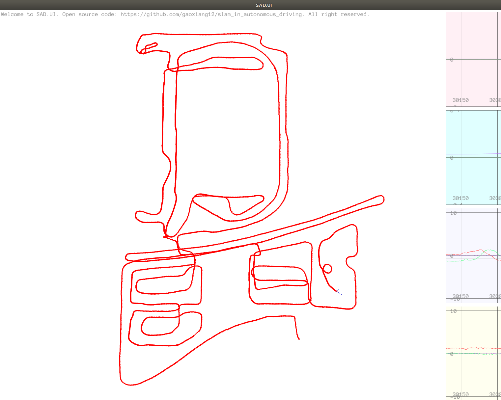
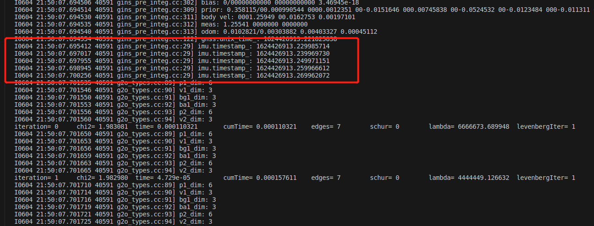
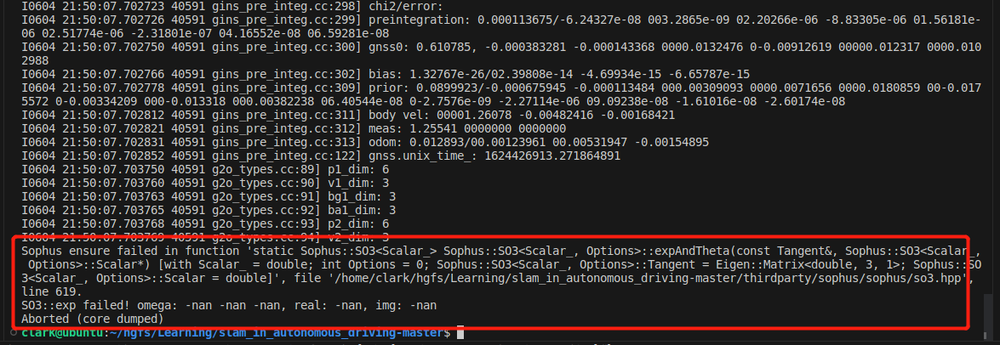
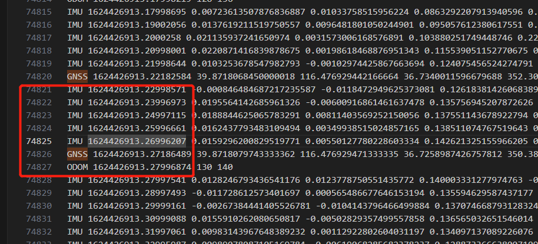
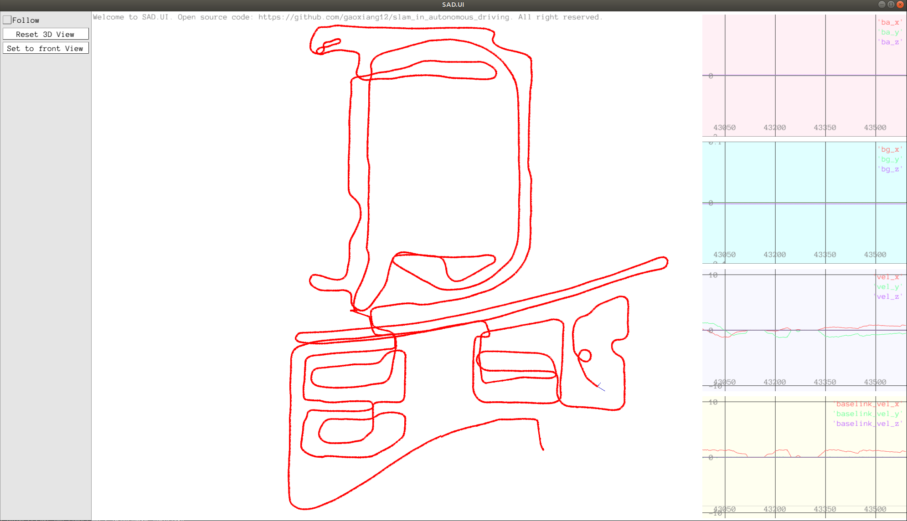
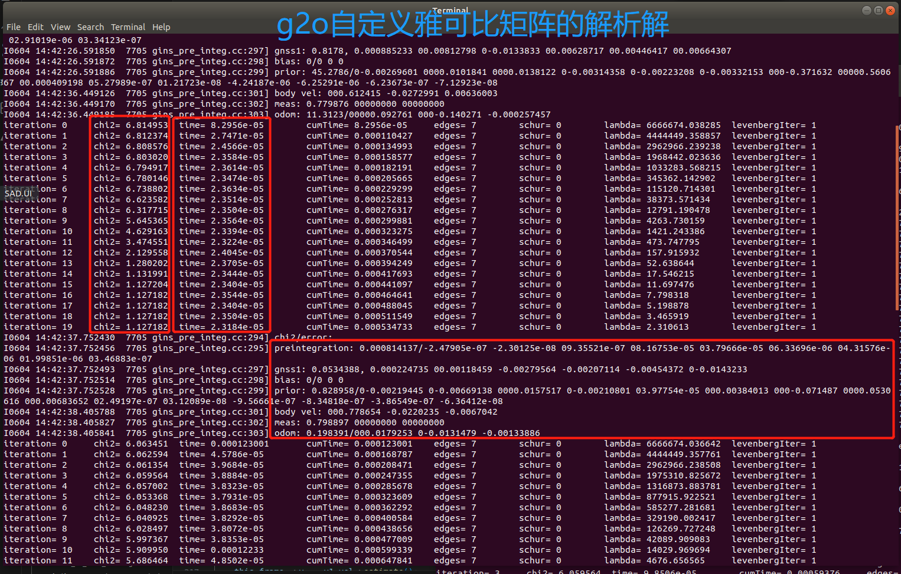
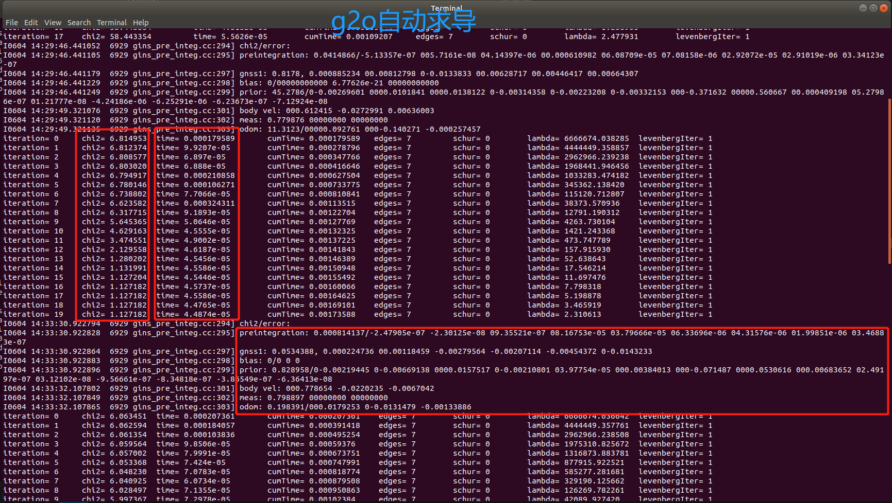
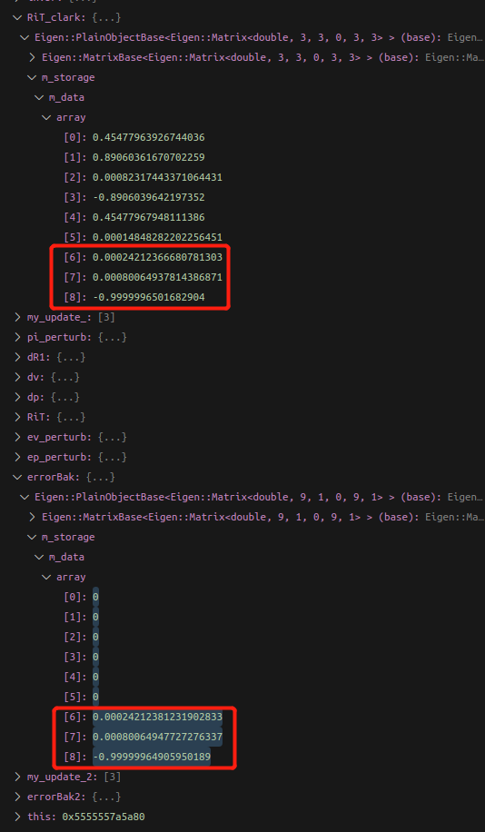

[TOC]

## 1. 推导以下等式（书中式4.48d）：$\frac{\partial \boldsymbol r_{\Delta\boldsymbol p_{ij}}}{\partial\boldsymbol\phi_i}=\left(\boldsymbol R_i^\top(\boldsymbol p_j-\boldsymbol p_i-\boldsymbol v_i\Delta t_{ij}-\frac{1}{2}\boldsymbol g\Delta t_{ij}^2)\right)^\wedge$

因为
$$
\begin{align}
r_{\Delta\boldsymbol p_{ij}}(\boldsymbol R_i\mathrm{Exp}(\boldsymbol\phi_i)) &= (\boldsymbol R_i\mathrm{Exp}(\boldsymbol\phi_i))^\top(\boldsymbol p_j-\boldsymbol p_i-\boldsymbol v_i\Delta t_{ij}-\frac{1}{2}\boldsymbol g\Delta t_{ij}^2)-\Delta\tilde{\boldsymbol p}_{ij}\notag\\
&= \mathrm{Exp}(\boldsymbol\phi_i)^\top\boldsymbol R_i^\top(\boldsymbol p_j-\boldsymbol p_i-\boldsymbol v_i\Delta t_{ij}-\frac{1}{2}\boldsymbol g\Delta t_{ij}^2)-\Delta\tilde{\boldsymbol p}_{ij}\notag\\
(指数映射一阶泰勒展开)&\approx (\boldsymbol I-\boldsymbol\phi_i^\wedge)^\top\boldsymbol R_i^\top(\boldsymbol p_j-\boldsymbol p_i-\boldsymbol v_i\Delta t_{ij}-\frac{1}{2}\boldsymbol g\Delta t_{ij}^2)-\Delta\tilde{\boldsymbol p}_{ij}\notag\\
&= \underbrace{\boldsymbol R_i^\top(\boldsymbol p_j-\boldsymbol p_i-\boldsymbol v_i\Delta t_{ij}-\frac{1}{2}\boldsymbol g\Delta t_{ij}^2)-\Delta\tilde{\boldsymbol p}_{ij}}_{r_{\Delta\boldsymbol p_{ij}}(\boldsymbol R_i)}-\boldsymbol\phi_i^\wedge\boldsymbol R_i^\top(\boldsymbol p_j-\boldsymbol p_i-\boldsymbol v_i\Delta t_{ij}-\frac{1}{2}\boldsymbol g\Delta t_{ij}^2)\notag\\
&= r_{\Delta\boldsymbol p_{ij}}(\boldsymbol R_i)+\left(\boldsymbol R_i^\top(\boldsymbol p_j-\boldsymbol p_i-\boldsymbol v_i\Delta t_{ij}-\frac{1}{2}\boldsymbol g\Delta t_{ij}^2)\right)^\wedge\boldsymbol\phi_i
\end{align}
$$

根据右扰动导数模型，并代入上式结果，可得：
$$
\begin{align}
    \frac{\partial \boldsymbol r_{\Delta\boldsymbol p_{ij}}}{\partial\boldsymbol\phi_i} &= \lim_{\boldsymbol\phi_i\rightarrow0}\frac{r_{\Delta\boldsymbol p_{ij}}(\boldsymbol R_i\mathrm{Exp}(\boldsymbol\phi_i))-r_{\Delta\boldsymbol p_{ij}}(\boldsymbol R_i)}{\boldsymbol\phi_i}\notag\\
    &=\lim_{\boldsymbol\phi_i\rightarrow0}\frac{r_{\Delta\boldsymbol p_{ij}}(\boldsymbol R_i)+\left(\boldsymbol R_i^\top(\boldsymbol p_j-\boldsymbol p_i-\boldsymbol v_i\Delta t_{ij}-\frac{1}{2}\boldsymbol g\Delta t_{ij}^2)\right)^\wedge\boldsymbol\phi_i-r_{\Delta\boldsymbol p_{ij}}(\boldsymbol R_i)}{\boldsymbol\phi_i}\notag\\
    &=\lim_{\boldsymbol\phi_i\rightarrow0}\frac{\left(\boldsymbol R_i^\top(\boldsymbol p_j-\boldsymbol p_i-\boldsymbol v_i\Delta t_{ij}-\frac{1}{2}\boldsymbol g\Delta t_{ij}^2)\right)^\wedge\boldsymbol\phi_i}{\boldsymbol\phi_i}\notag\\
    &=\left(\boldsymbol R_i^\top(\boldsymbol p_j-\boldsymbol p_i-\boldsymbol v_i\Delta t_{ij}-\frac{1}{2}\boldsymbol g\Delta t_{ij}^2)\right)^\wedge
\end{align}
$$

## 2. 实现由Odom数据触发的图优化（g2o）


这一题从题目中可以理解为两种情况：

### 1. 仅odom触发优化

这一题最直接的想法就是将AddGnss()中optimize()剪切到AddOdom()中，尝试了一下发现也有效果，且没有报错与中断。完整跑下来的结果如下图所示：

```c++
void GinsPreInteg::AddGnss(const GNSS& gnss) {

    // ...
    *this_frame_ = pre_integ_->Predict(*last_frame_, options_.gravity_);
    
    // Optimize(); // 触发一次g2o优化【注释掉，移到函数AddOdom()中】

    last_frame_ = this_frame_;  // 更新上一帧GNSS数据为当前帧GNSS数据
    last_gnss_ = this_gnss_;    // 更新上一帧GNSS数据为当前帧GNSS数据
}

void GinsPreInteg::AddOdom(const sad::Odom& odom) {
    last_odom_ = odom;
    last_odom_set_ = true;

    // g2o优化
    Optimize(); // 由里程计触发一次g2o优化
}
```


<center>
    
    <div>图1. 简单optimize挪到AddOdom()函数下的效果，还算丝滑没有回退跳跃的地方</div>
</center>

还尝试了GNSS数据与Odom数据达到时都触发优化，

### 2. odom数据与gnss数据到达时都会触发优化，且odom数据到来时也更新关键帧


```c++

void GinsPreInteg::AddGnss(const GNSS& gnss) {
    // 接收到GNSS数据
    this_frame_ = std::make_shared<NavStated>(current_time_);
    this_gnss_ = gnss;

    last_gnss_set_ = true;

    //。。。 省略GNSS初始化部分代码

    // 预积分前一个GNSS到当前GNSS时刻之间的IMU数据
    // 第一次的时候，last_imu_中的加速度和角速度都是0，时间戳也是0.0，此时还没有IMU数据，预积分函数中的量都是0
    pre_integ_->Integrate(last_imu_, gnss.unix_time_ - current_time_); // 当前GNSS数据时间戳减去上一帧GNSS数据时间戳

    current_time_ = gnss.unix_time_; // 更新当前时间为接收到GNSS数据的时间戳

    // 根据上一帧的GNSS状态数据预测当前帧GNSS的状态
    // 接收到首个GNSS的时候，this_frame就是last_frame，因为预积分量都是0
    *this_frame_ = pre_integ_->Predict(*last_frame_, options_.gravity_);
    
    Optimize(); // 触发一次g2o优化
    LOG(INFO) << std::fixed << std::setprecision(9)<< "gnss.unix_time_: " << gnss.unix_time_;

    last_frame_ = this_frame_;  // 更新上一帧GNSS数据为当前帧GNSS数据
    last_gnss_ = this_gnss_;    // 更新上一帧GNSS数据为当前帧GNSS数据
}

/**
 * @description: Odom轮速数据到来时也触发一次优化，没有j时刻的GNSS约束，只有j时刻的Odom的速度约束，看优化函数应该这么改
 *               如果Odom不触发，在RTK中GNSS数据来的时候触发一次优化，主要是R,t,v部分的更新
 * @param {Odom&} odom
 * @return {*}
 */
void GinsPreInteg::AddOdom(const sad::Odom& odom) {
    last_odom_ = odom;
    last_odom_set_ = true;

    // 累计IMU到当前Odom时刻的预积分量
    pre_integ_->Integrate(last_imu_, odom.timestamp_ - current_time_);

    // 更新当前时间为接收到的轮速计的时间戳
    current_time_ = odom.timestamp_; 

    *this_frame_ = pre_integ_->Predict(*last_frame_, options_.gravity_);

    // // g2o优化
    Optimize();
    // LOG(INFO) << "odom.timestamp_: " << odom.timestamp_;
    LOG(INFO) << std::fixed << std::setprecision(9)<< "odom.timestamp_: " << odom.timestamp_;
    last_frame_ = this_frame_;  // 更新状态
}
```
<center>
    
    <div>图2. odom和gnss数据到来时均触发优化的情况出现nan值报错中断</div>
</center>

<center>
    
    <div>图3. odom和gnss数据到来时均触发优化的情况出现nan值报错中断</div>
</center>

通过断点调试以及glog工具，找到了报错数据时间戳位于```1624426913.27186489```，

<center>
    
    <div>图4. 找到错误的数据位置</div>
</center>

也就是gnss数据与odom数据相邻到达的时候发生错误，连续触发优化，而中间却没有imu数据，通过观察发现，这个前后存在两处这样的相邻达到触发优化的地方，且这两者的时间差分别为：```1624426913.27996874 - 1624426913.27186489 = 0.00810385```以及```1624426913.9799695 - 1624426913.9718504 = 0.0081191```，然而在optimize()函数最前方的if判断中原始阈值为预积分累计时间dt_小于1e-3，而这两个时间差都大于1e-3，因此在没有IMU数据的情况下，仍然继续运行了后面的程序，于是这里简单的**将阈值改为1e-2**，对于10.txt数据文本来说，就不再出现nan值报错中断的情况了。

```c++
    // ODOM数据与GNSS数据相邻到达时，1624426913.27996874 - 1624426913.27186489 = 0.00810385 比1e-3 = 0.01大，没有返回，
    // 而中间却没有imu数据，因此这里将阈值改为1e-2，对于10.txt数据文本来说，就不再出现nan值报错中断的情况了
    if (pre_integ_->dt_ < 1e-2) { 
        // 未得到积分              
        return;                   
    }
```

<center>
    
    <div>图5. ODOM数据与GNSS数据均触发优化，且odom数据到来也更新关键帧状态</div>
</center>


## 3. 利用数值求导工具，验证本书实验中的雅可比矩阵的正确性。

### 3.1 方法一：与g2o自动求导的结果进行对比

通过查看github上g2o的官方文档，发现如果在派生类中重新实现了`linearizeOplus()`函数，g2o会调用自定义的雅可比计算过程，若没有提供，则会调用g2o的默认自动数值积分工具。

因此，这里要利用默认数值求导工具来验证实验中自定义的雅可比矩阵的计算是否正确，只需要将```src/ch4/g2o_types.cc```与```src/ch4/g2o_types.h```中的`linearizeOplus()`**函数的声明以及实现过程全部注释掉**，g2o就会**自动调用默认数值求导工具计算雅可比矩阵**。
```c++
class EdgeInertial : public g2o::BaseMultiEdge<9, Vec9d> {
public:
    EIGEN_MAKE_ALIGNED_OPERATOR_NEW

    EdgeInertial(std::shared_ptr<IMUPreintegration> preinteg, const Vec3d& gravity, double weight = 1.0);

    bool read(std::istream& is) override { return false; }
    bool write(std::ostream& os) const override { return false; }

    void computeError() override;

    // 注释掉这一行，不进行函数重载，则会调用默认数值求导工具，g2o_type.cc中对应的函数实现也要注释掉！！！
    // void linearizeOplus() override; 

    Eigen::Matrix<double, 24, 24> GetHessian() {
        linearizeOplus();
        Eigen::Matrix<double, 9, 24> J;
        J.block<9, 6>(0, 0) = _jacobianOplus[0];
        J.block<9, 3>(0, 6) = _jacobianOplus[1];
        J.block<9, 3>(0, 9) = _jacobianOplus[2];
        J.block<9, 3>(0, 12) = _jacobianOplus[3];
        J.block<9, 6>(0, 15) = _jacobianOplus[4];
        J.block<9, 3>(0, 21) = _jacobianOplus[5];
        return J.transpose() * information() * J;
    }

private:
    const double dt_;
    std::shared_ptr<IMUPreintegration> preint_ = nullptr;
    Vec3d grav_;
};

// /**
//  * @description: 计算三条边（旋转残差、速度残差、平移残差）相对于六个顶点（SE3位姿、速度、陀螺零偏、加计零偏）的雅可比。
//  * @return {*}
//  */
// void EdgeInertial::linearizeOplus() {
//     auto* p1 = dynamic_cast<const VertexPose*>(_vertices[0]);       // i时刻的位姿 Ri, pi
//     auto* v1 = dynamic_cast<const VertexVelocity*>(_vertices[1]);   // i时刻的速度 vi
//     auto* bg1 = dynamic_cast<const VertexGyroBias*>(_vertices[2]);  // i时刻的陀螺零偏 bgi
//     auto* ba1 = dynamic_cast<const VertexAccBias*>(_vertices[3]);   // i时刻的加计零偏 bai
//     auto* p2 = dynamic_cast<const VertexPose*>(_vertices[4]);       // j时刻的位姿 Rj, pj
//     auto* v2 = dynamic_cast<const VertexVelocity*>(_vertices[5]);   // j时刻的速度 vj

//     // 一些中间符号
//     const SO3 R1 = p1->estimate().so3();                // i时刻估计的旋转
//     const SO3 R2 = p2->estimate().so3();                // j时刻估计的旋转
//     const Vec3d vi = v1->estimate();                    // i时刻估计的速度
//     const Vec3d vj = v2->estimate();                    // j时刻估计的速度
//     const Vec3d pi = p1->estimate().translation();      // i时刻估计的位置
//     const Vec3d pj = p2->estimate().translation();      // j时刻估计的位置

//     const SO3 R1T = R1.inverse();                       // i时刻估计的旋转的转置

//     const Vec3d bg = bg1->estimate();                   // 估计的陀螺零偏
//     const Vec3d ba = ba1->estimate();                   // 估计的加计零偏
//     const Vec3d dbg = bg - preint_->bg_;                // 当前估计的陀螺零偏减去初始零偏，得到陀螺零偏的变化量

//     // 预积分观测量相对于IMU零偏的雅可比
//     auto dR_dbg = preint_->dR_dbg_;                     // 预积分【旋转】观测量相对于【陀螺】零偏的雅可比
//     auto dv_dbg = preint_->dV_dbg_;                     // 预积分【速度】观测量相对于【陀螺】零偏的雅可比
//     auto dp_dbg = preint_->dP_dbg_;                     // 预积分【平移】观测量相对于【陀螺】零偏的雅可比
//     auto dv_dba = preint_->dV_dba_;                     // 预积分【速度】观测量相对于【加计】零偏的雅可比
//     auto dp_dba = preint_->dP_dba_;                     // 预积分【平移】观测量相对于【加计】零偏的雅可比

//     const SO3 dR = preint_->GetDeltaRotation(bg);       // 根据估计出的陀螺零偏修正预积分的旋转观测量
//     const SO3 eR = SO3(dR).inverse() * R1T * R2;        // 公式(4.41a)中的旋转残差 \Delta R_ij^T * R_i^T * R_j
//     const Vec3d er = eR.log();                          // 转为旋转向量 
//     const Mat3d invJr = SO3::jr_inv(eR);                // 旋转矩阵的右雅可比矩阵的逆矩阵

//     /// 雅可比矩阵
//     /// 注意有3个index, 顶点的，自己误差的，顶点内部变量的
//     /// 变量顺序：pose1(R1,p1), v1, bg1, ba1, pose2(R2,p2), v2
//     /// 残差顺序：eR, ev, ep，残差顺序为行，变量顺序为列

//     //       | R1 | p1 | v1 | bg1 | ba1 | R2 | p2 | v2 |
//     //  vert | 0       | 1  | 2   | 3   | 4       | 5  |
//     //  col  | 0    3  | 0  | 0   | 0   | 0    3  | 0  |
//     //    row
//     //  eR 0 |
//     //  ev 3 |
//     //  ep 6 |

//     /// 残差对R1, 9x3
//     _jacobianOplus[0].setZero();
//     // 旋转残差相对于R1的雅可比dR/dR1，见公式（4.42）
//     _jacobianOplus[0].block<3, 3>(0, 0) = -invJr * (R2.inverse() * R1).matrix();
//     // 速度残差相对于R1的雅可比dv/dR1，见公式（4.47）
//     _jacobianOplus[0].block<3, 3>(3, 0) = SO3::hat(R1T * (vj - vi - grav_ * dt_));
//     // 平移残差相对于R1的雅可比dp/dR1，见公式（4.48）
//     _jacobianOplus[0].block<3, 3>(6, 0) = SO3::hat(R1T * (pj - pi - vi * dt_ - 0.5 * grav_ * dt_ * dt_));

//     /// 残差对p1, 9x3
//     // dp/dp1, 4.48a
//     // 平移残差相对于p1的雅可比dp/dp1
//     _jacobianOplus[0].block<3, 3>(6, 3) = -R1T.matrix();

//     /// 残差对v1, 9x3
//     _jacobianOplus[1].setZero();
//     // 速度残差相对于v1的雅可比dv/dv1
//     _jacobianOplus[1].block<3, 3>(3, 0) = -R1T.matrix();
//     // 平移残差相对于v1的雅可比dp/dv1, 4.48c
//     _jacobianOplus[1].block<3, 3>(6, 0) = -R1T.matrix() * dt_;

//     /// 残差对bg1
//     _jacobianOplus[2].setZero();
//     // 旋转残差相对于陀螺零偏dbg1的雅可比dR/dbg1, 4.45
//     _jacobianOplus[2].block<3, 3>(0, 0) = -invJr * eR.inverse().matrix() * SO3::jr((dR_dbg * dbg).eval()) * dR_dbg;
//     // 速度残差相对于陀螺零偏dbg1的雅可比dv/dbg1
//     _jacobianOplus[2].block<3, 3>(3, 0) = -dv_dbg;
//     // 平移残差相对于陀螺零偏dbg1的雅可比dp/dbg1
//     _jacobianOplus[2].block<3, 3>(6, 0) = -dp_dbg;

//     /// 残差对ba1
//     _jacobianOplus[3].setZero();
//     // 速度残差相对于加计零偏dba1的雅可比dv/dba1
//     _jacobianOplus[3].block<3, 3>(3, 0) = -dv_dba;
//     // 平移残差相对于加计零偏dba1的雅可比dp/dba1
//     _jacobianOplus[3].block<3, 3>(6, 0) = -dp_dba;

//     /// 残差对pose2
//     _jacobianOplus[4].setZero();
//     // 旋转残差相对于R2的雅可比dR/dR2, 4.43
//     _jacobianOplus[4].block<3, 3>(0, 0) = invJr;
//     // 平移残差相对于P2的雅可比dp/dp2, 4.48b
//     _jacobianOplus[4].block<3, 3>(6, 3) = R1T.matrix();

//     /// 残差对v2
//     _jacobianOplus[5].setZero();
//     // 速度残差相对于v2的雅可比dv/dv2, 4,46b
//     _jacobianOplus[5].block<3, 3>(3, 0) = R1T.matrix();  // OK
// }
```


这里分别将注释前后的运行的结果进行对比，通过gins_pre_integ.cc输出调试信息中来验证自定义的雅可比矩阵的计算是否正确。

首先是注释前的运行结果，也就雅可比矩阵的解析解：

<center>
    
    <div>图6. g2o自定义雅可比矩阵的解析解</div>
</center>

然后是注释后的运行结果，也就是g2o的默认数值求导的结果：

<center>
    
    <div>图7. g2o自动求导结果</div>
</center>

可以发现，解析解与自动求导的estimate优化结果是一致的，因此可以验证自定义的雅可比矩阵的计算是正确的。但是从图中也可以发现g2o自动求导的每次迭代的耗时要比解析解的耗时要长，（**解析解在2e-5左右，自动求导每次迭代的耗时则是5e-5左右**），这是因为自动求导的过程中需要进行大量的数值计算，因此**在实际的应用中，如果能够给出解析解，那么就应该尽量避免使用自动求导的方式。这样能大大提高程序的运行效率**。

### 3.3 方法二：手动实现数值求导工具进行对比

通过阅读```g2o/core/base_multi_edge.hpp```中基类```BaseMultiEdge```的成员函数```linearizeOplus()```的源码实现，可以对应上g2o原论文中的公式：

$$
\tilde{\mathbf J}_k^{\bullet^l}=\frac{1}{2\delta}(\mathbf e_k(\mathbf x_k\boxplus\delta\mathbf 1_l)-\mathbf e_k(\mathbf x_k\boxplus-\delta\mathbf 1_l))
$$

其中 $\delta>0$ 是小的常数（在它的实现中取值为 $10^{-9}$且$\mathbf 1_l$是沿着$l$的单位向量，且只存储并计算雅可比矩阵$\tilde{\mathbf J}_k$的非零项。

```c++
template <int D, typename E>
void BaseMultiEdge<D, E>::linearizeOplus()
{
  const number_t delta = cst(1e-9);
  const number_t scalar = 1 / (2*delta);
  ErrorVector errorBak;
  ErrorVector errorBeforeNumeric = _error;

  dynamic_aligned_buffer<number_t> buffer{ 12 };

  for (size_t i = 0; i < _vertices.size(); ++i) {
    //Xi - estimate the jacobian numerically
    OptimizableGraph::Vertex* vi = static_cast<OptimizableGraph::Vertex*>(_vertices[i]);

    if (vi->fixed()) {
      continue;
    } else {
      internal::QuadraticFormLock lck(*vi);
      const int vi_dim = vi->dimension();
      assert(vi_dim >= 0);

      number_t* add_vi = buffer.request(vi_dim);

      std::fill(add_vi, add_vi + vi_dim, cst(0.0));
      assert(_dimension >= 0);
      assert(_jacobianOplus[i].rows() == _dimension && _jacobianOplus[i].cols() == vi_dim && "jacobian cache dimension does not match");
        _jacobianOplus[i].resize(_dimension, vi_dim);
      // add small step along the unit vector in each dimension
      for (int d = 0; d < vi_dim; ++d) {
        vi->push();
        add_vi[d] = delta;
        vi->oplus(add_vi);
        computeError();
        errorBak = _error;
        vi->pop();
        vi->push();
        add_vi[d] = -delta;
        vi->oplus(add_vi);
        computeError();
        errorBak -= _error;
        vi->pop();
        add_vi[d] = 0.0;

        _jacobianOplus[i].col(d) = scalar * errorBak;
      } // end dimension
    }
  }
  _error = errorBeforeNumeric;
}
```

由上可知，默认的自动求导内部是通过设置微小扰动量 $\mathrm{delta=1e-9}$ 对每个顶点的每个维度进行微小的正负扰动，然后分别计算正扰动与负扰动残差时的对应残差值，再讲两者相减得到残差的变化量，最后除以2倍的扰动量delta，就得到雅可比矩阵的近似值，这也是导数的定义。

因此，可以在第4章的g2o_types.cc的EdgeInertial::linearizeOplus()函数中手动实现相似的效果，改动暂时比较初略笨重，但足以验证解析解的效果，后续再做进一步代码简化

我的做法如下：

1. 首先已知图中共有6个顶点（i时刻SE3位姿顶点、i时刻速度顶点、i时刻陀螺零偏、i时刻加计零偏、j时刻SE3位姿顶点、j时刻速度顶点）；
2. 且每个顶点的列数维度分别为(6, 3, 3, 3, 6, 3)，每个顶点的行数为合并的三个残差（er，ep，ev ，共9维），也就是说八个状态量（SE3顶点包含旋转+平移两个状态）都是9行3列的雅可比矩阵；
3. 可以对每个状态的三个维度上沿着单位向量逐一施加微小扰动，然后分别计算残差的变化量，最后除以2倍的扰动量delta，就得到9维的列向量，最后拼起来就是该状态的数值求导结果。

```c++
/**
 * @description: 计算三条边（旋转残差、速度残差、平移残差）相对于六个顶点（SE3位姿、速度、陀螺零偏、加计零偏）的雅可比。
 * @return {*}
 */
void EdgeInertial::linearizeOplus() {
    auto* p1 = dynamic_cast<const VertexPose*>(_vertices[0]);       // i时刻的位姿 Ri, pi
    auto* v1 = dynamic_cast<const VertexVelocity*>(_vertices[1]);   // i时刻的速度 vi
    auto* bg1 = dynamic_cast<const VertexGyroBias*>(_vertices[2]);  // i时刻的陀螺零偏 bgi
    auto* ba1 = dynamic_cast<const VertexAccBias*>(_vertices[3]);   // i时刻的加计零偏 bai
    auto* p2 = dynamic_cast<const VertexPose*>(_vertices[4]);       // j时刻的位姿 Rj, pj
    auto* v2 = dynamic_cast<const VertexVelocity*>(_vertices[5]);   // j时刻的速度 vj


    // double my_update_[] = {1e-9,1e-9,1e-9};
    // // p1->oplus(my_update_);
    // g2o::dynamic_aligned_buffer<number_t> buffer{ 12 };
    const number_t delta = g2o::cst(1e-9);
    const number_t scalar = 1 / (2*delta);

    const int p1_dim = p1->dimension();     // 6
    const int v1_dim = v1->dimension();     // 3
    const int bg1_dim = bg1->dimension();   // 3
    const int ba1_dim = ba1->dimension();   // 3
    const int p2_dim = p2->dimension();     // 6
    const int v2_dim = v2->dimension();     // 3
    LOG(INFO) << "p1_dim: " << p1_dim;
    LOG(INFO) << "v1_dim: " << v1_dim;
    LOG(INFO) << "bg1_dim: " << bg1_dim;
    LOG(INFO) << "ba1_dim: " << ba1_dim;
    LOG(INFO) << "p2_dim: " << p2_dim;
    LOG(INFO) << "v2_dim: " << v2_dim;

    // 一些中间符号
    const SO3 R1 = p1->estimate().so3();                // i时刻估计的旋转
    const SO3 R2 = p2->estimate().so3();                // j时刻估计的旋转
    const Vec3d vi = v1->estimate();                    // i时刻估计的速度
    const Vec3d vj = v2->estimate();                    // j时刻估计的速度
    const Vec3d pi = p1->estimate().translation();      // i时刻估计的位置
    const Vec3d pj = p2->estimate().translation();      // j时刻估计的位置
    
    const SO3 R1T = R1.inverse();                       // i时刻估计的旋转的转置
    
    const Vec3d bg = bg1->estimate();                   // 估计的陀螺零偏
    const Vec3d ba = ba1->estimate();                   // 估计的加计零偏
    const Vec3d dbg = bg - preint_->bg_;                // 当前估计的陀螺零偏减去初始零偏，得到陀螺零偏的变化量

    // 预积分观测量相对于IMU零偏的雅可比
    auto dR_dbg = preint_->dR_dbg_;                     // 预积分【旋转】观测量相对于【陀螺】零偏的雅可比
    auto dv_dbg = preint_->dV_dbg_;                     // 预积分【速度】观测量相对于【陀螺】零偏的雅可比
    auto dp_dbg = preint_->dP_dbg_;                     // 预积分【平移】观测量相对于【陀螺】零偏的雅可比
    auto dv_dba = preint_->dV_dba_;                     // 预积分【速度】观测量相对于【加计】零偏的雅可比
    auto dp_dba = preint_->dP_dba_;                     // 预积分【平移】观测量相对于【加计】零偏的雅可比

    const SO3 dR = preint_->GetDeltaRotation(bg);       // 根据估计出的陀螺零偏修正预积分的旋转观测量
    const SO3 eR = SO3(dR).inverse() * R1T * R2;        // 公式(4.41a)中的旋转残差 \Delta R_ij^T * R_i^T * R_j
    const Vec3d er = eR.log();                          // 转为旋转向量 
    const Mat3d invJr = SO3::jr_inv(eR);                // 旋转矩阵的右雅可比矩阵的逆矩阵

    /// 雅可比矩阵
    /// 注意有3个index, 顶点的，自己误差的，顶点内部变量的
    /// 变量顺序：pose1(R1,p1), v1, bg1, ba1, pose2(R2,p2), v2
    /// 残差顺序：eR, ev, ep，残差顺序为行，变量顺序为列

    //       | R1 | p1 | v1 | bg1 | ba1 | R2 | p2 | v2 |
    //  vert | 0       | 1  | 2   | 3   | 4       | 5  |
    //  col  | 0    3  | 0  | 0   | 0   | 0    3  | 0  |
    //    row
    //  eR 0 |
    //  ev 3 |
    //  ep 6 |

    /// 残差对R1, 9x3
    _jacobianOplus[0].setZero();
    // 旋转残差相对于R1的雅可比dR/dR1，见公式（4.42）
    _jacobianOplus[0].block<3, 3>(0, 0) = -invJr * (R2.inverse() * R1).matrix();
    // 速度残差相对于R1的雅可比dv/dR1，见公式（4.47）
    _jacobianOplus[0].block<3, 3>(3, 0) = SO3::hat(R1T * (vj - vi - grav_ * dt_));
    // 平移残差相对于R1的雅可比dp/dR1，见公式（4.48）
    _jacobianOplus[0].block<3, 3>(6, 0) = SO3::hat(R1T * (pj - pi - vi * dt_ - 0.5 * grav_ * dt_ * dt_));

    /// 残差对p1, 9x3
    // dp/dp1, 4.48a
    // 平移残差相对于p1的雅可比dp/dp1
    _jacobianOplus[0].block<3, 3>(6, 3) = -R1T.matrix();

    const Mat3d RiT_clark = -R1T.matrix();
    LOG(INFO) << "-R1T.matrix(): " << RiT_clark;
    
    /// 残差对v1, 9x3
    _jacobianOplus[1].setZero();
    // 速度残差相对于v1的雅可比dv/dv1
    _jacobianOplus[1].block<3, 3>(3, 0) = -R1T.matrix();
    // 平移残差相对于v1的雅可比dp/dv1, 4.48c
    _jacobianOplus[1].block<3, 3>(6, 0) = -R1T.matrix() * dt_;

    /// 残差对bg1
    _jacobianOplus[2].setZero();
    // 旋转残差相对于陀螺零偏dbg1的雅可比dR/dbg1, 4.45
    _jacobianOplus[2].block<3, 3>(0, 0) = -invJr * eR.inverse().matrix() * SO3::jr((dR_dbg * dbg).eval()) * dR_dbg;
    // 速度残差相对于陀螺零偏dbg1的雅可比dv/dbg1
    _jacobianOplus[2].block<3, 3>(3, 0) = -dv_dbg;
    // 平移残差相对于陀螺零偏dbg1的雅可比dp/dbg1
    _jacobianOplus[2].block<3, 3>(6, 0) = -dp_dbg;

    /// 残差对ba1
    _jacobianOplus[3].setZero();
    // 速度残差相对于加计零偏dba1的雅可比dv/dba1
    _jacobianOplus[3].block<3, 3>(3, 0) = -dv_dba;
    // 平移残差相对于加计零偏dba1的雅可比dp/dba1
    _jacobianOplus[3].block<3, 3>(6, 0) = -dp_dba;

    /// 残差对pose2
    _jacobianOplus[4].setZero();
    // 旋转残差相对于R2的雅可比dR/dR2, 4.43
    _jacobianOplus[4].block<3, 3>(0, 0) = invJr;
    // 平移残差相对于P2的雅可比dp/dp2, 4.48b
    _jacobianOplus[4].block<3, 3>(6, 3) = R1T.matrix();

    /// 残差对v2
    _jacobianOplus[5].setZero();
    // 速度残差相对于v2的雅可比dv/dv2, 4,46b
    _jacobianOplus[5].block<3, 3>(3, 0) = R1T.matrix();  // OK


    // 对第三维度进行正的微小扰动 +delta
    double my_update_[] = {0, 0, 1e-9}; // 每次只对一个维度进行微小扰动

    // SO3 R1 = R1 * SO3::exp(Eigen::Map<const Vec3d>(&my_update_[0])); 
    // SO3 R2_perturb = R2 * SO3::exp(Eigen::Map<const Vec3d>(&my_update_[0])); 
    Vec3d pi_perturb = pi + Eigen::Map<const Vec3d>(&my_update_[0]);  
    // Vec3d pj_perturb = pj + Eigen::Map<const Vec3d>(&my_update_[0]);   
    // Vec3d vi_perturb = vi + Eigen::Map<const Vec3d>(&my_update_[0]);  
    // Vec3d vj_perturb = vj + Eigen::Map<const Vec3d>(&my_update_[0]);   
    // Vec3d bg_perturb = bg + Eigen::Map<const Vec3d>(&my_update_[0]);  
    // Vec3d ba_perturb = ba + Eigen::Map<const Vec3d>(&my_update_[0]);        

    // 将当前估计的零偏，与初始零偏相减，得到零偏的增量 delta bg, delta ba
    SO3 dR1 = preint_->GetDeltaRotation(bg);// 修正后的预积分旋转观测量，对应式(4.32a)
    Vec3d dv = preint_->GetDeltaVelocity(bg, ba); // 修正后的预积分速度观测量，对应式(4.32b)
    Vec3d dp = preint_->GetDeltaPosition(bg, ba); // 修正后的预积分平移观测量，对应式(4.32c)

    // 计算三个残差
    Vec3d er_perturb = (dR1.inverse() * R1.inverse() * R2).log();
    Mat3d RiT = R1.inverse().matrix();
    Vec3d ev_perturb = RiT * (vj - vi - grav_ * dt_) - dv;
    Vec3d ep_perturb = RiT * (pj - pi_perturb - vi * dt_ - grav_ * dt_ * dt_ / 2) - dp; 

    ErrorVector errorBak;
    errorBak << er_perturb, ev_perturb, ep_perturb; // 记录正扰动残差的变化量 9维

    // 对第三维度进行负的微小扰动 -delta
    double my_update_2[] = {0, 0, -1e-9}; // 每次只对一个维度进行微小扰动

    // SO3 R1 = R1 * SO3::exp(Eigen::Map<const Vec3d>(&my_update_[0])); 
    // SO3 R2_perturb = R2 * SO3::exp(Eigen::Map<const Vec3d>(&my_update_[0])); 
    pi_perturb = pi + Eigen::Map<const Vec3d>(&my_update_[0]);  
    // pj_perturb = pj + Eigen::Map<const Vec3d>(&my_update_[0]);   
    // vi_perturb = vi + Eigen::Map<const Vec3d>(&my_update_[0]);  
    // vj_perturb = vj + Eigen::Map<const Vec3d>(&my_update_[0]);   
    // bg_perturb = bg + Eigen::Map<const Vec3d>(&my_update_[0]);  
    // ba_perturb = ba + Eigen::Map<const Vec3d>(&my_update_[0]);         
    // RiT_perturb = R1_perturb.inverse().matrix();

    // 将当前估计的零偏，与初始零偏相减，得到零偏的增量 delta bg, delta ba
    // dR_perturb = preint_->GetDeltaRotation(bg_perturb);// 修正后的预积分旋转观测量，对应式(4.32a)
    // dv_perturb = preint_->GetDeltaVelocity(bg_perturb, ba_perturb); // 修正后的预积分速度观测量，对应式(4.32b)
    // dp_perturb = preint_->GetDeltaPosition(bg_perturb, ba_perturb); // 修正后的预积分平移观测量，对应式(4.32c)

    // 计算三个残差
    er_perturb = (dR1.inverse() * R1.inverse() * R2).log();
    RiT = R1.inverse().matrix();
    ev_perturb = RiT * (vj - vi - grav_ * dt_) - dv;
    ep_perturb = RiT * (pj - pi_perturb - vi * dt_ - grav_ * dt_ * dt_ / 2) - dp; 

    ErrorVector errorBak2;
    errorBak2 << er_perturb, ev_perturb, ep_perturb; // 记录负扰动残差的变化量 9维

    errorBak = errorBak - errorBak2;                // 将正负扰动残差的变化量相减，得到残差的变化量

    errorBak = scalar * errorBak;                   // 除以2倍的扰动量delta，就得到这个顶点第三维的数值求导结果

    LOG(INFO) << "errorBak: " << errorBak.transpose();
}
```

验证过程如下：

1. 以i时刻的平移为例，它的解析解为：```-R1T.matrix()```，位于第一个顶点内部的第二维（第3-5列），也就是```_jacobianOplus[0].block<3, 3>(6, 3)```。
2. 假设对平移的最后一维先施加正扰动，也就是(0,0,1e-9)，此时扰动后的i时刻的平移量为：```Vec3d pi_perturb = pi + Eigen::Map<const Vec3d>(&my_update_[0]);```，然后根据computeError()中的过程计算此时的9维残差向量
3. 继续对最后一维施加负的扰动，也就是(0,0,-1e-9)，同样计算对应的残差向量
4. 将正负扰动的残差向量相减，得到残差的变化量，再除以2倍的扰动量delta，就得到这个顶点第三维的数值求导结果
5. debug模式下设置断点，编译通过后进行调试，可以发现解析解与数值求导的结果是一致的，如下图所示：
<center>
    
    <div>图8. 解析解与数值求导结果对比</div>
</center>

可以想象对i时刻的平移的9x3雅可比矩阵中，前两个3x3块均是0矩阵，最后一个3x3块就是位移残差相对于i时刻的平移的雅可比矩阵，也就是上面红框是```-R1T.matrix()```矩阵。3x3矩阵输出时被压扁成9维的向量，因为关注的是对第三维施加扰动，因此只需要观察解析解中这个雅可比矩阵的第6-8个元素跟数值求导的最后三个元素是否接近即可。**上图的下面那个红框中的最后三个数值刚好与解析解中的最后三个数值几乎相同，因此可以验证解析解与数值求导的结果是一致的。**


## 4. 参考资料

1. **《自动驾驶与机器人中的SLAM技术》**
2. **《视觉SLAM十四讲》**
2. **Grisetti, Giorgio, et al. "g2o: A general Framework for (Hyper) Graph Optimization" Proceedings of the IEEE international conference on robotics and automation (ICRA), Shanghai, China. 2011.**
2. **https://github.com/gaoxiang12/slam_in_autonomous_driving**