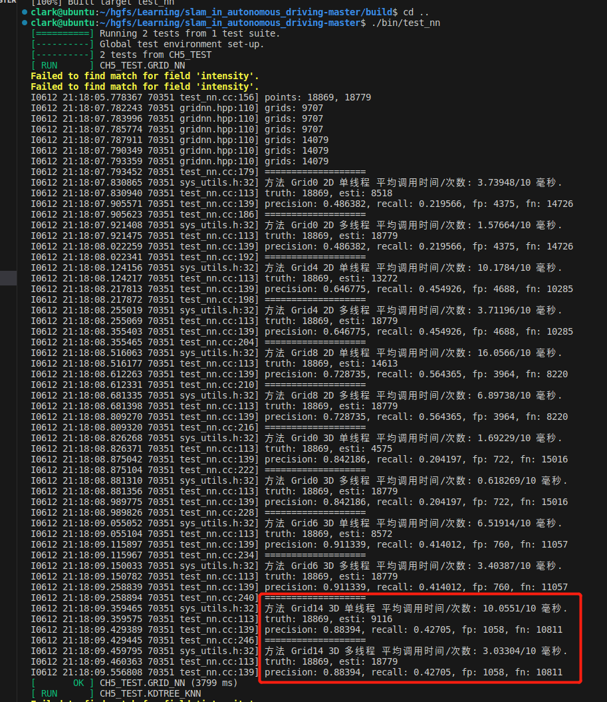
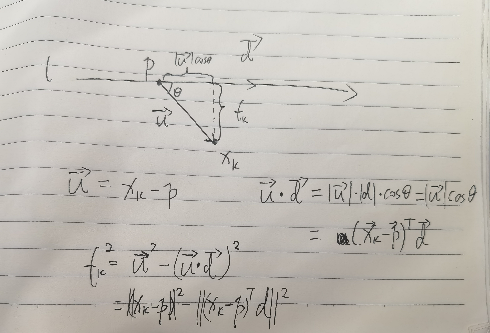
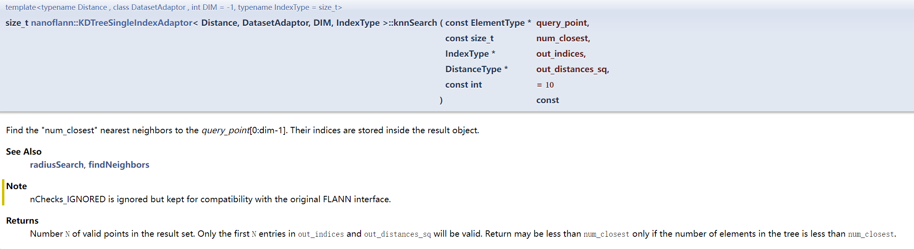
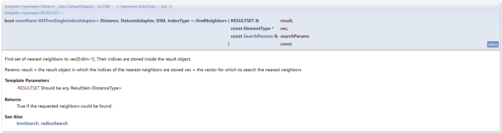
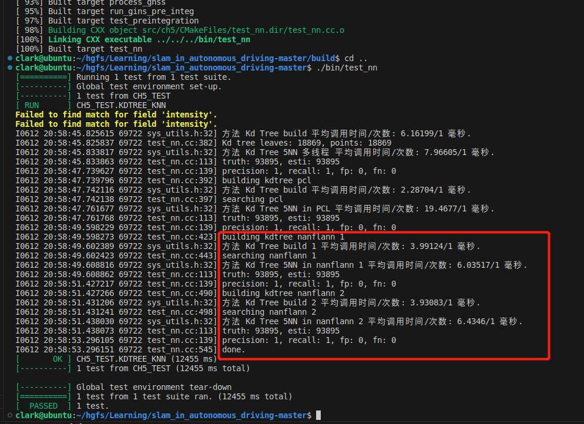

## 1. 在三维体素中定义 NEARBY14，实现 14 格最近邻的查找。

**答：**


修改点主要有一下几个地方：

### 1.1 在栅格类GridNN中的近邻关系枚举类型中增加一种NEARBY14，表示上下左右前后，以及八个角共14个近邻关系

```src/ch5/gridnn.hpp```
```c++
// 枚举类型，定义近邻关系
enum class NearbyType {
    CENTER,  // 只考虑中心

    // for 2D
    NEARBY4,  // 上下，左右           
    NEARBY8,  // 上下左右四角         

    // for 3D
    NEARBY6,  // 上下左右前后，不包含8个角
    NEARBY14, // 上下左右前后，包含8个角【新增 by ClarkWang】
};
```

### 1.2 在三维栅格的生成近邻生成函数GenerateNearbyGrids()中增加一个else if的分支判断，当近邻类型为NEARBY14时，生成14个近邻栅格

```src/ch5/gridnn.hpp```
```c++
template <>
void GridNN<3>::GenerateNearbyGrids() {
    if (nearby_type_ == NearbyType::CENTER) {
        nearby_grids_.emplace_back(KeyType::Zero());
    } else if (nearby_type_ == NearbyType::NEARBY6) {
        nearby_grids_ = {KeyType( 0,  0,  0),  
                         KeyType(-1,  0,  0),   KeyType(1,  0,  0),   // 左右
                         KeyType( 0,  1,  0),   KeyType(0, -1,  0),   // 前后
                         KeyType( 0,  0, -1),   KeyType(0,  0,  1)};  // 上下
    } else if (nearby_type_ == NearbyType::NEARBY14) {
        // 【新增 by ClarkWang】
        nearby_grids_ = {KeyType( 0,  0,  0),  
                         KeyType(-1,  0,  0),   KeyType( 1,  0,  0),   // 左右
                         KeyType( 0,  1,  0),   KeyType( 0, -1,  0),   // 前后
                         KeyType( 0,  0, -1),   KeyType( 0,  0,  1),   // 上下
                         KeyType(-1, -1, -1),   KeyType(-1,  1, -1),   // 八个角
                         KeyType(-1, -1,  1),   KeyType(-1,  1,  1), 
                         KeyType( 1, -1, -1),   KeyType( 1,  1, -1), 
                         KeyType( 1, -1,  1),   KeyType( 1,  1,  1)};
    }
}
```

### 1.3 在test_nn.cc中GRID_NN测试案例中增加一种14格最近邻的三维栅格对象，分别增加单线程与多线程两种栅格最近邻检索的测试用例

```src/ch5/test_nn.cc```

```c++
    ...
    // 对比不同种类的grid
    sad::GridNN<2>  grid2_0(0.1, sad::GridNN<2>::NearbyType::CENTER), 
                    grid2_4(0.1, sad::GridNN<2>::NearbyType::NEARBY4),
                    grid2_8(0.1, sad::GridNN<2>::NearbyType::NEARBY8);
    sad::GridNN<3>  grid3_0(0.1, sad::GridNN<3>::NearbyType::CENTER),       // 【新增 by ClarkWang】
                    grid3_6(0.1, sad::GridNN<3>::NearbyType::NEARBY6),
                    grid3_14(0.1, sad::GridNN<3>::NearbyType::NEARBY14);    // 【新增 by ClarkWang】

    grid2_0.SetPointCloud(first);
    grid2_4.SetPointCloud(first);
    grid2_8.SetPointCloud(first);
    
    grid3_0.SetPointCloud(first);       // 【新增 by ClarkWang】
    grid3_6.SetPointCloud(first);
    grid3_14.SetPointCloud(first);      // 【新增 by ClarkWang】
    ...

    LOG(INFO) << "===================";
    sad::evaluate_and_call(
        [&first, &second, &grid3_0, &matches]() { grid3_0.GetClosestPointForCloud(first, second, matches); },
        "Grid0 3D 单线程", 10); // 【新增 by ClarkWang】
    EvaluateMatches(truth_matches, matches);
    LOG(INFO) << "===================";
    sad::evaluate_and_call( 
        [&first, &second, &grid3_0, &matches]() { grid3_0.GetClosestPointForCloudMT(first, second, matches); },
        "Grid0 3D 多线程", 10); // 【新增 by ClarkWang】
    EvaluateMatches(truth_matches, matches);
    LOG(INFO) << "===================";
    sad::evaluate_and_call(
        [&first, &second, &grid3_6, &matches]() { grid3_6.GetClosestPointForCloud(first, second, matches); },
        "Grid6 3D 单线程", 10); 
    EvaluateMatches(truth_matches, matches);
    LOG(INFO) << "===================";
    sad::evaluate_and_call(
        [&first, &second, &grid3_6, &matches]() { grid3_6.GetClosestPointForCloudMT(first, second, matches); },
        "Grid6 3D 多线程", 10);
    EvaluateMatches(truth_matches, matches);
    LOG(INFO) << "===================";
    sad::evaluate_and_call(
        [&first, &second, &grid3_14, &matches]() { grid3_14.GetClosestPointForCloud(first, second, matches); },
        "Grid14 3D 单线程", 10);    // 【新增 by ClarkWang】
    EvaluateMatches(truth_matches, matches);
    LOG(INFO) << "===================";
    sad::evaluate_and_call(
        [&first, &second, &grid3_14, &matches]() { grid3_14.GetClosestPointForCloudMT(first, second, matches); },
        "Grid14 3D 多线程", 10);    // 【新增 by ClarkWang】
    EvaluateMatches(truth_matches, matches);
```

## 1.4 结果

<center>
    
    <div>图. 新增NEARBY14格最近邻检索</div>
</center>

上图结果可见，在原来的三维栅格实现中增加了0格和14格的最近邻检索测试用力后，随着近邻栅格的增多，**单线程版本的栅格暴力匹配运行时间逐渐增多，14格最近邻的多线程版本的3毫秒明显要由于单线程版本的10毫秒**，这也说明了多线程版本的栅格最近邻检索的效率要高于单线程版本。在准确率和召回率的指标方面，**整体上从上到下，三维体素要明显优于二维栅格，6格准确率接近0.91，召回率为0.41左右，但增加到14格后，准确率降到了0.88394，召回率反而提升到了0.4275，说明增加体素栅格后，误检率随之增加，而漏检率减少了**，从fn和fp的次数相比较6格和0格也能看出。


## 2. 推导公式（5.32）的解为A^T*A的最大特征值对应的特征向量或者A的最大右奇异向量。

也就是推导
$$\boldsymbol d^* = \arg\max_d\|\boldsymbol{Ad}\|_2^2$$

**答：**

首先，由于直线$l$上的点$\boldsymbol x$满足下述方程：

$$
\boldsymbol x =\boldsymbol dt+\boldsymbol p
$$

其中$\boldsymbol{d,p}\in\mathbb R^3$分别为直线方向，$\|\boldsymbol d\|=1$与线上的某一个点

根据勾股定理，对于不在直线$l$上的点$\boldsymbol x_k$到直线$l$的垂直距离，如下图所示，为：
<center>
    
    <div>图. 勾股定理求解直线外一点到直线的距离</div>
</center>

$$
f_k^2 = \|\boldsymbol x_k-\boldsymbol p\|^2 - \|(\boldsymbol x_k-\boldsymbol p)^\top\boldsymbol d\|^2
$$

根据上式，构造最小二乘问题，求解其中的直线方向$\boldsymbol d$以及直线上的点$\boldsymbol p$，即：

$$
(\boldsymbol{d,p})^* = \arg\min_{\boldsymbol{d,p}}\sum_{k=1}^nf_k^2,\qquad\text{s.t.}\|\boldsymbol d\|=1
$$

由于每个点的误差已经取了平方，上式只需求和即可。

接下来从上式中分离出$\boldsymbol d$和$\boldsymbol p$。

先求距离对点$\boldsymbol p$的偏导数$\frac{\partial f_k^2}{\partial\boldsymbol p}$，可得：

$$
\begin{align}
    \frac{\partial f_k^2}{\partial\boldsymbol p} &= \frac{\partial(\|\boldsymbol x_k-\boldsymbol p\|^2 - \|(\boldsymbol x_k-\boldsymbol p)^T\boldsymbol d\|^2)}{\partial\boldsymbol p}\notag\\
    &=-2(\boldsymbol x_k-\boldsymbol p) + 2\underbrace{(\boldsymbol x_k-\boldsymbol p)^\top\boldsymbol d}_{标量=\boldsymbol d^\top(\boldsymbol x_k-\boldsymbol p)}\boldsymbol d\notag\\
    &=-2(\boldsymbol x_k-\boldsymbol p) + 2\boldsymbol d\underbrace{\boldsymbol d^\top(\boldsymbol x_k-\boldsymbol p)}_{标量}\notag\\
    &=-2(\boldsymbol I- 2\boldsymbol d\boldsymbol d^\top)(\boldsymbol x_k-\boldsymbol p)\notag\\
\end{align}
$$

再对上式求和，可得整体的目标函数关于点$\boldsymbol p$的偏导数：

$$
\begin{align}
    \frac{\partial \sum_{k=1}^nf_k^2}{\partial\boldsymbol p} &=\sum_{k=1}^n\left[-2(\boldsymbol I- 2\boldsymbol d\boldsymbol d^\top)(\boldsymbol x_k-\boldsymbol p)\right]\notag\\
    &=-2(\boldsymbol I- 2\boldsymbol d\boldsymbol d^\top)\sum_{k=1}^n(\boldsymbol x_k-\boldsymbol p)\notag\\
\end{align}
$$

令上式的偏导数为零，可得：

$$
\boldsymbol p = \frac{1}{n}\sum_{k=1}^n\boldsymbol x_k
$$

也就是点$\boldsymbol p$取了整个点云的中心。

在确定了点$\boldsymbol p$的情况下，再来考虑直线的方向$\boldsymbol d$，这里令$\boldsymbol y_k = \boldsymbol x_k-\boldsymbol p$，由于$\boldsymbol p,\boldsymbol x_k$已知，所以$\boldsymbol y_k$也是已知量了，代回原始距离平方公式中：

$$
\begin{align}
f_k^2 &= \|\boldsymbol x_k-\boldsymbol p\|^2 - \|(\boldsymbol x_k-\boldsymbol p)^\top\boldsymbol d\|^2\notag\\
&= \|\boldsymbol y_k\|^2 - \|\boldsymbol y_k^\top\boldsymbol d\|^2\notag\\
&= \boldsymbol y_k^\top\boldsymbol y_k - (\boldsymbol y_k^\top\boldsymbol d)^\top\boldsymbol y_k^\top\boldsymbol d\notag\\
&= \boldsymbol y_k^\top\boldsymbol y_k - \boldsymbol d^\top\boldsymbol y_k\boldsymbol y_k^\top\boldsymbol d\notag\\
\end{align}
$$

此时等式右侧第一项不含$\boldsymbol d$，可以忽略，因此求解上式的最小值问题，可以转换为求解第二项去掉负号后的最大值问题。

$$
\boldsymbol d^* = \arg\max_{\boldsymbol d}\sum_{k=1}^n\boldsymbol d^\top\boldsymbol y_k\boldsymbol y_k^\top\boldsymbol d= \arg\max_{\boldsymbol d}\sum_{k=1}^n\|\boldsymbol y_k^\top\boldsymbol d\|_2^2
$$

再令

$$
\boldsymbol A = \begin{bmatrix}
    \boldsymbol y_1^\top\\\vdots\\\boldsymbol y_n^\top
\end{bmatrix}
$$

则可以去掉求和符号，转变为矩阵相乘形式：

$$
\boldsymbol d^* = \arg\max_{\boldsymbol d}\|\boldsymbol A\boldsymbol d\|_2^2
$$

求解上式的最大值，可以通过线性最小二乘的特征值解法或者奇异值解法进行求解：

### 2.1 特征值解法

由于矩阵$\boldsymbol A$是一个$n\times 3$的矩阵，需要计算一个$\boldsymbol d^*$的三维列向量，使得

$$
\boldsymbol d^* = \arg\max_{\boldsymbol d}\|\boldsymbol A\boldsymbol d\|_2^2 = \arg\max_{\boldsymbol d}\boldsymbol d^\top\boldsymbol A^\top\boldsymbol A\boldsymbol d,\qquad\text{s.t.}\|\boldsymbol d\|=1
$$

可以看出上式中的$\boldsymbol{A^\top A}$是一个实对称矩阵，根据线性代数知识可知，实对称矩阵可以利用特征值分解进行对角化可得

$$
\boldsymbol{A^\top A = V\Lambda V^\top}
$$

其中$\boldsymbol\Lambda$是对角特征值矩阵，可以假设从大到小顺序排列，记为$\lambda_1,\cdots,\lambda_n$，$\boldsymbol V$是正交矩阵，列向量为每一维特征值对应的特征向量，记作$\boldsymbol v_1,\cdots,\boldsymbol v_n$，这$n$个特征向量构成了一组单位正交基。也就是说任意一个三维向量$\boldsymbol d$都可以表示为：

$$
\begin{align}
    \boldsymbol d &= \beta_1\boldsymbol v_1+\cdots+\beta_n\boldsymbol v_n\notag\\
    &= \begin{bmatrix}
    \boldsymbol v_1&\cdots&\boldsymbol v_n
\end{bmatrix}\begin{bmatrix}
    \beta_1\\\vdots\\\beta_n    
\end{bmatrix}\notag\\
&=\boldsymbol {VB} 
\end{align}
$$

两边同时左乘一个矩阵$\boldsymbol V$的转置，可得：

$$\boldsymbol{V^{-1}d} \overset{正交}{=} \boldsymbol{V^\top d} = \begin{bmatrix}
    \beta_1\\\vdots\\\beta_n    
\end{bmatrix}$$

因此：

$$
\begin{align}
    \|\boldsymbol A\boldsymbol d\|_2^2&=\boldsymbol d^\top\boldsymbol A^\top\boldsymbol A\boldsymbol d\notag\\ 
    &=\boldsymbol{d^\top V\Lambda V^\top d}\notag\\
    &=\begin{bmatrix}\beta_1&\cdots&\beta_n\end{bmatrix}\begin{bmatrix}
    \lambda_1&&\\
    &\ddots&\\
    &&\lambda_n
    \end{bmatrix}\begin{bmatrix}\beta_1\\\vdots\\\beta_n\end{bmatrix}\notag\\
    &=\sum_{i=1}^n\lambda_i\beta_i^2\notag\\
\end{align}
$$

由于$\boldsymbol d$是单位向量，也就是$\|\boldsymbol d\|^2 = \beta_1^2+\cdots+\beta_n^2=1$，又因为特征值是降序排列的，那么就取$\beta_1=1,\beta_2=0\cdots,\beta_n=0$，即$\boldsymbol d^*=\boldsymbol v_1$

至此，线性最小二乘的最优解，是$\boldsymbol{A^\top A}$最大特征值对应的特征向量

### 2.2 奇异值解法

也可以通过奇异值分解SVD的角度来处理，由于已知任意矩阵都可以进行奇异值分解，于是可以对矩阵$\boldsymbol A$进行SVD分解，可得：

$$
\boldsymbol{A = U\Sigma V^\top}
$$

其中，$\boldsymbol{UV}$是正交矩阵，$\boldsymbol\Sigma$是对角矩阵，也称为奇异值矩阵，对角线上的元素为矩阵$\boldsymbol A$的奇异值，由大到小排列，$\sigma_1\geq\sigma_2\geq\cdots\geq\sigma_n\geq0$，其余元素均为零。

于是可以将SVD的分解结果带回原始可得：

$$
\boldsymbol d^\top\boldsymbol A^\top\boldsymbol A\boldsymbol d = \boldsymbol d^\top\boldsymbol V\Sigma^\top\boldsymbol U^\top\boldsymbol U\Sigma\boldsymbol V^\top\boldsymbol d  = \boldsymbol d^\top\boldsymbol V\Sigma^2\boldsymbol V^\top\boldsymbol d
$$

到了这一步，类似特征值的解法，可以取$\boldsymbol d$为矩阵$\boldsymbol V$的第一列即可，也就是矩阵$\boldsymbol A$的最大奇异值对应的右奇异值向量。

**综上所述**，**线性最小二乘的最优解，是$\boldsymbol{A^\top A}$最大特征值对应的特征向量，或者是矩阵$\boldsymbol A$的最大奇异值对应的右奇异值向量。**


## 3. 将本节的最近邻算法与一些常见的近似最近邻算法进行对比，比如nanoflann，给出精度指标和时间效率指标。

**答：**

这里选择题目推荐的**nanoflann**库进行对比，精度指标与时间效率指标与书上一致。

### 3.1 nanoflann库熟悉

首先，从github上克隆代码到本地，其实只有一个hpp文件，将其与第5章的代码放在同一级目录下，使用起来非常方便，只需在test_nn.cc文件中引入该头文件即可使用：

```#include "ch5/nanoflann.hpp"```

通过查看nanoflann项目中的几个examples，其中pointcloud_kdd_radius.cpp的示例最相关，给出了如何构建KD树、两种执行最近邻搜索的方法```knnSearch()```、```radiusSearch()```的使用，再结合对应doxygen文档中函数参数的说明：

<center>
    
    <div>图. knnSearch()函数</div>
</center>

```c++
template <typename num_t>
void kdtree_demo(const size_t N)
{
    PointCloud<num_t> cloud;    // 创建点云对象
    // Generate points:
    // 生成随机点云
    generateRandomPointCloud(cloud, N);
    // construct a kd-tree index 使用using定义kd树类型
    using my_kd_tree_t = nanoflann::KDTreeSingleIndexAdaptor<nanoflann::L2_Simple_Adaptor<num_t, PointCloud<num_t>>,
                                                             PointCloud<num_t>, 3 /* dim */>;
    // 构建kd树索引
    my_kd_tree_t index(3 /*dim*/,               // 3维空间
                       cloud,                   // 点云对象 
                       {10 /* max leaf */});    // 最大叶子节点数
    // 待查询点
    const num_t query_pt[3] = {0.5, 0.5, 0.5};
    // ----------------------------------------------------------------
    // knnSearch():  Perform a search for the N closest points 
    //               执行搜索以查找最近的N个点
    // ----------------------------------------------------------------
    {
        size_t                num_results = 5;              // 最近的5个点
        std::vector<uint32_t> ret_index(num_results);       // 返回的点的索引
        std::vector<num_t>    out_dist_sqr(num_results);    // 返回的点的距离
        // 调用knnSearch()函数，返回最近的5个点的索引和距离
        num_results = index.knnSearch(&query_pt[0], num_results, &ret_index[0], &out_dist_sqr[0]);
        // In case of less points in the tree than requested: 如果树中的点少于请求的点，则重新调整返回的点的索引和距离容器的大小
        ret_index.resize(num_results);
        out_dist_sqr.resize(num_results);
        cout << "knnSearch(): num_results=" << num_results << "\n";
        for (size_t i = 0; i < num_results; i++)
            cout << "idx[" << i << "]=" << ret_index[i] << " dist[" << i << "]=" << out_dist_sqr[i] << endl;
        cout << "\n";
    }
    // ----------------------------------------------------------------
    // radiusSearch(): Perform a search for the points within search_radius
    //                  执行搜索以查找search_radius半径内的点
    // ----------------------------------------------------------------
    {
        const num_t search_radius = static_cast<num_t>(0.1);
        std::vector<nanoflann::ResultItem<uint32_t, num_t>> ret_matches;
        // nanoflanSearchParamsameters params;
        // params.sorted = false;

        // 调用radiusSearch()函数，返回指定搜索半径内的点的索引和距离
        const size_t nMatches = index.radiusSearch(&query_pt[0], search_radius, ret_matches);
        cout << "radiusSearch(): radius=" << search_radius << " -> " << nMatches << " matches\n";
        for (size_t i = 0; i < nMatches; i++)
            cout << "idx[" << i << "]=" << ret_matches[i].first << " dist[" << i << "]=" << ret_matches[i].second << endl;
        cout << "\n";
    }
}
```

在另一个例程**pointcloud_example.cpp**中，给出了另一种近邻搜索的使用方法，就是利用```findNeighbors()```函数，对应函数说明如下图所示：

<center>
    
    <div>图. findNeighbors()函数</div>
</center>

demo代码如下：

```c++
template <typename num_t>
void kdtree_demo(const size_t N)
{
    static_assert(std::is_standard_layout<nanoflann::ResultItem<num_t, size_t>>::value, "Unexpected memory layout for nanoflann::ResultItem");
    PointCloud<num_t> cloud;
    // Generate points:
    generateRandomPointCloud(cloud, N);
    num_t query_pt[3] = {0.5, 0.5, 0.5};
    // construct a kd-tree index:
    using my_kd_tree_t = nanoflann::KDTreeSingleIndexAdaptor<nanoflann::L2_Simple_Adaptor<num_t, PointCloud<num_t>>,
        PointCloud<num_t>, 3 /* dim */>;
    dump_mem_usage();
    my_kd_tree_t index(3 /*dim*/, cloud, {10 /* max leaf */});
    dump_mem_usage();
    {
        // do a knn search
        const size_t                   num_results = 1;
        size_t                         ret_index;
        num_t                          out_dist_sqr;
        nanoflann::KNNResultSet<num_t> resultSet(num_results);
        resultSet.init(&ret_index, &out_dist_sqr);
        index.findNeighbors(resultSet, &query_pt[0]);
        std::cout << "knnSearch(nn=" << num_results << "): \n";
        std::cout << "ret_index=" << ret_index
                  << " out_dist_sqr=" << out_dist_sqr << std::endl;
    }
    {
        // radius search:
        const num_t                                       squaredRadius = 1;
        std::vector<nanoflann::ResultItem<size_t, num_t>> indices_dists;
        nanoflann::RadiusResultSet<num_t, size_t>         resultSet(squaredRadius, indices_dists);
        index.findNeighbors(resultSet, query_pt);
        // Get worst (furthest) point, without sorting:
        nanoflann::ResultItem<size_t, num_t> worst_pair = resultSet.worst_item();
        std::cout << "Worst pair: idx=" << worst_pair.first
                  << " squaredDist=" << worst_pair.second << std::endl;
    }
}
```

## 3.2 工程代码修改与精度耗时对比

在3.1小节中已经大致熟悉了nanoflann中几个示例与关键函数的使用，这一小节直接将其用于第五章的GTest测试代码框架中，稍作修改后，**与高博新书实现的kd树以及pcl版本的kd树进行比较**。

添加头文件后，再最上方定义了一个适配nanoflann的点云结构体，便于其函数调用

```c++
template <typename T>
struct PointCloud_NanoFlann
{
    struct Point
    {
        T x, y, z;
    };
    using coord_t = T;  //!< The type of each coordinate
    std::vector<Point> pts;
    inline size_t kdtree_get_point_count() const { return pts.size(); }
    inline T kdtree_get_pt(const size_t idx, const size_t dim) const
    {
        if (dim == 0)
            return pts[idx].x;
        else if (dim == 1)
            return pts[idx].y;
        else
            return pts[idx].z;
    }
    template <class BBOX>
    bool kdtree_get_bbox(BBOX& /* bb */) const
    {
        return false;
    }
};
```

在KDTREE_KNN测试用例中pcl版本的kdtree下方添加一组nanoflann版本的kdtree测试代码，大致过程为（1）**用定义的结构体Pointcloud_NanoFlann以及first点云初始化一个kdtree类对象；**（2）**调用kdtree类对象的buildIndex()函数构建kd树索引；**（3）**利用for_each的std::execution::par_unseq对second点云中的每个点并发调用K近邻搜索，返回每个待检索点最近的k个点的索引和距离并保存；**（4）**将所有second点云中点检索的前5个最近邻点的索引和距离整合到match匹配数组中用于跟暴力近邻检索的真值结果进行对比，计算得到准确率和召回率，再与另两种方法比较kd树构建耗时、近邻检索耗时。**

分别利用两种方法实现了基于nanoflann版本的kdtree，如下所示：

```c++
    /////////////////////////// kdtree nanoflann测试 1////////////////////////////////
    LOG(INFO) << "building kdtree nanflann";
    using kdtree_nano = nanoflann::KDTreeSingleIndexAdaptor<nanoflann::L2_Simple_Adaptor<float, PointCloud_NanoFlann<float>>, 
                                                            PointCloud_NanoFlann<float>, 3>;
    kdtree_nano* my_kdtree_nano;
    // nanoflann tree
    PointCloud_NanoFlann<float> first_cloud_flann;
    first_cloud_flann.pts.resize(first->points.size());
    for (int i = 0; i < first->points.size(); i++)
    {
        first_cloud_flann.pts[i].x = first->points[i].x;
        first_cloud_flann.pts[i].y = first->points[i].y;
        first_cloud_flann.pts[i].z = first->points[i].z;
    }
    sad::evaluate_and_call([&first, &my_kdtree_nano, &first_cloud_flann]() { 
                                my_kdtree_nano = new kdtree_nano(3, first_cloud_flann, nanoflann::KDTreeSingleIndexAdaptorParams(10));
                                my_kdtree_nano->buildIndex();
                            }, "Kd Tree build", 1);

    LOG(INFO) << "searching nanflann";
    matches.clear();
    int k = 5; 
    std::vector<std::vector<uint32_t>> ret_index_all;
    std::vector<std::vector<float>> out_dist_sqr_all;
    ret_index_all.resize(second->size());
    out_dist_sqr_all.resize(second->size());
    sad::evaluate_and_call([&second, &my_kdtree_nano, &matches, &k, &ret_index_all, &out_dist_sqr_all]() {
            // 索引
            std::vector<int> index(second->size());
            for (int i = 0; i < second->points.size(); ++i) {
                index[i] = i;
            }
            
            std::for_each(std::execution::par_unseq, index.begin(), index.end(), [&second, &my_kdtree_nano, &k, &ret_index_all, &out_dist_sqr_all](int idx) {
                std::vector<uint32_t> ret_index(k);          // 返回的点的索引
                std::vector<float> out_dist_sqr(k);         // 返回的点的距离
                // 获取第二个点云中的每个点，作为当前待查询点
                float query_p[3] = { second->points[idx].x, second->points[idx].y, second->points[idx].z};
                
                // 调用knnSearch()函数，返回最近的5个点的索引和距离
                int num_results = my_kdtree_nano->knnSearch(&query_p[0], k, &ret_index[0], &out_dist_sqr[0]);
                
                ret_index.resize(num_results);
                out_dist_sqr.resize(num_results);

                ret_index_all[idx] = ret_index;
                out_dist_sqr_all[idx] = out_dist_sqr;
                
            });
            // 遍历每个点，获取最近的5个点的索引和距离
            for (int i = 0; i < second->points.size(); i++) {
                // 遍历每个点的最近的5个点
                for (int j = 0; j < ret_index_all[i].size(); ++j) {
                    int m = ret_index_all[i][j];         // 最近的5个点的索引
                    double d = out_dist_sqr_all[i][j];   // 最近的5个点的距离
                    matches.push_back({m, i});          // 将最近的5个点的索引和距离存入matches
                }
            }

        },
        "Kd Tree 5NN in nanflann", 1);
    EvaluateMatches(true_matches, matches);
    /////////////////////////// kdtree nanoflann测试 2 ////////////////////////////////
    LOG(INFO) << "building kdtree nanflann 2";

    kdtree_nano* my_kdtree_nano2;
    sad::evaluate_and_call([&first, &my_kdtree_nano2, &first_cloud_flann]() { 
                                my_kdtree_nano2 = new kdtree_nano(3, first_cloud_flann, nanoflann::KDTreeSingleIndexAdaptorParams(10));
                                my_kdtree_nano2->buildIndex();
                            }, "Kd Tree build", 1);
    LOG(INFO) << "searching nanflann 2";
    matches.clear();
    std::vector<std::vector<size_t>> ret_index_all2;
    std::vector<std::vector<float>> out_dist_sqr_all2;
    ret_index_all2.resize(second->size());
    out_dist_sqr_all2.resize(second->size());
    sad::evaluate_and_call([&second, &my_kdtree_nano2, &matches, &k, &ret_index_all2, &out_dist_sqr_all2]() {
            // 索引
            std::vector<int> index(second->size());
            for (int i = 0; i < second->points.size(); ++i) {
                index[i] = i;
            }
            std::for_each(std::execution::par_unseq, index.begin(), index.end(), [&second, &my_kdtree_nano2, &k, &ret_index_all2, &out_dist_sqr_all2](int idx) {
                
                size_t ret_index[k];          // 返回的点的索引
                float out_dist_sqr[k];         // 返回的点的距离
                // 获取第二个点云中的每个点，作为当前待查询点
                float query_p[3] = { second->points[idx].x, second->points[idx].y, second->points[idx].z};
                nanoflann::KNNResultSet<float> resultSet(k);
                resultSet.init(ret_index, out_dist_sqr);
                my_kdtree_nano2->findNeighbors(resultSet, query_p);

                std::vector<size_t> ret_index_(ret_index, ret_index+k);          // 返回的点的索引
                std::vector<float> out_dist_sqr_(out_dist_sqr, out_dist_sqr+k);  // 返回的点的距离

                ret_index_all2[idx] = ret_index_;
                out_dist_sqr_all2[idx] = out_dist_sqr_;
                
            });
            // 遍历每个点，获取最近的5个点的索引和距离
            for (int i = 0; i < second->points.size(); i++) {
                // 遍历每个点的最近的5个点
                for (int j = 0; j < ret_index_all2[i].size(); ++j) {
                    int m = ret_index_all2[i][j];         // 最近的5个点的索引
                    double d = out_dist_sqr_all2[i][j];   // 最近的5个点的距离
                    matches.push_back({m, i});          // 将最近的5个点的索引和距离存入matches
                }
            }

        },
        "Kd Tree 5NN in nanflann", 1);
    EvaluateMatches(true_matches, matches);
```
测试结果如下图所示：

<center>
    
    <div>图. nanoflann与pcl版本以及高博新书中自定义实现版本的kdtree的精度耗时对比</div>
</center>

可以发现，nanoflann库利用knnsearch()方法实现以及利用findNeighbor()方法的K近邻匹配检索的准确率和召回率与另两种方法一样均为1，未出现漏检与误检的情况。然后，在KNN检索调用耗时方面nanoflann的6毫秒均要优于自定义实现的7.9毫秒以及远远优于pcl版本的19毫秒，kd树构建耗的方式也非常简单，高博自定义版本kdtree建树耗时方面能够再优化一下，也是很好的。


# 4. 参考资料

1. **《自动驾驶与机器人中的SLAM技术》**
2. **《视觉SLAM十四讲》**
3. **J. L. Blanco and P. K. Rai, “nanoflann: a C++ header-only fork of FLANN, a library for nearest neighbor (NN) with kd-trees.”https://github.com/jlblancoc/nanoflann, 2014.**
4. **http://jlblancoc.github.io/nanoflann/classnanoflann_1_1KDTreeSingleIndexAdaptor.html**
5. **https://github.com/gaoxiang12/slam_in_autonomous_driving**