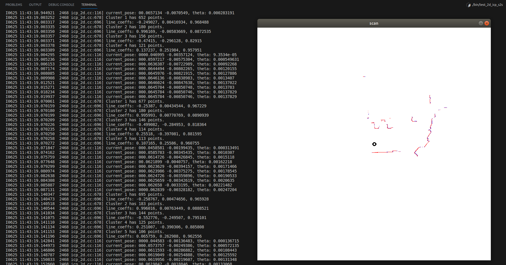
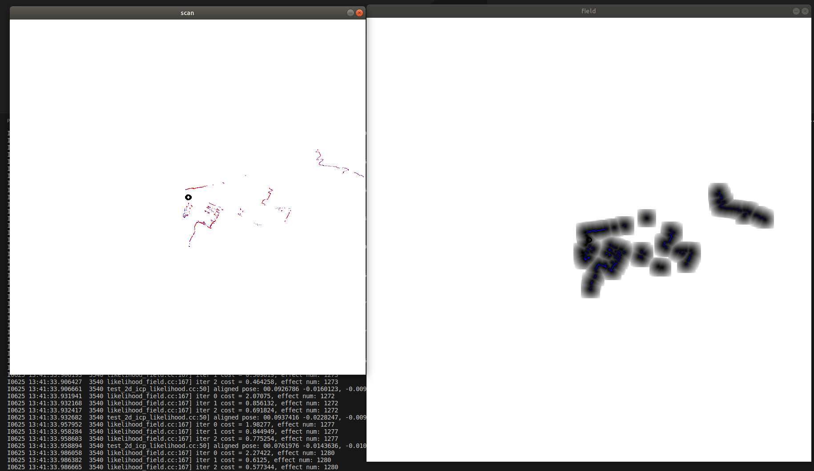
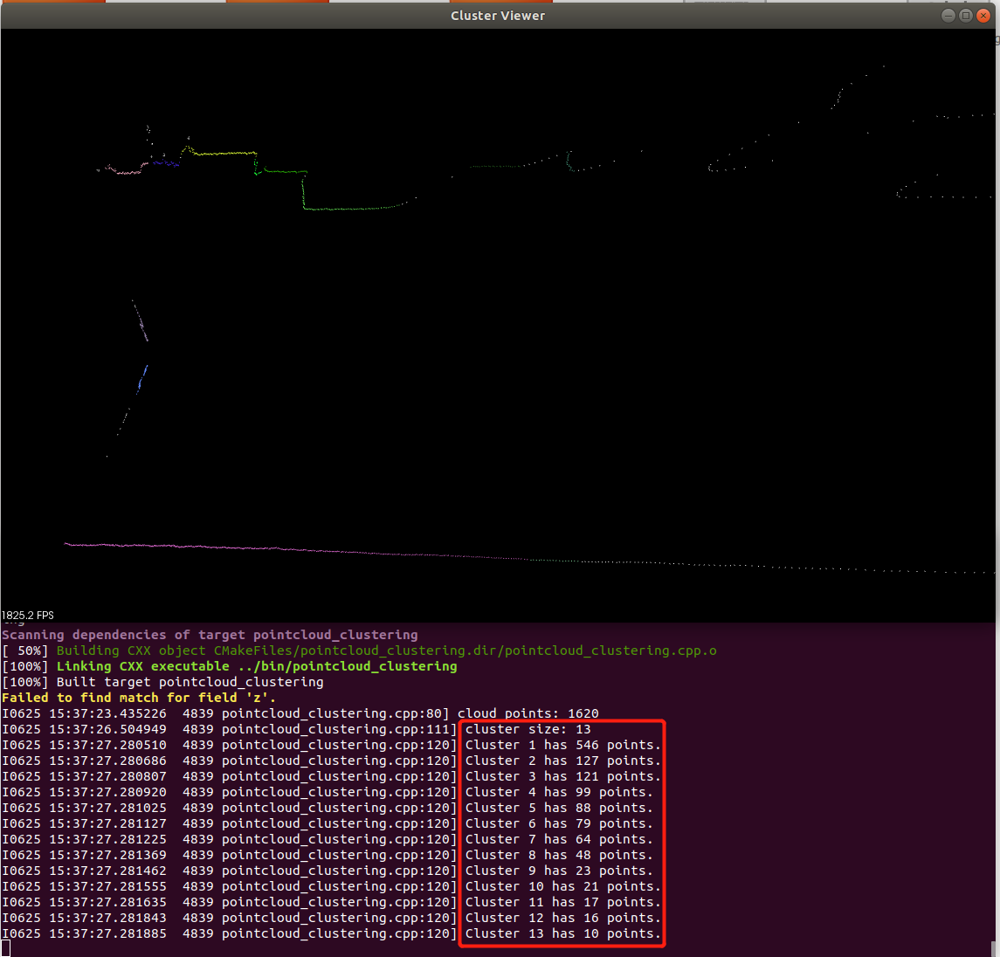
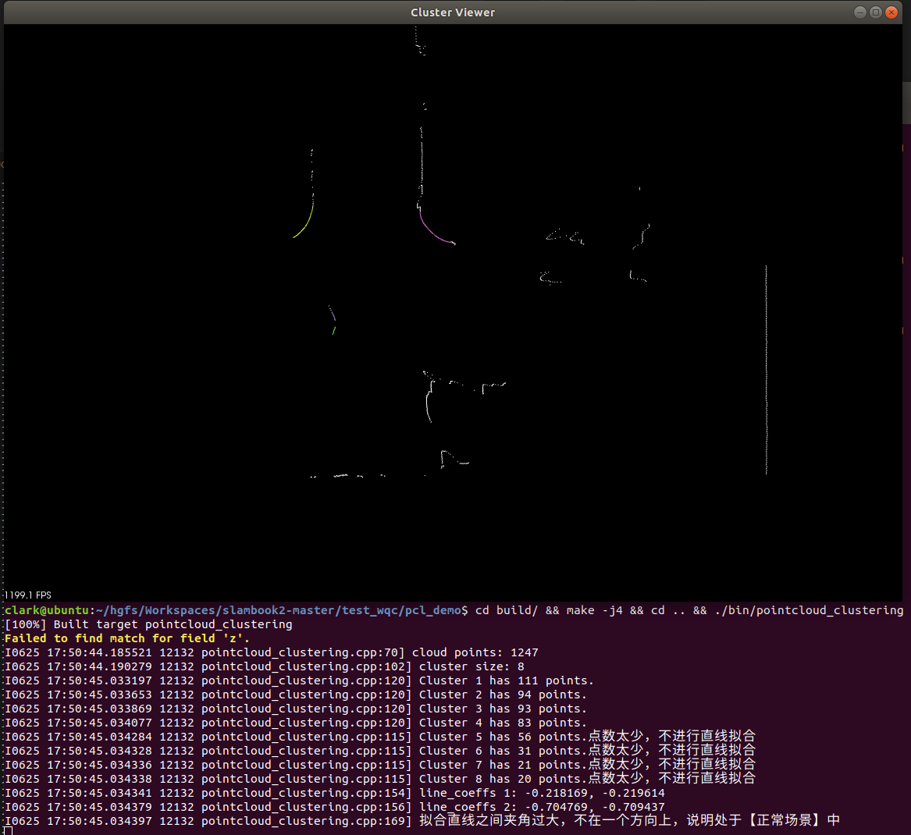
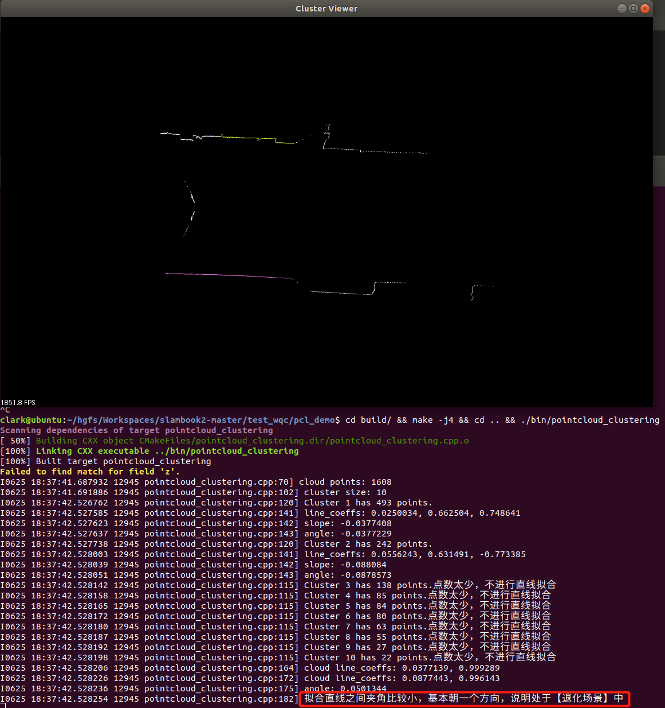

[TOC]

# 1. 实现基于优化器的点到点ICP、点到线ICP。

**答：**

由于程序中已经提供了手写高斯版本的点到点ICP与点到线ICP算法的实现，已知其中残差公式与对应的雅可比矩阵，将其修改为基于优化器的实现版本会容易很多，这里采用g2o优化器来实现，本人对点到点ICP和点到线的ICP都考虑了两种做法：

1. **模仿手写高斯牛顿中的迭代流程，外部for循环迭代10次，内部for循环遍历当前帧激光点云中的所有点，使用每次迭代的当前位姿转换每个点为世界系坐标，用kdtree搜索上一帧目标点云中最近邻点，optimize(1)仅优化一次**

2. **仅一个for循环遍历当前帧激光点云中的所有点，将kdtree和目标点云target_cloud以指针形式都传入自定义边的构造函数中，在其内部进行kdtree的最近邻搜索后，计算残差与雅可比，计算过程与手写高斯实现中的内容一致。然后外部optimize(10)优化十次。**

发现与手写高斯点到点ICP和点到线ICP相比，上面两种实现的运行结果都非常的慢，于是考虑了第三种做法，但可能与手写高斯版本的过程有点不一致：也是仅有一个for循环遍历点云，但这里for循环内部没有使用每次迭代更新后的位姿顶点来转换，而是**都采用init_pose初始位姿**，然后optimize(10)优化十次。这样实现后，**速度上跟手写高斯差不多，由于使用的都是初始位姿，感觉理论上匹配的不会那么好**，但实际效果上，没有看的很清楚，**也作为一种速度和精度之间的取舍放在这里作为基于优化器的第三种做法**。

```c++
/// 【新增】使用g2o进行点到点的ICP配准
bool AlignG2OP2P(SE2& init_pose);   // 外部for循环迭代10次，内部for循环遍历scan点云，kdtree搜索current_pose转换的pw点得到qw，optimize(1)，每次迭代后更新current_pose
bool AlignG2OP2P_2(SE2& init_pose); // for循环遍历scan点云，kdtree传入位姿边构造函数，g2o内部每次迭代更新的位姿转换得到pw点进行近邻搜索得到qw，optimize(10)

bool AlignG2OP2P_3(SE2& init_pose); // for循环遍历scan点云，每个点都使用initial_pose转换的pw点，去进行近邻搜索得到qw，optimize(10)

/// 【新增】使用g2o进行点到线的ICP配准（2D激光场景中，并不存在面，可以将点到线的形式看成低维的点到面）
bool AlignG2OP2L(SE2& init_pose);   // 外部for循环迭代10次，内部for循环遍历scan点云，kdtree搜索current_pose转换的pw点得到qw，optimize(1)，每次迭代后更新current_pose
bool AlignG2OP2L_2(SE2& init_pose); // for循环遍历scan点云，kdtree传入位姿边构造函数，g2o内部每次迭代更新的位姿转换得到pw点进行近邻搜索得到qw，optimize(10)
```


## 1.1 基于g2o优化器的点到点ICP-方法1-g2o外部进行kdtree近邻搜索

比较直接，模仿手写高斯牛顿中的迭代流程，外部for循环迭代10次，内部for循环遍历当前帧激光点云中的所有点，使用每次迭代的当前位姿转换每个点为世界系坐标，用kdtree搜索上一帧目标点云中最近邻点，optimize(1)仅优化一次。

```c++
/**
 * @description: 基于G2O优化器的2D 点到点ICP算法
 * @param {SE2&} init_pose 初始位姿
 * @return {*}
 */
bool Icp2d::AlignG2OP2P(SE2& init_pose) {
    int iterations = 10;                // 迭代次数
    double rk_delta = 0.8;
    float max_dis2 = 0.01;        // 最近邻时的最远距离（平方）
    int min_effect_pts = 20;      // 最小有效点数
    SE2 current_pose = init_pose;   // 当前位姿
    for (int iter = 0; iter < iterations; ++iter) {
        using BlockSolverType = g2o::BlockSolver<g2o::BlockSolverTraits<3, 1>>;
        using LinearSolverType = g2o::LinearSolverCholmod<BlockSolverType::PoseMatrixType>;
        auto* solver = new g2o::OptimizationAlgorithmLevenberg(g2o::make_unique<BlockSolverType>(g2o::make_unique<LinearSolverType>()));
        g2o::SparseOptimizer optimizer;
        optimizer.setAlgorithm(solver);
        
        auto* v = new VertexSE2();      // 新建SE2位姿顶点
        v->setId(0);                    // 设置顶点的id
        v->setEstimate(current_pose);   // 设置顶点的估计值为初始位姿
        optimizer.addVertex(v);         // 将顶点添加到优化器中
        int effective_num = 0;  // 有效点数
        // 遍历源始点云
        for (size_t i = 0; i < source_scan_->ranges.size(); ++i) {
            double range = source_scan_->ranges[i]; // 源始点云的距离
            // 判断每个点的距离是否越界
            if (range < source_scan_->range_min || range > source_scan_->range_max) 
                continue;

            // 根据最小角度和角分辨率计算每个点的角度
            double angle = source_scan_->angle_min + i * source_scan_->angle_increment;
            double theta = current_pose.so2().log(); // 当前位姿的角度

            // 世界系下点的坐标 p_i^W，极坐标转笛卡尔坐标公式
            Vec2d pw = current_pose * Vec2d(range * std::cos(angle), range * std::sin(angle));

            Point2d pt;
            pt.x = pw.x();
            pt.y = pw.y();

            // 最近邻
            std::vector<int> nn_idx;    // 最近邻的索引
            std::vector<float> dis;     // 最近邻的距离
            // 在目标点云的KD树中查找一个最近邻，返回该最近邻的索引和距离
            kdtree_2d->nearestKSearch(pt, 1, nn_idx, dis);

            // 判断最近邻集合是否非空，且最小距离是否小于最大距离阈值
            if (nn_idx.size() > 0 && dis[0] < max_dis2) {
                effective_num++;    // 有效点数自增一
                Vec2d qw = Vec2d(target_cloud_2d->points[nn_idx[0]].x, target_cloud_2d->points[nn_idx[0]].y);   // 当前激光点在目标点云中的最近邻点坐标
                auto *edge = new EdgeSE2P2P(range, angle, qw, theta);   // 构建约束边，参数为：激光点的距离、角度、近邻点坐标、当前旋转角度
                edge->setVertex(0, v);                  // 设置边的第一个顶点为SE2位姿顶点
                edge->setInformation(Mat2d::Identity());// 观测为2维点坐标，因此信息矩阵需设为2x2单位矩阵
                auto rk = new g2o::RobustKernelHuber;   // Huber鲁棒核函数
                rk->setDelta(rk_delta);                 // 设置阈值
                edge->setRobustKernel(rk);              // 为边设置鲁棒核函数
                optimizer.addEdge(edge);                // 将约束边添加到优化器中
            } 
        }

        // 判断有效激光点数是否少于最小有效点数阈值
        if (effective_num < min_effect_pts) 
            return false;

        optimizer.setVerbose(false);        // 不输出优化过程
        optimizer.initializeOptimization(); // 初始化优化器
        optimizer.optimize(1);              // g2o内部仅非线性优化求解一次

        // 取出优化后的SE2位姿，更新当前位姿，用于下一次迭代
        current_pose = v->estimate();
    }
    init_pose = current_pose;
    LOG(INFO) << "estimated pose: " << current_pose.translation().transpose() << ", theta: " << current_pose.so2().log();
    // LOG(INFO) << "g2o: estimated pose: " << init_pose.translation().transpose() << ", theta: " << init_pose.so2().log();
    return true;
}
```

这里在```src/ch6/g2o_types.h```中新增了一个自定义边类**EdgeSE2P2P**，用于第一种点到点的ICP匹配，自定义边构造函数中传入的参数为四个（当前激光点的距离，角度，在目标点云中的近邻点，）：

```c++
/**
 * @description: 一元边，定义了SE2位姿的残差，以及残差相对于（x,y,theta）雅可比矩阵的解析形式
 * @return {*}
 */
class EdgeSE2P2P : public g2o::BaseUnaryEdge<2, Vec2d, VertexSE2> {    // 测量值为2维；SE2类型位姿顶点
public:
    EIGEN_MAKE_ALIGNED_OPERATOR_NEW;
    EdgeSE2P2P(double range, double angle, Vec2d qw, double theta) : range_(range), angle_(angle), qw_(qw), theta_(theta) {}
    
    // 定义残差
    void computeError() override {
        auto* pose = dynamic_cast<const VertexSE2*>(_vertices[0]);
        _error = pose->estimate() * Vec2d(range_ * std::cos(angle_), range_ * std::sin(angle_)) - qw_; // pw - qw
    }

    // 雅可比矩阵的解析形式
    void linearizeOplus() override {
        _jacobianOplusXi <<  1, 0, 0, 1,  // de / dx， de / dy
                            -range_ * std::sin(angle_ + theta_), range_ * std::cos(angle_ + theta_);  //  de / dtheta
    }

    bool read(std::istream& is) override { return true; }
    bool write(std::ostream& os) const override { return true; }

private:
    double range_ = 0;  // 距离
    double angle_ = 0;  // 角度
    double theta_ = 0;
    Vec2d qw_;          // 世界系下的近邻点坐标
};
```


## 1.2 基于g2o优化器的点到点ICP-方法2-g2o内部进行kdtree近邻搜索

第二种做法，仅一个for循环遍历当前帧激光点云中的所有点，将kdtree和目标点云target_cloud以指针形式都传入自定义边的构造函数中，在其内部进行kdtree的最近邻搜索后，计算残差与雅可比，计算过程与手写高斯实现中的内容一致。然后外部optimize(10)优化十次。

首先需要实现将kdtree传入g2o内部函数中进行调用，于是考虑**将自定义边类EdgeSE2P2P_2以嵌套类的形式放入icp_2d.h的Icp2d类中**，并在其中**定义kdtree和目标点云成员变量**。同时也将外部Icp2d类中的这两个成员变量均改为了Ptr指针形式。

```c++
bool Icp2d::AlignG2OP2P_2(SE2& init_pose) {
    int iterations = 10;                // 迭代次数
    double rk_delta = 0.8;
    float max_dis2 = 0.01;        // 最近邻时的最远距离（平方）
    int min_effect_pts = 20;      // 最小有效点数

    using BlockSolverType = g2o::BlockSolver<g2o::BlockSolverTraits<3, 1>>;
    using LinearSolverType = g2o::LinearSolverCholmod<BlockSolverType::PoseMatrixType>;
    auto* solver = new g2o::OptimizationAlgorithmLevenberg(g2o::make_unique<BlockSolverType>(g2o::make_unique<LinearSolverType>()));
    g2o::SparseOptimizer optimizer;
    optimizer.setAlgorithm(solver);
    
    auto* v = new VertexSE2();      // 新建SE2位姿顶点
    v->setId(0);                    // 设置顶点的id
    v->setEstimate(init_pose);   // 设置顶点的估计值为初始位姿
    optimizer.addVertex(v);         // 将顶点添加到优化器中
    int effective_num = 0;  // 有效点数
    // 遍历源始点云
    for (size_t i = 0; i < source_scan_->ranges.size(); ++i) {
        double range = source_scan_->ranges[i]; // 源始点云的距离
        // 判断每个点的距离是否越界
        if (range < source_scan_->range_min || range > source_scan_->range_max) 
            continue;

        // 根据最小角度和角分辨率计算每个点的角度
        double angle = source_scan_->angle_min + i * source_scan_->angle_increment;
        
        auto *edge = new EdgeSE2P2P_2(kdtree_2d, target_cloud_2d, range, angle);   

        edge->setVertex(0, v);                  // 设置边的第一个顶点为SE2位姿顶点
        if (edge->isPointValid()){
            effective_num++; 
            edge->setInformation(Mat2d::Identity());// 观测为2维点坐标，信息矩阵需设为2x2单位矩阵
            auto rk = new g2o::RobustKernelHuber;   // Huber鲁棒核函数
            rk->setDelta(rk_delta);                 // 设置阈值
            edge->setRobustKernel(rk);              // 为边设置鲁棒核函数    
            optimizer.addEdge(edge);                // 将约束边添加到优化器中
        }
    }

    // 判断有效激光点数是否少于最小有效点数阈值
    if (effective_num < min_effect_pts) 
        return false;

    optimizer.setVerbose(false);        // 不输出优化过程
    optimizer.initializeOptimization(); // 初始化优化器
    optimizer.optimize(10);              // g2o内部仅非线性优化求解一次

    // 取出优化后的SE2位姿，更新当前位姿，用于下一次迭代
    init_pose = v->estimate();
    LOG(INFO) << "estimated pose: " << v->estimate().translation().transpose() << ", theta: " << v->estimate().so2().log();
    return true;
}
```

在自定义边内部，定义了一个**isPointValid()**函数，用于判断当前激光点的最近邻集合是否为空，或者最小距离是否大于最大距离阈值，如果是，computeError()和linearizeOplus()才会去计算残差和雅可比，否则将当前边的等级设为1，也就是不参与优化，相当于剔除了这条边，这样做与手写高斯中的判断过程一致。


```c++
class EdgeSE2P2P_2 : public g2o::BaseUnaryEdge<2, Vec2d, VertexSE2> {
public:
    EIGEN_MAKE_ALIGNED_OPERATOR_NEW;
    EdgeSE2P2P_2(const pcl::search::KdTree<Point2d>::Ptr kdtree, const Cloud2d::Ptr target_cloud, double range, double angle) : kdtree_(kdtree),  target_cloud_(target_cloud), range_(range), angle_(angle) {}

    // 判断当前激光点的最近邻集合是否为空，或者最小距离是否大于最大距离阈值
    bool isPointValid() { 
        auto* pose = dynamic_cast<const VertexSE2*>(_vertices[0]);
        theta_ = pose->estimate().so2().log(); // 当前位姿的角度
        // 世界系下点的坐标 p_i^W，极坐标转笛卡尔坐标公式
        pw_ = pose->estimate() * Vec2d(range_ * std::cos(angle_), range_ * std::sin(angle_));

        Point2d pt;
        pt.x = pw_.x();
        pt.y = pw_.y();

        // 在目标点云的KD树中查找一个最近邻，返回该最近邻的索引和距离
        kdtree_->nearestKSearch(pt, 1, nn_idx_, dis_);
        float max_dis2 = 0.01;
        // 判断最近邻集合是否非空，且最小距离是否小于最大距离阈值
        if (nn_idx_.size() > 0 && dis_[0] < max_dis2) {
            // 当前激光点在目标点云中的最近邻点坐标
            qw_ = Vec2d(target_cloud_->points[nn_idx_[0]].x, target_cloud_->points[nn_idx_[0]].y);   
            return true;
        }
        else 
            return false;
    }
    
    // 定义残差
    void computeError() override {
        // 判断最近邻集合是否非空，且最小距离是否小于最大距离阈值
        if (isPointValid()) 
            _error =  pw_ - qw_; 
        else {
            _error = Vec2d(0, 0);
            setLevel(1);
        }
    }

    // 雅可比矩阵的解析形式
    void linearizeOplus() override {
        if (isPointValid()) {
            _jacobianOplusXi <<  1, 0, 0, 1,  // de / dx， de / dy
                                -range_ * std::sin(angle_ + theta_), range_ * std::cos(angle_ + theta_);  //  de / dtheta       
        } else {
            _jacobianOplusXi.setZero();
            setLevel(1);
        }                   
    }

    bool read(std::istream& is) override { return true; }
    bool write(std::ostream& os) const override { return true; }

private:
    double range_ = 0;  // 距离
    double angle_ = 0;  // 角度

    // 【新增】
    double theta_ = 0;
    Vec2d pw_, qw_;
    const pcl::search::KdTree<Point2d>::Ptr kdtree_; 
    const Cloud2d::Ptr target_cloud_;
    std::vector<int> nn_idx_;    // 最近邻的索引
    std::vector<float> dis_;     // 最近邻的距离
};
```


## 1.3 基于g2o优化器的点到线ICP-方法1-g2o外部进行kdtree近邻搜索

实现过程与基于g2o优化器的点到点ICP过程类似，也是在```src/ch6/g2o_types.h```中新增了一个自定义边类**EdgeSE2P2L**，用于第一种点到线的ICP匹配，自定义边构造函数中传入三个参数（当前激光点的距离，角度，直线拟合系数）：

```c++
class EdgeSE2P2L : public g2o::BaseUnaryEdge<1, double, VertexSE2> {    // 测量值为2维；SE2类型位姿顶点
public:
    EIGEN_MAKE_ALIGNED_OPERATOR_NEW;
    EdgeSE2P2L(double range, double angle, Vec3d line_coeffs) : range_(range), angle_(angle), line_coeffs_(line_coeffs) {}
    
    // 定义残差
    void computeError() override {
        auto* pose = dynamic_cast<const VertexSE2*>(_vertices[0]);
        Vec2d pw = pose->estimate() * Vec2d(range_ * std::cos(angle_), range_ * std::sin(angle_));
        _error[0] = line_coeffs_[0] * pw[0] + line_coeffs_[1] * pw[1] + line_coeffs_[2]; 
    }

    // 雅可比矩阵的解析形式
    void linearizeOplus() override {
        auto* pose = dynamic_cast<const VertexSE2*>(_vertices[0]);
        float theta = pose->estimate().so2().log(); // 当前位姿的角度
        _jacobianOplusXi <<   line_coeffs_[0], 
                              line_coeffs_[1], 
                            - line_coeffs_[0] * range_ * std::sin(angle_ + theta) 
                            + line_coeffs_[1] * range_ * std::cos(angle_ + theta);  
    }

    bool read(std::istream& is) override { return true; }
    bool write(std::ostream& os) const override { return true; }

private:
    double range_ = 0;  // 距离
    double angle_ = 0;  // 角度
    Vec3d line_coeffs_; // 直线拟合系数 A,B,C
};
```

外部for循环的遍历过程中基本类似，直接给出代码：

```c++
bool Icp2d::AlignG2OP2L(SE2& init_pose) {
    int iterations = 10;        // 迭代次数
    double rk_delta = 0.8;
    float max_dis = 0.3;       // 最近邻时的最远距离（平方）
    int min_effect_pts = 20;    // 最小有效点数
    
    SE2 current_pose = init_pose;   // 当前位姿
    for (int iter = 0; iter < iterations; ++iter) {
        using BlockSolverType = g2o::BlockSolver<g2o::BlockSolverTraits<3, 1>>;
        using LinearSolverType = g2o::LinearSolverCholmod<BlockSolverType::PoseMatrixType>;
        auto* solver = new g2o::OptimizationAlgorithmLevenberg(g2o::make_unique<BlockSolverType>(g2o::make_unique<LinearSolverType>()));
        g2o::SparseOptimizer optimizer;
        optimizer.setAlgorithm(solver);

        auto* v = new VertexSE2();      // 新建SE2位姿顶点
        v->setId(0);                    // 设置顶点的id
        v->setEstimate(current_pose);   // 设置顶点的估计值为初始位姿
        optimizer.addVertex(v);         // 将顶点添加到优化器中
        int effective_num = 0;  // 有效点数
        // 遍历源始点云
        for (size_t i = 0; i < source_scan_->ranges.size(); ++i) {
            double range = source_scan_->ranges[i]; // 源始点云的距离
            // 判断每个点的距离是否越界
            if (range < source_scan_->range_min || range > source_scan_->range_max) 
                continue;

            // 当前激光点的角度
            double angle = source_scan_->angle_min + i * source_scan_->angle_increment;
            // 从上一次迭代得到的位姿 T_wb 的2x2旋转矩阵中，利用对数映射获取对应的旋转角度
            double theta = current_pose.so2().log();
            // 机器人坐标系下的极坐标转换为笛卡尔坐标，并转为世界坐标系下的坐标 p_i^W，
            Vec2d pw = current_pose * Vec2d(range * std::cos(angle), range * std::sin(angle));
            Point2d pt;
            pt.x = pw.x();
            pt.y = pw.y();

            // 查找5个最近邻
            std::vector<int> nn_idx;    // 最近邻的索引
            std::vector<float> dis;     // 最近邻的距离
            kdtree_2d->nearestKSearch(pt, 5, nn_idx, dis);

            std::vector<Vec2d> effective_pts;  // 有效点
            // 遍历所有五个近邻点
            for (int j = 0; j < nn_idx.size(); ++j) {
                // 判断每个近邻点的距离是否处于最远阈值距离内
                if (dis[j] < max_dis) 
                    // 若是，该近邻点符合要求，存储到向量中
                    effective_pts.emplace_back(Vec2d(target_cloud_2d->points[nn_idx[j]].x, target_cloud_2d->points[nn_idx[j]].y));
            }
            // 判断有效近邻点是否少于三个
            if (effective_pts.size() < 3) 
                // 若少于3个，则跳过当前激光点
                continue;

            // 拟合直线，组装J、H和误差
            Vec3d line_coeffs;
            // 利用当前点附近的几个有效近邻点，基于SVD奇异值分解，拟合出ax+by+c=0 中的最小直线系数 a,b,c，对应公式（6.11）
            if (math::FitLine2D(effective_pts, line_coeffs)) {
                effective_num++; // 有效点数
                auto *edge = new EdgeSE2P2L(range, angle, line_coeffs);
                edge->setVertex(0, v);                  // 设置边的第一个顶点为SE2位姿顶点
                edge->setInformation(Eigen::Matrix<double, 1, 1>::Identity());// 观测为2维点坐标，因此信息矩阵需设为2x2单位矩阵
                auto rk = new g2o::RobustKernelHuber;   // Huber鲁棒核函数
                rk->setDelta(rk_delta);                 // 设置阈值
                edge->setRobustKernel(rk);              // 为边设置鲁棒核函数
                optimizer.addEdge(edge);                // 将约束边添加到优化器中
            }
        }

        // 判断有效激光点数是否少于最小有效点数阈值
        if (effective_num < min_effect_pts) 
            return false;

        optimizer.setVerbose(false);        // 不输出优化过程
        optimizer.initializeOptimization(); // 初始化优化器
        optimizer.optimize(1);              // g2o内部仅非线性优化求解一次

        // 取出优化后的SE2位姿，更新当前位姿，用于下一次迭代
        current_pose = v->estimate();
    }
    init_pose = current_pose;
    LOG(INFO) << "estimated pose: " << current_pose.translation().transpose() << ", theta: " << current_pose.so2().log();
    // LOG(INFO) << "g2o: estimated pose: " << init_pose.translation().transpose() << ", theta: " << init_pose.so2().log();
    return true;
}
```

## 1.4 基于g2o优化器的点到线ICP-方法2-g2o内部进行kdtree近邻搜索

也是在icp_2d.h的Icp2d类中新增了一个嵌套类，增加一个直线拟合是否成功的判定函数，内外部均可用到

```c++
class EdgeSE2P2L_2 : public g2o::BaseUnaryEdge<1, double, VertexSE2> {
public:
    EIGEN_MAKE_ALIGNED_OPERATOR_NEW;
    EdgeSE2P2L_2(const pcl::search::KdTree<Point2d>::Ptr kdtree, const Cloud2d::Ptr target_cloud, double range, double angle) : kdtree_(kdtree),  target_cloud_(target_cloud), range_(range), angle_(angle) {}

    bool getIsLineFitSuccess() { return isLineFitSuccess_; }

    // 直线拟合是否成功
    bool isLineFitValid() { 
        auto* pose = dynamic_cast<const VertexSE2*>(_vertices[0]);
        theta_ = pose->estimate().so2().log(); // 当前位姿的角度
        // 世界系下点的坐标 p_i^W，极坐标转笛卡尔坐标公式
        pw_ = pose->estimate() * Vec2d(range_ * std::cos(angle_), range_ * std::sin(angle_));

        Point2d pt;
        pt.x = pw_.x();
        pt.y = pw_.y();

        // 在目标点云的KD树中查找一个最近邻，返回该最近邻的索引和距离
        kdtree_->nearestKSearch(pt, 5, nn_idx_, dis_);

        std::vector<Vec2d> effective_pts;  // 有效点
        float max_dis = 0.3;
        // 遍历所有五个近邻点
        for (int j = 0; j < nn_idx_.size(); ++j) {
            // 判断每个近邻点的距离是否处于最远阈值距离内
            if (dis_[j] < max_dis) 
                // 若是，该近邻点符合要求，存储到向量中
                effective_pts.emplace_back(Vec2d(target_cloud_->points[nn_idx_[j]].x, target_cloud_->points[nn_idx_[j]].y));
        }
        // 判断有效近邻点是否少于三个
        if (effective_pts.size() < 3) 
            // 若少于3个，则跳过当前激光点
            return false;

        
        // 利用当前点附近的几个有效近邻点，基于SVD奇异值分解，拟合出ax+by+c=0 中的最小直线系数 a,b,c，对应公式（6.11）
        if (math::FitLine2D(effective_pts, line_coeffs_)) {
            isLineFitSuccess_ = true;
            return isLineFitSuccess_;
        } else {
            isLineFitSuccess_ = false;
            return isLineFitSuccess_;
        }
    }
    
    // 定义残差
    void computeError() override {
        // 判断最近邻集合是否非空，且最小距离是否小于最大距离阈值
        if (isLineFitValid()) 
            _error[0] = line_coeffs_[0] * pw_[0] + line_coeffs_[1] * pw_[1] + line_coeffs_[2];
        else {
            _error[0] = 0.0;
            setLevel(1);
        }
    }

    // 雅可比矩阵的解析形式
    void linearizeOplus() override {
        if (isLineFitSuccess_) {
            _jacobianOplusXi << line_coeffs_[0], 
                                line_coeffs_[1], 
                                - line_coeffs_[0] * range_ * std::sin(angle_ + theta_) 
                                + line_coeffs_[1] * range_ * std::cos(angle_ + theta_);        
        } else {
            _jacobianOplusXi.setZero();
            setLevel(1);
        }                   
    }

    bool read(std::istream& is) override { return true; }
    bool write(std::ostream& os) const override { return true; }

private:
    double range_ = 0;  // 距离
    double angle_ = 0;  // 角度

    // 【新增】
    double theta_ = 0;
    Vec2d pw_, qw_;
    const pcl::search::KdTree<Point2d>::Ptr kdtree_; 
    const Cloud2d::Ptr target_cloud_;
    std::vector<int> nn_idx_;    // 最近邻的索引
    std::vector<float> dis_;     // 最近邻的距离

    Vec3d line_coeffs_;  // 拟合直线，组装J、H和误差

    bool isLineFitSuccess_ = false;
};
```

```c++
bool Icp2d::AlignG2OP2L_2(SE2& init_pose) {
    int iterations = 10;        // 迭代次数
    double rk_delta = 0.8;
    float max_dis = 0.3;       // 最近邻时的最远距离（平方）
    int min_effect_pts = 20;    // 最小有效点数
    
    SE2 current_pose = init_pose;   // 当前位姿

    using BlockSolverType = g2o::BlockSolver<g2o::BlockSolverTraits<3, 1>>;
    using LinearSolverType = g2o::LinearSolverCholmod<BlockSolverType::PoseMatrixType>;
    auto* solver = new g2o::OptimizationAlgorithmLevenberg(g2o::make_unique<BlockSolverType>(g2o::make_unique<LinearSolverType>()));
    g2o::SparseOptimizer optimizer;
    optimizer.setAlgorithm(solver);

    auto* v = new VertexSE2();      // 新建SE2位姿顶点
    v->setId(0);                    // 设置顶点的id
    v->setEstimate(current_pose);   // 设置顶点的估计值为初始位姿
    optimizer.addVertex(v);         // 将顶点添加到优化器中
    int effective_num = 0;          // 有效点数

    // 遍历源始点云
    for (size_t i = 0; i < source_scan_->ranges.size(); ++i) {
        double range = source_scan_->ranges[i]; // 源始点云的距离
        // 判断每个点的距离是否越界
        if (range < source_scan_->range_min || range > source_scan_->range_max) 
            continue;

        // 当前激光点的角度
        double angle = source_scan_->angle_min + i * source_scan_->angle_increment;
        
        auto *edge = new EdgeSE2P2L_2(kdtree_2d, target_cloud_2d, range, angle);

        edge->setVertex(0, v);                  // 设置边的第一个顶点为SE2位姿顶点
        

        // 利用当前点附近的几个有效近邻点，基于SVD奇异值分解，拟合出ax+by+c=0 中的最小直线系数 a,b,c，对应公式（6.11）
        if (edge->isLineFitValid()) {
            effective_num++; // 有效点数
            edge->setInformation(Eigen::Matrix<double, 1, 1>::Identity());// 观测为2维点坐标，因此信息矩阵需设为2x2单位矩阵
            auto rk = new g2o::RobustKernelHuber;   // Huber鲁棒核函数
            rk->setDelta(rk_delta);                 // 设置阈值
            edge->setRobustKernel(rk);              // 为边设置鲁棒核函数
            optimizer.addEdge(edge);                // 将约束边添加到优化器中
        }
    }

    // 判断有效激光点数是否少于最小有效点数阈值
    if (effective_num < min_effect_pts) 
        return false;

    optimizer.setVerbose(false);        // 不输出优化过程
    optimizer.initializeOptimization(); // 初始化优化器
    optimizer.optimize(10);              // g2o内部仅非线性优化求解一次

    // 取出优化后的SE2位姿，更新当前位姿，用于下一次迭代
    current_pose = v->estimate();
    
    init_pose = current_pose;
    LOG(INFO) << "estimated pose: " << current_pose.translation().transpose() << ", theta: " << current_pose.so2().log();
    // LOG(INFO) << "g2o: estimated pose: " << init_pose.translation().transpose() << ", theta: " << init_pose.so2().log();
    return true;
}
```


## 1.5 测试与结果

在```test_2d_icp_s2s.cc```中增加上述几种方法的选项，便于终端切换：

```c++
SE2 pose;
if (fLS::FLAGS_method == "point2point") {
    icp.AlignGaussNewton(pose);
} else if (fLS::FLAGS_method == "point2line") {
    icp.AlignGaussNewtonPoint2Plane(pose);
} else if (fLS::FLAGS_method == "point2point_g2o") {
    LOG(INFO) << "icp.AlignG2OP2P(pose): ";
    icp.AlignG2OP2P(pose);
} else if (fLS::FLAGS_method == "point2point_g2o_2") {
    LOG(INFO) << "icp.AlignG2OP2P_2(pose): ";
    icp.AlignG2OP2P_2(pose);
} else if (fLS::FLAGS_method == "point2point_g2o_3") {
    LOG(INFO) << "icp.AlignG2OP2P_3(pose): ";
    icp.AlignG2OP2P_3(pose);
} else if (fLS::FLAGS_method == "point2line_g2o") {
    LOG(INFO) << "icp.AlignG2OP2L(pose): ";
    icp.AlignG2OP2L(pose);
} else if (fLS::FLAGS_method == "point2line_g2o_2") {
    LOG(INFO) << "icp.AlignG2OP2L_2(pose): ";
    icp.AlignG2OP2L_2(pose);
}
```

如上几种实现均顺利编译成功后，可以很明显的可以发现，基于g2o优化器实现的几个版本，均要慢于手写高斯版本的实现，从直观的匹配效果上看，这几种效果差不多，关于如何提速基于优化器的实现，由于时间精力限制，暂时没有深入研究，后续有时间再作进一步优化。

<center>
    
</center>


# 2. 实现对似然场图像进行插值后进行scan matching扫描匹配的算法。

基于似然场的扫描匹配方法的实现中，书本与项目代码的原意应该是将原先简单直接的差分方式改为双线性插值的方式

```c++
float dx = 0.5 * (field_.at<float>(pf[1], pf[0] + 1) - field_.at<float>(pf[1], pf[0] - 1));
float dy = 0.5 * (field_.at<float>(pf[1] + 1, pf[0]) - field_.at<float>(pf[1] - 1, pf[0]));
```

但是在实际实现过程中，发现在```src/ch6/g2o_types.h```中EdgeSE2LikelihoodFiled自定义边的```computeError()```函数中，已经使用了定义在```src/common/math_utils.h```中的双线性插值算法实现```GetPixelValue(const cv::Mat& img, float x, float y)```，而基于手写高斯的似然场法的实现中未使用，因此，可以直接其用于```AlignGaussNewton()```中。

```c++
// 图像梯度（双线性插值 bilinear interpolation）
float dx = 0.5 * (math::GetPixelValue_bilinear<float>(field_, pf[0] + 1, pf[1]) - math::GetPixelValue_bilinear<float>(field_, pf[0] - 1, pf[1]));
float dy = 0.5 * (math::GetPixelValue_bilinear<float>(field_, pf[0], pf[1] + 1) - math::GetPixelValue_bilinear<float>(field_, pf[0], pf[1] - 1));
```

此外，本人实现了基于双三次bicubic的插值方法用于似然场图像的插值，得到更精确的误差值和梯度函数。

```c++
template <typename T>
inline float GetPixelValue_bicubic(const cv::Mat& img, float x, float y) {
    // boundary check 边界检查，若越界，则取边界值
    if (x < 0) x = 0;
    if (y < 0) y = 0;
    if (x >= img.cols) x = img.cols - 1;
    if (y >= img.rows) y = img.rows - 1;

    // 计算源图像中最近的四个像素的坐标
    int x0 = static_cast<int>(std::floor(x));
    int y0 = static_cast<int>(std::floor(y));
    int x1 = x0 + 1;
    int y1 = y0 + 1;

    // 计算距离最近的四个像素的权重
    float dx = x - static_cast<float>(x0);
    float dy = y - static_cast<float>(y0);
    float wx[4], wy[4];
    Compute_Weights(dx, wx);
    Compute_Weights(dy, wy);

    // 计算双三次插值结果
    const T* data = &img.at<T>(y0, x0);
    float interpolated_value = 0.0f;
    for (int j = 0; j < 4; j++) {
        for (int i = 0; i < 4; i++) {
            interpolated_value += static_cast<float>(data[i + j * img.step / sizeof(T)]) * wx[i] * wy[j];
        }
    }
    return interpolated_value;
}
```

因此，调用如下：

```c++
// 判断这个点是否在似然场图像范围内
if (pf[0] >= image_boarder && pf[0] < field_.cols - image_boarder && 
    pf[1] >= image_boarder && pf[1] < field_.rows - image_boarder) {

    effective_num++;

    // // 图像梯度
    // float dx = 0.5 * (field_.at<float>(pf[1], pf[0] + 1) 
    //                  - field_.at<float>(pf[1], pf[0] - 1));
    // float dy = 0.5 * (field_.at<float>(pf[1] + 1, pf[0]) 
    //                  - field_.at<float>(pf[1] - 1, pf[0]));
    // // 图像梯度（双线性插值 bilinear interpolation）
    // float dx = 0.5 * (math::GetPixelValue_bilinear<float>(field_, pf[0] + 1, pf[1]) 
    //                  - math::GetPixelValue_bilinear<float>(field_, pf[0] - 1, pf[1]));
    // float dy = 0.5 * (math::GetPixelValue_bilinear<float>(field_, pf[0], pf[1] + 1) 
    //                  - math::GetPixelValue_bilinear<float>(field_, pf[0], pf[1] - 1));

    // 图像梯度（双三次插值 bicubic interpolation）
    float dx = 0.5 * (math::GetPixelValue_bicubic<float>(field_, pf[0] + 1, pf[1]) 
                    - math::GetPixelValue_bicubic<float>(field_, pf[0] - 1, pf[1]));
    float dy = 0.5 * (math::GetPixelValue_bicubic<float>(field_, pf[0], pf[1] + 1) 
                    - math::GetPixelValue_bicubic<float>(field_, pf[0], pf[1] - 1));

    Vec3d J;
    J << resolution_ * dx, resolution_ * dy,
        -resolution_ * dx * r * std::sin(angle + theta) + resolution_ * dy * r * std::cos(angle + theta);
    H += J * J.transpose();

    // float e = field_.at<float>(pf[1], pf[0]); 
    // float e = math::GetPixelValue_bilinear<float>(field_, pf[0], pf[1]); // 双线性插值
    float e = math::GetPixelValue_bicubic<float>(field_, pf[0], pf[1]);     // 双三次插值
    b += -J * e;

    cost += e * e;
}
```
<center>
    
    <div>双三次插值得到似然场图像</div>
</center>

# 3. 基于直线拟合方法，讨论并实现对单个scan退化检测的算法

一看到这个题目，有点懵，回看了高博的submap子地图部分的视频片段的**24分46秒**左右的内容，退化检测两种方法，整理如下：

1. **拿ICP的结果去评估，看结果是不是存在额外自由度**
2. **对于2D场景，对scan本身做一个直线拟合，看拟合出来的直线是不是都朝一个方向，如果都是朝一个方向的话，说明scan有可能就长这个样子，如果直线方向比较好，比较均匀，横的
、竖的、斜的方向都有，说明这个地方不是一个退化区域，这里将scan本身的形状分析作为退化的判定，是一种硬性的判定，判定出来若是退化的区域，则用其它传感器（IMU、轮速计）代替2D激光进行测量。**

因此，理解下来就是需要对scan进行点云聚类操作，然后对每一子类点云作直线拟合，对拟合出来的直线进行方向判断是否朝向一致。

## 3.1 点云聚类

首先需要对目标点云进行聚类，通过查找发现PCL用于点云分割的算法欧式聚类及其变种、基于supervoxel、Grabcut、随机游走、随机抽样、区域生长等算法。

这里选择最简单的欧式聚类算法，其对应的类为```pcl::EuclideanClusterExtraction```，算法基本流程如下：

1. **初始化两个空集，一个作为备选点的点集，一个作为聚类的结果集。**
2. **在点云中随机选择一个点作为种子；**
3. **按照给定的半径对最临近的点进行搜索，此处可以使用kd-tree加速。**
4. **如果最近点小于给定欧式距离的阈值，将该点纳入备选点和相应的聚类结果集。如果最近点大于给定半径，则对当前点的搜索结束。**
5. **重复步骤4，直至备选点集为空集。**
6. **将聚类结果集中的点从原点云中剔除，重复步骤2-5。直至点云中所有点都被剔除。**

在PCL中额外增加了最大点数和最小点数的限制。在第5步时，如果一个类的最大点数超过最大点限制，会直接跳到第6步。而如果一个类的点数小于最小点数，这个类里的点会被当做外点。

于是，单独写一个测试代码，```pointcloud_clustering.cpp```，通过setSearchMethod()设置点云的kd-tree，用来进行上面第3步的近邻搜索；setClusterTolerance()函数设置第4步中欧氏距离的阈值，setMinClusterSize(),setMaxClusterSize()设置最大点数和最小点数

```c++
#include <iostream>
#include <fstream>
#include <memory>

#include <gflags/gflags.h>
#include <glog/logging.h>

#include <pcl/io/pcd_io.h>
#include <pcl/point_cloud.h>
#include <pcl/point_types.h>
#include <pcl/search/kdtree.h>
#include <pcl/search/impl/kdtree.hpp>
#include <pcl/kdtree/kdtree_flann.h>
#include <pcl/segmentation/extract_clusters.h> 
#include <pcl/segmentation/impl/extract_clusters.hpp> 
#include <pcl/filters/statistical_outlier_removal.h>
#include <pcl/visualization/pcl_visualizer.h>
#include <pcl/visualization/cloud_viewer.h>

using namespace std;

using PointType = pcl::PointXYZ;
using PointCloudType = pcl::PointCloud<PointType>;

DEFINE_string(pcd_path, "./data/target_cloud.pcd", "点云文件路径"); // scan_example.pcd  target_cloud.pcd

int main(int argc, char **argv) {
    google::InitGoogleLogging(argv[0]);
    FLAGS_stderrthreshold = google::INFO;
    FLAGS_colorlogtostderr = true;
    google::ParseCommandLineFlags(&argc, &argv, true);

    if (FLAGS_pcd_path.empty()) {
        LOG(ERROR) << "pcd path is empty";
        return -1;
    }
    // 读取点云
    pcl::PointCloud<PointType>::Ptr cloud(new pcl::PointCloud<PointType>);
    pcl::PointCloud<PointType>::Ptr cloud_filtered(new pcl::PointCloud<PointType>);
    pcl::io::loadPCDFile(FLAGS_pcd_path, *cloud);

    LOG(INFO) << "cloud points: " << cloud->size();

    if (cloud->empty()) {
        LOG(ERROR) << "cannot load cloud file";
        return -1;
    }

    pcl::StatisticalOutlierRemoval<PointType> sor;
    sor.setInputCloud(cloud);
    sor.setMeanK(30);  // 对每个点分析的邻近点个数
    sor.setStddevMulThresh(1.0);  // 标准差倍数
    sor.filter(*cloud_filtered);

    // 显示剔除离群点后的点云
    pcl::visualization::CloudViewer viewer2("after filtered");
	viewer2.showCloud(cloud_filtered, "cloud filtered0");
    while (!viewer2.wasStopped()) 
        boost::this_thread::sleep(boost::posix_time::microseconds(10000));

    pcl::search::KdTree<PointType>::Ptr kdtree_; // (new pcl::search::KdTree<PointType>)
    kdtree_ = boost::make_shared<pcl::search::KdTree<PointType>>();
    kdtree_->setInputCloud(cloud_filtered);      // 设置输入构建目标点云的KD树

    pcl::EuclideanClusterExtraction<PointType> clusterExtractor_;
    // 创建一个向量来存储聚类的结果
    std::vector<pcl::PointIndices> cluster_indices;
    clusterExtractor_.setClusterTolerance(0.02);        // 设置聚类的距离阈值
    clusterExtractor_.setMinClusterSize(10);            // 设置聚类的最小点数
    clusterExtractor_.setMaxClusterSize(1000);          // 设置聚类的最大点数 25000
    clusterExtractor_.setSearchMethod(kdtree_);         // 使用kdtree树进行加速
    clusterExtractor_.setInputCloud(cloud_filtered);    // 设置点云聚类对象的输入点云数据
    clusterExtractor_.extract(cluster_indices);         // 执行点云聚类
    LOG(INFO) << "cluster size: " << cluster_indices.size();

    // 创建可视化对象
    pcl::visualization::PCLVisualizer viewer("Cluster Viewer");
    viewer.setBackgroundColor(0.0, 0.0, 0.0);
    viewer.addPointCloud<PointType>(cloud_filtered, "cloud");
    
    int clusterNumber = 1;  // 输出聚类结果
    for (const auto& indices : cluster_indices) {
        LOG(INFO) << "Cluster " << clusterNumber << " has " << indices.indices.size() << " points.";
        pcl::PointCloud<PointType>::Ptr cluster(new pcl::PointCloud<PointType>);
        pcl::copyPointCloud(*cloud_filtered, indices, *cluster);

        // 为聚类分配不同的颜色
        double r = static_cast<double>(rand()) / RAND_MAX;
        double g = static_cast<double>(rand()) / RAND_MAX;
        double b = static_cast<double>(rand()) / RAND_MAX;

        // 将聚类点云添加到可视化对象中
        std::string clusterId = "cluster_" + std::to_string(clusterNumber);
        viewer.addPointCloud<PointType>(cluster, clusterId);
        viewer.setPointCloudRenderingProperties(pcl::visualization::PCL_VISUALIZER_COLOR, r, g, b, clusterId);
        clusterNumber++;
    }

    while (!viewer.wasStopped()) 
        viewer.spinOnce();

    return 0;
}
```

<center>
    
    <div>pcl欧式聚类算法</div>
</center>


## 3.2 对聚类结果点云进行直线拟合

由于是2D激光，且是平面上的直线，还是采用math_utils.h中的直线拟合方法FitLine2D()，对于每一个聚类点云，进行直线拟合，然后对拟合出来的直线进行方向判断是否朝向一致。

```c++
template <typename S>
bool FitLine2D(const std::vector<Eigen::Matrix<S, 2, 1>>& data, Eigen::Matrix<S, 3, 1>& coeffs) {
    if (data.size() < 2) 
        return false;

    Eigen::MatrixXd A(data.size(), 3); // S行3列，对应公式（6.12）

    // 遍历所有近邻点，生成矩阵A
    //       x1  y1  1
    //  A =  x2  y2  1
    //       ..  ..  ..
    //       xk  yk  1
    for (int i = 0; i < data.size(); ++i) {
        // 第i个近邻点2D列向量转置为行向量存储
        A.row(i).head<2>() = data[i].transpose();
        // 最后一列为1
        A.row(i)[2] = 1.0;
    }

    // 因为是求最小二乘问题，只需要计算最小奇异值对应的特征向量即可，无需计算全部特征向量
    Eigen::JacobiSVD svd(A, Eigen::ComputeThinV);

    // 对矩阵A进行SVD奇异值分解，取最后一列，
    // 就是最小奇异值所对应的特征向量，也就拟合出了最小直线系数a,b
    coeffs = svd.matrixV().col(2); 
    return true;
}
```

然后在聚类点云遍历循环中，并不是所有类都会去进行直线拟合，这里仅会对点云数目多于指定阈值的类才会执行，计算出直线系数A，B，C系数后，判断系数A的值是否为负，若为负整体取反后，计算直线之间的夹角（系数向量(A,B)点乘的反余弦值），判断该角度是否过大，若过大，则认为当前为退化场景，否则认为正常场景。


```c++
std::vector<Eigen::Vector2d> linecoeffs_cloud;
for (const auto& indices : cluster_indices) {

    if(indices.indices.size() < 150) {
        LOG(INFO) << "Cluster " << clusterNumber << " has " << indices.indices.size() << " points." << "点数太少，不进行直线拟合";
        clusterNumber++;
        continue;
    } 
    
    LOG(INFO) << "Cluster " << clusterNumber << " has " << indices.indices.size() << " points.";

    pcl::PointCloud<PointType>::Ptr cluster(new pcl::PointCloud<PointType>);
    pcl::copyPointCloud(*cloud_filtered, indices, *cluster);

    // 将pcl::PointXYZ类型的点云转换为Eigen::Vector3d类型的点云
    std::vector<Eigen::Vector2d> pts;
    pts.reserve(cluster->size());

    for (const PointType& pt : *cluster)
        pts.emplace_back(Eigen::Vector2d(pt.x, pt.y));

    // 拟合直线，组装J、H和误差
    Eigen::Vector3d line_coeffs;
    // 利用当前点附近的几个有效近邻点，基于SVD奇异值分解，拟合出ax+by+c=0 中的最小直线系数 a,b,c，对应公式（6.11）
    if (FitLine2D(pts, line_coeffs)) {
        if(line_coeffs[0] < 0.0)
            line_coeffs = -line_coeffs;

        double slope = -line_coeffs[0] / line_coeffs[1];
        double angle = std::atan(slope);
        LOG(INFO) << "line_coeffs: " << line_coeffs[0] << ", " << line_coeffs[1] << ", " << line_coeffs[2];
        LOG(INFO) << "slope: " << slope;
        LOG(INFO) << "angle: " << angle;
        
        linecoeffs_cloud.emplace_back(line_coeffs.head<2>());
    }

    // 为聚类分配不同的颜色
    double r = static_cast<double>(rand()) / RAND_MAX;
    double g = static_cast<double>(rand()) / RAND_MAX;
    double b = static_cast<double>(rand()) / RAND_MAX;

    // 将聚类点云添加到可视化对象中
    std::string clusterId = "cluster_" + std::to_string(clusterNumber);
    viewer.addPointCloud<PointType>(cluster, clusterId);
    viewer.setPointCloudRenderingProperties(pcl::visualization::PCL_VISUALIZER_COLOR, r, g, b, clusterId);
    clusterNumber++;
}
```

将本章rosbag数据中的某几帧scan点云保存为pcd数据进行测试，结果如下：

<center>
    
    <div>直线拟合的退化检测</div>
</center>

<center>
    
    <div>直线拟合的退化检测</div>
</center>

通过多次参数调试，发现setClusterTolerance()函数中的**距离阈值设置为0.02，最大点数和最小点数分别设置为1500和20**，对于一帧的2D激光点云scan来说分割效果比较合适，如果采用默认值得话（最小1000，最大25000）只能聚出3类，效果不是很好。这里也可以放宽阈值设定，在后面增加手动判断条件也是可以得，进队点数多于一定数目的类进行直线拟合。上述做法可能还有问题，仅是简单的通过2d点云的外观进行判定，后续还可以进一步改进。


# 4. 讨论在实际机器人中，如何处理悬空物体和低矮物体（开放问题）

**答：**

可以结合三维传感器（例如：RGBD深度相机，或多线激光雷达）可以获取物体的三维信息，

在二维SLAM方案中，如果场景中存在其他高度的障碍物或物体形状随着高度变化的情况，可以采取一些方法来处理悬空物体和低矮物体，以避免机器人与它们发生碰撞。以下是一些可能的解决方案：（1）**增加传感器**：通过添加额外的传感器（例如：RGBD深度相机等）来捕捉实际场景中的立体深度信息，更好地建立地图，并避开悬空物体和低矮物体。（2）可以**考虑多层次的地图**，除了2D激光传感器获取的二维地图外，可以添加一个额外的高度层，用于表示悬空物体和低矮物体的位置和高度。（3）由于2D SLAM生成的占据栅格地图，是黑白灰三色，可以考虑**人工干预**：对于特定场景中存在的悬空物体和低矮物体，可以事先通过手动标注或预先建模，将这些特殊物体的位置和高度信息加入到地图中，以帮助机器人进行更准确的导航和避障。

# 5. 参考资料

1. **《自动驾驶与机器人中的SLAM技术》**
2. **《视觉SLAM十四讲》**
3. **https://github.com/gaoxiang12/slam_in_autonomous_driving**
4. **https://zhuanlan.zhihu.com/p/458450122?utm_id=0**