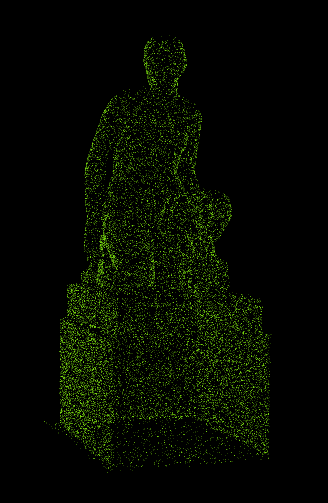

[TOC]

# 1. 为三类ICP和NDT配准添加一个Cauchy核的robust loss，讲述原理并代码实现。

**答：**


先来看看什么是鲁棒代价核函数

## 1.1 鲁棒代价核函数 Robust Cost Function

先来看看高博《十四讲》第9章中关于鲁棒核函数的介绍：


“ 在将最小化误差项的二范数平方和作为目标函数时，由于误匹配等原因，会在图优化模型中加入原本不该在其中的边，使得优化算法无法分辨错误数据，会将所有数据当作误差来处理。在算法看来，相当于突然观测到了一次很不可能产生的数据。此时，在图优化中会有一条误差很大的边，梯度也很大，意味着调整与它相关的变量会使目标函数下降很多。所以，算法将试图优先调整这条边所连接的节点的估计值，使它们顺应这条边的无理要求。由于这条边的误差真的很大，往往会抹平其它正确边的影响，使得优化算法专注于调整一个错误的值。这显然不是希望看到的。

出现这种问题的原因就是，当误差很大时，二范数增长得太快。于是就有了核函数得存在。**核函数保证每条边得误差不会大的没边而掩盖其它的边**。具体的方式是，**把原先误差的二范数度量替换成一个增长没那么快的函数，同时保证自己的光滑性质（否则无法求导）**。因为它们使得整个优化结果更加鲁棒，所以称为**鲁棒核函数（Robust Kernel）**。”

通过查阅**Barfoot巴富特**2015年的论文<At all Costs: A Comparison of Robust Cost Functions for Camera Correspondence Outliers>中关于核函数更为详细介绍，如下所示


鲁棒代价核函数替代最小二乘、最大似然代价函数，来减少 **异常值外点（outliers）** 的影响。对于如下最大似然高斯（最小二乘）估计问题：

$$
J(\mathbf x) \triangleq e(\mathbf x)^2,\qquad e(\mathbf x) \triangleq \|\mathbf y - \mathbf f(\mathbf x)\|_{\boldsymbol \Lambda}^2\tag{1}
$$

其中$J$是我们想要最小化的代价，$\mathbf x$是需要估计的状态量，$f(\mathbf x)$是估计值，$\mathbf y$是观测值，$\boldsymbol\Lambda$是测量协方差，$e(\mathbf x)$是马氏距离残差。通常会有一堆$K$个观测数据$\mathbf y$与状态向量$\mathbf x$条件独立，那么代价函数可以写成$K$个代价的累加和

$$
J(\mathbf x) \triangleq \sum_{k=1}^K e_k(\mathbf x)^2, \qquad e_k(\mathbf x) \triangleq \|\mathbf y_k - \mathbf f_k(\mathbf x)\|_{\boldsymbol \Lambda_k}\tag{2}
$$

鲁棒估计重新定义代价函数，使用二次函数代替：

$$
J_k(\mathbf x) \triangleq \rho(e_k(\mathbf x))\tag{3}
$$

通过令上式导数为零可以得到最优状态$\mathbf x^*$，对应于这个新的代价函数的最小值。

$$
\begin{align}
    &\frac{\partial J_k(\mathbf x)}{\partial \mathbf x} = \psi(e_k(\mathbf x))\frac{\partial e_k(\mathbf x)}{\partial \mathbf x} \qquad \psi(e_k)=\frac{\partial \rho(e_k)}{\partial e_k} \tag{4}\\
    &= 0 \triangleq \psi(e_k(\mathbf x^*)) \frac{\partial e_k(\mathbf x)}{\partial \mathbf x}\bigg|_{\check{\mathbf x}^*}\tag{5}
\end{align}
$$

其中$\check{\mathbf x}^*$是前一次迭代的最优状态。公式（5）中的解取决于$\frac{\partial \rho(e_k)}{\partial e_k}$的形式，可能会比较困难。但是，可以通过定义一个权重函数$w$，允许匹配**迭代重新加权最小二乘（Iteratively Reweighted Least-Squares, IRLS）** 问题，

$$
\begin{align}
    &\mathbf x^* = \arg\min_{\mathbf x} \sum_k w(e_k(\check{\mathbf x}^*))e_k(\mathbf x)^2 \tag{6}\\
    &= 0 \triangleq w(e_k(\check{\mathbf x}^*))e_k(\mathbf x^*)\frac{\partial e_k(\mathbf x)}{\partial \mathbf x}\bigg|_{\check{\mathbf x}^*},\qquad w(e_k)\triangleq \frac{\partial\psi(e_k)}{\partial e_k}\tag{7}
\end{align}
$$

使用从上一次迭代的解中计算的到的鲁棒权重来迭代求解最小二乘问题。

总之，一个鲁棒的代价为：

$$
\frac{\partial J_k(\mathbf x)}{\partial \mathbf x} = \rho(e_k(\mathbf x)), \qquad \psi(e_k)=\frac{\partial \rho(e_k)}{\partial e_k}, \qquad w(e_k)=\frac{\partial \psi(e_k)}{\partial e_k} \tag{8}
$$

论文中也给出了七种不同核函数、一阶导、二阶导的示意，如下图所示

<center>
    
    <div>
    图1. 原论文中不同鲁棒核函数、一阶导、二阶导函数。
    </div>
</center>

**下图**为上面不同核函数、一阶导、二阶导的示意，在所有情况中，调试参数设置为默认值 1。当残差很小时，Huber核，Dynamic Covariance Scaling（DCS）核，类RANSAC阈值核与L2和函数效果类似。对于较大的残差值，DCS与Geman-McClure（G-M）核函数效果类似，阈值核函数完全失效，Huber核与L1类似。L1核函数的二阶导在残差为零附近无穷大，不适合进行鲁棒估计；L1核与阈值核函数具有不连续的一阶导函数，在优化过程中可能会引起颤振。：
<center>
    
    <div>
    图2. 不同鲁棒核函数、一阶导、二阶导函数示意图。
    </div>
</center>


但与```g2o/core/robust_kernel_impl.cpp```源码中的几种鲁棒核函数的具体实现对比后，发现有比较大的出入，

```c++
// Huber 核函数
void RobustKernelHuber::robustify(number_t e, Vector3& rho) const
{
  number_t dsqr = _delta * _delta;
  if (e <= dsqr) { // inlier
    rho[0] = e;
    rho[1] = 1.;
    rho[2] = 0.;
  } else { // outlier
    number_t sqrte = sqrt(e); // absolut value of the error
    rho[0] = 2*sqrte*_delta - dsqr; // rho(e)   = 2 * delta * e^(1/2) - delta^2
    rho[1] = _delta / sqrte;        // rho'(e)  = delta / sqrt(e)
    rho[2] = - 0.5 * rho[1] / e;    // rho''(e) = -1 / (2*e^(3/2)) = -1/2 * (delta/e) / e
  }
}

// cauchy 核函数
void RobustKernelCauchy::robustify(number_t e2, Vector3& rho) const
{
  number_t dsqr = _delta * _delta;
  number_t dsqrReci = 1. / dsqr;
  number_t aux = dsqrReci * e2 + 1.0;
  rho[0] = dsqr * log(aux);
  rho[1] = 1. / aux;
  rho[2] = -dsqrReci * std::pow(rho[1], 2);
}

// Geman McClure 核函数
void RobustKernelGemanMcClure::robustify(number_t e2, Vector3& rho) const
{
  const number_t aux = _delta / (_delta + e2);
  rho[0] = e2 * aux;
  rho[1] = aux * aux;
  rho[2] = -2. * rho[1] * aux;
}
```

且论文中的一阶导和二阶导本身就有误，现结合论文与上面g2o源码中的实现，鲁棒Cauchy核函数定义为：

$$
\rho(s) = \delta^2 \log(1 + \frac{s}{\delta^2})\tag{9}
$$

对公式（9）求**一阶导和二阶导**，得到：

$$
\begin{align}
    \rho'(s) &= \frac{\partial \rho(s)}{\partial s} = \frac{\delta^2}{\delta^2 + s} = \frac{1}{1 + \frac{s}{\delta^2}}  \tag{10}\\
    \rho''(s) &= \frac{\partial \psi(s)}{\partial s} = -\frac{1}{\delta^2}\frac{1}{(1 + \frac{s}{\delta^2})^2} = -\frac{(\rho'(s))^2}{\delta^2}\tag{11}
\end{align}
$$


其中$s$为**残差的平方**，当残差为向量时，也就是**残差向量的卡方值chi2()**，

```c++
double chi2() const
{
    const OnlineVertexSE2* v1 = static_cast<const OnlineVertexSE2*>(_vertices[0]);
    const OnlineVertexSE2* v2 = static_cast<const OnlineVertexSE2*>(_vertices[1]);
    SE2 delta = _inverseMeasurement * (v1->updatedEstimate.inverse()*v2->updatedEstimate);
    Eigen::Vector3d error = delta.toVector();
    return error.dot(information() * error);
}
```

$\delta$为**鲁棒核函数的控制阈值**，根据95% efficiency rule，如果残差符合高斯分布，那么对于Cauchy核函数来说这个阈值可以设为 **2.3849**，Huber核函数为 1.345。对于非高斯分布来说，这个阈值需要根据实际情况进行调整。参考g2o中的实现，阈值可以设为1.0。因此，**对于NDT配准来说，delta阈值设为2.3849。对于ICP配准来说，delta阈值设为1.0**。

在```g2o/core/base_unary_edge.hpp```的函数```constructQuadraticForm()```中，给出了为残差添加鲁棒核的完整实现。
```c++
if (this->robustKernel()) {
  number_t error = this->chi2();
  Vector3 rho;
  this->robustKernel()->robustify(error, rho);
  InformationType weightedOmega = this->robustInformation(rho);

  from->b().noalias() -= rho[1] * A.transpose() * omega * _error;
  from->A().noalias() += A.transpose() * weightedOmega * A;
} else {
  from->b().noalias() -= A.transpose() * omega * _error;
  from->A().noalias() += A.transpose() * omega * A;
}
```

在```g2o/core/base_edge.h```的函数```robustInformation()```中，计算了新的信息矩阵，但是作者注释掉了二阶导数项的修正内容，如下所示

```c++
/**
 * calculate the robust information matrix by updating the information matrix of the error
 */
InformationType robustInformation(const Vector3& rho)
{
  InformationType result = rho[1] * _information;
  //ErrorVector weightedErrror = _information * _error;
  //result.noalias() += 2 * rho[2] * (weightedErrror * weightedErrror.transpose());
  return result;
}
```


接下来对ICP和NDT代码进行修改。

## 1.2 为ICP配准添加Cauchy鲁棒核函数

点到点、点到面以及点到线这三种ICP配准方法的修改内容基本相同，都是在高斯牛顿迭代for循环中的std::accumulate()并发函数内进行修改，如下所示


```c++
auto H_and_err = std::accumulate(
    index.begin(), index.end(), std::pair<Mat6d, Vec6d>(Mat6d::Zero(), Vec6d::Zero()),
    [&jacobians, &errors, &effect_pts, &total_res, &effective_num](const std::pair<Mat6d, Vec6d>& pre,
                                                                    int idx) -> std::pair<Mat6d, Vec6d> {
        if (!effect_pts[idx]) {
            return pre;
        } else {                    
            double e2 = errors[idx].dot(errors[idx]);
            // total_res += errors[idx].dot(errors[idx]);
            total_res += e2;

            effective_num++;

            // TODO: Cauchy 鲁棒核函数
            double delta =  1.0; 

            double delta2 = delta * delta;
            double delta2_inv = 1.0 / delta2;
            double aux = delta2_inv * e2 + 1.0;

            Vec3d rho;
            rho[0] = delta2_inv / log(aux);         // Cauchy核函数
            rho[1] = 1.0 / aux;                     // Cauchy核函数的一阶导数
            rho[2] = -delta2_inv * pow(rho[1],2);   // Cauchy核函数的二阶导数

            // Mat3d weighted_infos = rho[1] * Mat3d::Identity() + 2 * rho[2] * errors[idx] * errors[idx].transpose();
            Mat3d weighted_infos = rho[1] * Mat3d::Identity();

            // return std::pair<Mat6d, Vec6d>(pre.first + jacobians[idx].transpose() * jacobians[idx],
            //                                pre.second - jacobians[idx].transpose() * errors[idx]);
            return std::pair<Mat6d, Vec6d>(pre.first + jacobians[idx].transpose() * weighted_infos * jacobians[idx],
                                            pre.second - rho[1] * jacobians[idx].transpose() * errors[idx]);
        }
    });

```

但是点到面ICP有一个不一样的地方，因为它的残差和雅可比矩阵的维数与点到点和点到线的ICP中的维数不同

```c++
// 点到点ICP与点到线ICP
std::vector<Eigen::Matrix<double, 3, 6>> jacobians(index.size());
std::vector<Vec3d> errors(index.size());

// 点到面ICP
std::vector<Eigen::Matrix<double, 1, 6>> jacobians(index.size());
std::vector<double> errors(index.size());
```

因此，在计算加权信息矩阵的地方也稍有不同，其他部分是相同的，如下所示。

```c++
// 点到点ICP与点到线ICP
// Mat3d weighted_infos = rho[1] * Mat3d::Identity() + 2 * rho[2] * errors[idx] * errors[idx].transpose();
Mat3d weighted_infos = rho[1] * Mat3d::Identity();

// 点到面ICP
// double weighted_infos = rho[1] + 2 * rho[2] * errors[idx] * errors[idx].transpose();
double weighted_infos = rho[1]; // g2o源码中的实现，注释掉了二阶导部分
```


加完Cauchy核函数后对雕塑模型进行ICP与NDT配准后的结果并没有很明显的变化，如下图所示

<center>
    
    <div>
    加了Cauchy核函数的点到点ICP配准结果
    </div>
</center>

<center>
    
    <div>
    未加Cauchy核函数的点到点ICP配准结果
    </div>
</center>

## 1.3 为NDT配准添加Cauchy鲁棒核函数

NDT点云配准的修改内容也是基本与ICP的类似，只不过delta阈值设置略有不同，因为NDT中的残差本身是符合高斯分布，根据Huber提出的95% efficiency rule，delta阈值可以设为2.3849。

在```src/ch7/ndt_3d.cc```文件中的```AlignNdt()```函数中中添加Cauchy鲁棒核函数，修改后的代码片段如下所示

```c++
for (int idx = 0; idx < effect_pts.size(); ++idx) {
    if (!effect_pts[idx]) 
        continue;

    // 总的chi2卡方值
    // total_res += errors[idx].transpose() * infos[idx] * errors[idx];
    double e2 = errors[idx].transpose() * infos[idx] * errors[idx];
    total_res += e2;

    // chi2.emplace_back(errors[idx].transpose() * infos[idx] * errors[idx]);
    
    effective_num++;

    // TODO: Cauchy Kernel

    // 根据Huber定义的95% efficiency rule，由于NDT的残差是高斯分布，所以Cauchy核的控制参数delta取2.3849
    double delta = 2.3849; 

    double delta2 = delta * delta;
    double delta2_inv = 1.0 / delta2;
    double aux = delta2_inv * e2 + 1.0;

    Vec3d rho;
    rho[0] = delta2_inv / log(aux);         // Cauchy核函数
    rho[1] = 1.0 / aux;                     // Cauchy核函数的一阶导数
    rho[2] = -delta2_inv * pow(rho[1],2);   // Cauchy核函数的二阶导数

    // 加权信息矩阵，
    Mat3d weighted_infos = rho[1] * infos[idx]; // g2o中cauchy核函数的实现中，作者仅用了一阶导函数，其注释掉了二阶导函数
    // Mat3d weighted_infos = rho[1] * infos[idx] + 2 * rho[2] * errors[idx] * errors[idx].transpose(); // 二阶泰勒展开的加权信息矩阵

    H += jacobians[idx].transpose() * weighted_infos * jacobians[idx];      // 修改为加权信息矩阵
    err += -rho[1] * jacobians[idx].transpose() * infos[idx] * errors[idx]; // 乘以Cauchy核函数的一阶导

    // // 加权最小二乘的高斯牛顿解法，累加海森矩阵和残差，对应公式（7.15）
    // H += jacobians[idx].transpose() * infos[idx] * jacobians[idx];
    // err += -jacobians[idx].transpose() * infos[idx] * errors[idx];
}
```


# 2. 将第一题中的robust loss引入IncNDTLO和LooselyLIO，给出实现和运行效果。

**答：**

第二题原理上与第一题没区别，且松耦合的LIO中激光里程计部分用的就是增量式的NDT，因此这里只需要在增量式NDT中增加Cauchy鲁棒核函数即可，这里直接给出代码实现与运行结果。

首先在```src/ch7/ndt_inc.cc```文件中的```AlignNdt()```函数中中添加Cauchy鲁棒核函数

```c++
for (int idx = 0; idx < effect_pts.size(); ++idx) {
    if (!effect_pts[idx]) 
        continue;

    // total_res += errors[idx].transpose() * infos[idx] * errors[idx];
    double e2 = errors[idx].transpose() * infos[idx] * errors[idx];
    total_res += e2;

    effective_num++;

    // TODO: Cauchy Kernel

    // 根据Huber定义的95 efficiency rule，由于NDT的残差是高斯分布，所以Cauchy核的控制参数delta取2.3849
    double delta = 2.3849; 

    double delta2 = delta * delta;
    double delta2_inv = 1.0 / delta2;
    double aux = delta2_inv * e2 + 1.0;

    Vec3d rho;
    rho[0] = delta2_inv / log(aux);         // Cauchy核函数
    rho[1] = 1.0 / aux;                     // Cauchy核函数的一阶导数
    rho[2] = -delta2_inv * pow(rho[1],2);   // Cauchy核函数的二阶导数

    // 加权信息矩阵，
    Mat3d weighted_infos = rho[1] * infos[idx]; // g2o中cauchy核函数的实现中，作者仅用了一阶导函数，其注释掉了二阶导函数
    // Mat3d weighted_infos = rho[1] * infos[idx] + 2 * rho[2] * errors[idx] * errors[idx].transpose(); // 二阶泰勒展开的加权信息矩阵

    H += jacobians[idx].transpose() * weighted_infos * jacobians[idx];      // 修改为加权信息矩阵
    err += -rho[1] * jacobians[idx].transpose() * infos[idx] * errors[idx]; // 乘以Cauchy核函数的一阶导

    // // 加权最小二乘的高斯牛顿解法，累加海森矩阵和残差，对应公式（7.15）
    // H += jacobians[idx].transpose() * infos[idx] * jacobians[idx];
    // err += -jacobians[idx].transpose() * infos[idx] * errors[idx];
}
```

添加Cauchy核函数前后的效果对比如下图所示

<center>
    
    <div>
    加了Cauchy核函数的LooselyLIO建图结果
    </div>
</center>

<center>
    
    <div>
    未加Cauchy核函数的LooselyLIO建图结果
    </div>
</center>

从肉眼上，没有看出太大区别。

# 3. 从概率层面解释NDT残差和协方差矩阵的关系，说明为什么NDT协方差矩阵可以用于最小二乘。

**答：**

由于NDT方法的大概思路是**将目标点云按一定分辨率分成若干体素，然后计算每个体素中的点云高斯分布。比如第$k$个体素中的均值为$\mu_k$，方差为$\Sigma_k$。在配准的时候，先计算每个点落在哪个体素中，然后建立这个点与该体素的均值和方差构成的残差。最后利用高斯牛顿或LM算法对估计位姿进行迭代，然后更新位姿估计**。

在NDT点云配准中，被配准点云中的点$\mathbf q_i$，经过$\mathbf{R,t}$变换后，**落在某一个均值为$\mu_i$，方差为$\Sigma_i$的体素中**，残差的定义为：

$$
\mathbf e_i = \mathbf {Rq}_i +\mathbf t-\mu_i
$$

由**高博《十四讲》中第6章**的内容可知，最大似然估计就是没有先验信息的情况下，利用已知的数据来估计最优参数。此时我们已知被配准的点落在一个均值为$\mu_i$，方差为$\Sigma_i$的体素中，也就是说，观测数据的条件概率：$P(\mathbf z|\mathbf{x,y})=P(\mathbf {Rq}_i +\mathbf t) \sim\mathcal N(\mu_i,\Sigma_i)$，服从高斯分布。为了得到最优的位姿估计$\mathbf{R,t}$，也就是**使得在该位姿状态下**，**点落在这个栅格的似然概率最大**：

$$
(\mathbf{R,t})^* = \arg\max_{\mathbf{R,t}} \prod_i P(\mathbf {Rq}_i +\mathbf t)
$$

由高斯分布概率密度函数的定义，单次观测为：

$$
P(\mathbf {Rq}_i +\mathbf t) = \frac{1}{\sqrt{(2\pi)^N\mathrm{det}(\Sigma_i)}}\exp\left(-\frac{1}{2}(\mathbf {Rq}_i +\mathbf t-\mu_i)^\top\Sigma_i^{-1}(\mathbf {Rq}_i +\mathbf t-\mu_i)\right)
$$

要取观测的最大似然估计，可以使用最小化负对数来求：

$$
-\ln(P(\mathbf {Rq}_i +\mathbf t)) = \underbrace{\frac{1}{2}\ln\left((2\pi)^N\mathrm{det}(\Sigma_i)\right)}_{与\mathbf{R,t}无关，可略} + \frac{1}{2}\boxed{(\mathbf {Rq}_i +\mathbf t-\mu_i)^\top\Sigma_i^{-1}(\mathbf {Rq}_i +\mathbf t-\mu_i)}
$$

从上式可以发现，**对原始函数$P(\mathbf {Rq}_i +\mathbf t)$求最大化，相当于对负对数求最小化，而第一项与$\mathbf{R,t}$无关，可以略去。因此，只需要最小化右侧的二次型项即可，就能得到对位姿状态的最大似然估计了**。

$$
\begin{align}
    (\mathbf{R,t})^* &= \arg\max_{\mathbf{R,t}} \prod_i P(\mathbf {Rq}_i +\mathbf t) \notag\\
    &= \arg\max_{\mathbf{R,t}} \prod_i \mathcal N(\mu_i,\Sigma_i)\notag\\
    &= \arg\min_{\mathbf{R,t}} \sum_i \left[(\mathbf {Rq}_i +\mathbf t-\mu_i)^\top\Sigma_i^{-1}(\mathbf {Rq}_i +\mathbf t-\mu_i)\right]\notag\\
    &= \arg\min_{\mathbf{R,t}} \sum_i (\mathbf e_i^\top\Sigma_i^{-1}\mathbf e_i)\notag\\
\end{align}
$$

从马氏距离公式中可以发现，等价于最小化了残差的平方项。而体素栅格点分布的协方差矩阵的逆（也就是**信息矩阵**）$\Sigma^{-1}$，为上式的最小二乘问题提供了权值分布，因此马氏距离也就相当于加权后的欧式距离。这就**将NDT的协方差矩阵与最小二乘问题联系在一起了**。


# 4. *为LOAM like LO设计一个地面点云提取流程，并单独为这些点使用点面ICP。

**答：**

关于地面点云提取方法，通过检索论文和网上资料，发现有两种方法，一种是基于RANSAC随机采样一致性算法进行地平面参数拟合，另一种是LegoLOAM中点云分割前的地面点云提取方法。这里先实现基于RANSAC的地面点云提取方法，再实现LegoLOAM中的地面点云提取方法。

## 4.1 基于RANSAC的地面点云提取方法

首先通过查找PCL库的DOC文档，找到了PCL中的随机采样一致性算法RANSAC的使用方法，如下图所示

<center>
    
    <div>
    原始点云
    </div>
</center>


```c++
/**
 * @description: PCL RANSAC 分割地面点云
 * @param {Ptr} cloud 点云
 * @return {*}
 */
void ExtractGroundPoints_RANSAC(PointCloudType::Ptr cloud) {
    //创建分割时所需要的模型系数对象coefficients及存储内点的点索引集合对象inliers。
    pcl::ModelCoefficients::Ptr coefficients(new pcl::ModelCoefficients);
    pcl::PointIndices::Ptr inliers(new pcl::PointIndices());
    // 创建分割对象
    pcl::SACSegmentation<pcl::PointXYZ> seg;    // 可选择配置，设置模型系数需要优化
    seg.setOptimizeCoefficients(true);          // 设置对估计的模型参数进行优化处理
    seg.setModelType(pcl::SACMODEL_PLANE);      // 设置分割的模型类型为平面
    seg.setMethodType(pcl::SAC_RANSAC);         // 设置用ransac随机参数估计方法
    seg.setMaxIterations(1000);
    seg.setDistanceThreshold(0.15);             // 平面厚度距离阈值，表示距离平面多少米之内的点都算平面内点inlier。
    seg.setInputCloud(cloud);                   // 输入点云
    seg.segment(*inliers, *coefficients);       // 实现分割，并存储分割结果到点集合inliers及存储平面模型系数coefficients

    PointCloudType::Ptr cloud_ground(new PointCloudType),       // 地面点云
                        cloud_no_ground(new PointCloudType);    // 非地面点云
                        
    pcl::ExtractIndices<pcl::PointXYZ> extract;
    extract.setInputCloud(cloud);
    extract.setIndices(inliers);
    extract.setNegative(true);  // true表示剔除地面点
    extract.filter(*cloud_no_ground);
    extract.setNegative(false); // false表示保留平面内点
    extract.filter(*cloud_ground);

    pcl::io::savePCDFileBinaryCompressed("./data/ch5/scan_example_ground.pcd", *cloud_ground);
    pcl::io::savePCDFileBinaryCompressed("./data/ch5/scan_example_no_ground.pcd", *cloud_no_ground);
}
```

通过对单帧scan的pcd点云进行地面点云提取测试，结果如下图所示

<center>
    
    <div>
    原始点云
    </div>
</center>

<center>
    
    <div>
    剔除地面后的剩余点云
    </div>
</center>

<center>
    
    <div>
    PCL的RANSAC方法提取出的地面点云
    </div>
</center>

RANSAC地面拟合的效果还不错，但有可能出现将其它非地面的平面也拟合成地面的情况。

## 4.2 复现LegoLOAM中的地面点云提取方法

LegoLOAM中的点云地面分割，主要是通过相邻两线的点云来计算水平夹角，水平夹角在特定范围内，我们就默认为是地面特征，据此来分割地面点云。

在```src/ch7/feature_extraction.cc```文件中的```Extract()```函数中中添加地面点云提取方法，修改后的代码片段如下所示

```c++
std::vector<CloudPtr> scans_in_each_line;  // 分线数的点云
CloudPtr full_cloud(new PointCloudType),            // 全点云
         range_cloud(new PointCloudType),           // 距离图像  range image projection
         current_ground(new PointCloudType),        // 当前帧的地面点云【新增】  PCL RANSAC方法
         current_no_ground(new PointCloudType),     // 当前帧的非地面点云【新增】 PCL RANSAC方法
         groundCloud_legoloam(new PointCloudType);  // 地面点云【新增】 LegoLOAM方法

// 遍历所有激光点，按照分配到对应的激光线束中
int k = 0;
unsigned int rowIdn, columnIdn, index;
float verticalAngle, horizonAngle, range;
float azimuth_resolution_deg = 0.3; // 方位角分辨率
float sensorMinimumRange = 1.0;
int Horizon_SCAN = int(360 / azimuth_resolution_deg);  // 水平为360度，按分辨率切分即可，360/0.3=1200

range_cloud->points.resize(num_scans*Horizon_SCAN);
cv::Mat groundMat(num_scans, Horizon_SCAN, CV_8S, cv::Scalar::all(0));

for (auto &pt : pc_in->points) {
    // 点云中已经携带了每个点的线束信息，无需计算，直接读取即可。
    assert(pt.ring >= 0 && pt.ring < num_scans);
    if (rowIdn < 0 || rowIdn >= num_scans) // 0~15
            continue;

    LOG(INFO) << "pt.ring: " << unsigned(pt.ring); // pt.ring 是uint8_t类型，范围是0~255，打印时需要转换为unsigned类型
    PointType p;
    p.x = pt.x; // x,y,z坐标
    p.y = pt.y;
    p.z = pt.z;
    p.intensity = pt.intensity; // intensity存储的是强度
    // 将点按照线束分组，第ring行激光线束的点
    scans_in_each_line[pt.ring]->points.emplace_back(p);
    full_cloud->points.emplace_back(p);  // 用于PCL RANSAC方法

    /// 【LegoLOAM】
    rowIdn = unsigned(pt.ring); // 如果当前点的ring值[0~15]已知，行索引就是ring值

    horizonAngle = atan2(pt.x, pt.y) * 180 / M_PI;
    // LOG(INFO) << "horizonAngle: " << horizonAngle; 

    // 列索引
    columnIdn = -round((horizonAngle-90.0)/azimuth_resolution_deg) + Horizon_SCAN/2;
    // LOG(INFO) << "columnIdn: " << columnIdn; 
    if (columnIdn >= Horizon_SCAN)
        columnIdn -= Horizon_SCAN;

    if (columnIdn < 0 || columnIdn >= Horizon_SCAN)
            continue;

    
    // 计算距离
    range = sqrt(pt.x * pt.x + pt.y * pt.y + pt.z * pt.z);
    if (range < sensorMinimumRange)
            continue;


    // LOG(INFO) << "range: " << range; 
    // 计算出当前点在距离图像中的索引
    index = columnIdn  + rowIdn * Horizon_SCAN;
    // LOG(INFO) << "index: " << index; 
    range_cloud->points[index] = p; // 用于LegoLOAM
    k++;
}

size_t lowerInd, upperInd;
float diffX, diffY, diffZ, angle;

float sensorMountAngle = 0.0;
// groundMat
// -1, no valid info to check if ground of not  无效点
//  0, initial value, after validation, means not ground  表示不是地面点
//  1, ground 地面点标记
for (size_t j = 0; j < Horizon_SCAN; ++j){ // 一根线束上共1800个点
    for (size_t i = 0; i < 7; ++i){ // 对于VLP16线来说，下面7根为地面线束，[0-6]

        lowerInd = j + ( i )*Horizon_SCAN;  // 第 i   根线束的第j个点的索引
        upperInd = j + (i+1)*Horizon_SCAN;  // 第 i+1 根线束的第j个点的索引

        if (range_cloud->points[lowerInd].intensity == -1 ||
            range_cloud->points[upperInd].intensity == -1){
            // no info to check, invalid points
            groundMat.at<int8_t>(i,j) = -1; // 无效点
            continue;
        }
            
        // 上下两根激光线束扫到的垂直相邻点的坐标差
        diffX = range_cloud->points[upperInd].x - range_cloud->points[lowerInd].x;
        diffY = range_cloud->points[upperInd].y - range_cloud->points[lowerInd].y;
        diffZ = range_cloud->points[upperInd].z - range_cloud->points[lowerInd].z;

        // 计算相邻两根线束的点云来计算水平夹角，水平夹角在特定范围内，则认为是地面点
        angle = atan2(diffZ, sqrt(diffX*diffX + diffY*diffY) ) * 180 / M_PI;
        if (abs(angle - sensorMountAngle) <= 10){
            // 那么，这两根相邻线束上相同索引处扫到点，就是地面点，标记为1
            groundMat.at<int8_t>(i,j) = 1;      // 第i根线束的第j个点是地面点
            groundMat.at<int8_t>(i+1,j) = 1;    // 第i+1根线束的第j个点是地面点
        }
    }
}

// extract ground cloud (groundMat == 1) 
// mark entry that doesn't need to label (ground and invalid point) for segmentation
// note that ground remove is from 0~N_SCAN-1, need rangeMat for mark label matrix for the 16th scan
// 遍历16线激光线束的底下的7根线束，将这7根线束上标记为1的地面点提取出来，放到groundCloud中
for (size_t i = 0; i <= 7; ++i){    // 7根地面线束
    for (size_t j = 0; j < Horizon_SCAN; ++j){  // 1800个点
        // 判断第i根线束上的第j个点是否是地面点
        if (groundMat.at<int8_t>(i,j) == 1)
            // 如果是地面点，则放到groundCloud中
            groundCloud_legoloam->push_back(range_cloud->points[j + i*Horizon_SCAN]);
    }
}

LOG(INFO) << "ground: " << groundCloud_legoloam->size();

```

legoloam整合到SAD中的效果如下图所示

<center>
    
    <div>
    原始点云
    </div>
</center>


<center>
    
    <div>
    LegoLOAM方法提取出的地面点云
    </div>
</center>

<center>
    
    <div>
    RANSAC方法提取出的地面点云
    </div>
</center>

<center>
    
    <div>
    RANSAC方法提取出的地面点云
    </div>
</center>

可以看到LegoLoam的效果还可以，与RANSAC方法提取的地面点云数目差不多，都在4500个点左右，基本提取出来了地面点云，效果要优于简单调用的PCL中的RANSAC方法，但还是存在不少噪点，LeGO LOAM的这种思路对于斜坡场景效果应该不会很好，还可以再考虑一些诸如区域生长、法向量连通域的方法来作进一步优化。

## 4.3 地面点云的单独做点面ICP配准

在```src/ch7/loam_like_odom.h```头文件中添加如下代码

```c++
public:
    struct Options {
        Options() {}

        int min_edge_pts_ = 20;               // 最小边缘点数
        int min_ground_pts_ = 20;             // 最小地面点数 【新增】
        int min_surf_pts_ = 20;               // 最小平面点数
        double kf_distance_ = 1.0;            // 关键帧距离
        double kf_angle_deg_ = 15;            // 旋转角度
        int num_kfs_in_local_map_ = 30;       // 局部地图含有多少个关键帧
        bool display_realtime_cloud_ = true;  // 是否显示实时点云

        // ICP 参数
        int max_iteration_ = 5;             // 最大迭代次数
        double max_plane_distance_ = 0.05;  // 平面最近邻查找时阈值
        double max_ground_distance_ = 0.05;  // 地面最近邻查找时阈值【新增】
        double max_line_distance_ = 0.5;    // 点线最近邻查找时阈值
        int min_effective_pts_ = 10;        // 最近邻点数阈值
        double eps_ = 1e-3;                 // 收敛判定条件

        bool use_edge_points_ = false;  // 是否使用边缘点
        bool use_surf_points_ = false;  // 是否使用平面点
        bool use_ground_points_ = true; // 是否使用地面点 【新增】
    };

private:
    /// 与局部地图进行配准
    SE3 AlignWithLocalMap(CloudPtr edge, CloudPtr surf);

    /// 判定是否为关键帧
    bool IsKeyframe(const SE3& current_pose);

    Options options_;

    int cnt_frame_ = 0;
    int last_kf_id_ = 0;

    CloudPtr local_map_edge_ = nullptr, local_map_surf_ = nullptr;  // 局部地图的local map
    CloudPtr local_map_ground_ = nullptr; // 局部地面地图的 local map  【新增】


    std::vector<SE3> estimated_poses_;    // 所有估计出来的pose，用于记录轨迹和预测下一个帧
    SE3 last_kf_pose_;                    // 上一关键帧的位姿
    std::deque<CloudPtr> edges_,    // 缓存的角点和平面点
                         surfs_
                         ground_;  // 缓存的地面点 【新增】

    CloudPtr global_map_ = nullptr;  // 用于保存的全局地图

    std::shared_ptr<FeatureExtraction> feature_extraction_ = nullptr;

    std::shared_ptr<PCLMapViewer> viewer_ = nullptr;
    KdTree kdtree_edge_, 
           kdtree_surf_,
           kdtree_ground_; // 地面点云的kd树 【新增】
```

由于**题目要求单独对地面点进行点面ICP，因此将```use_edge_points_```与```use_surf_points_```均置为false，```use_ground_points_```置为true。**

然后在```src/ch7/loam_like_odom.cc```文件中的```AlignWithLocalMap()```函数中添加地面点云的点面ICP配准，对应的函数需要做相应修改，便于提取出的地面点云传入函数中，修改后的代码如下所示

```c++

std::vector<bool> effect_ground(ground_size, false);                  // 【新增】
std::vector<Eigen::Matrix<double, 1, 6>> jacob_ground(ground_size);  // 点面的残差是1维的
std::vector<double> errors_ground(ground_size);

/// 最近邻，地面点部分，点面ICP
if (options_.use_ground_points_) {
    std::for_each(std::execution::par_unseq, index_ground.begin(), index_ground.end(), [&](int idx) {
        Vec3d q = ToVec3d(ground->points[idx]);
        Vec3d qs = pose * q;

        // 检查最近邻
        std::vector<int> nn_indices;

        kdtree_ground_.GetClosestPoint(ToPointType(qs), nn_indices, 5);
        effect_ground[idx] = false;

        if (nn_indices.size() == 5) {
            std::vector<Vec3d> nn_eigen;
            for (auto& n : nn_indices) 
                nn_eigen.emplace_back(ToVec3d(local_map_ground_->points[n]));

            // 点面残差
            Vec4d n;
            if (!math::FitPlane(nn_eigen, n)) 
                return;

            double dis = n.head<3>().dot(qs) + n[3];
            if (fabs(dis) > options_.max_plane_distance_) 
                return;

            effect_ground[idx] = true;

            // build residual
            Eigen::Matrix<double, 1, 6> J;
            J.block<1, 3>(0, 0) = -n.head<3>().transpose() * pose.so3().matrix() * SO3::hat(q);
            J.block<1, 3>(0, 3) = n.head<3>().transpose();

            jacob_ground[idx] = J;
            errors_ground[idx] = dis;
        }
    });
}

// 海森矩阵与地面残差累加
for (const auto& idx : index_ground) {
    if (effect_ground[idx]) {
        H += jacob_ground[idx].transpose() * jacob_ground[idx];
        err += -jacob_ground[idx].transpose() * errors_ground[idx];
        effective_num++;
        total_res += errors_ground[idx] * errors_ground[idx];
    }
}
```


# 5. 参考资料

1. **《自动驾驶与机器人中的SLAM技术》**
2. **《视觉SLAM十四讲》**
3. **https://github.com/gaoxiang12/slam_in_autonomous_driving**
4. [**At all Costs: A Comparison of Robust Cost Functions for Camera Correspondence Outliers**](https://ieeexplore.ieee.org/abstract/document/7158322)
5. **https://pointclouds.org/documentation/classpcl_1_1_s_a_c_segmentation.html#details**