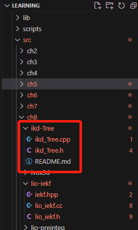
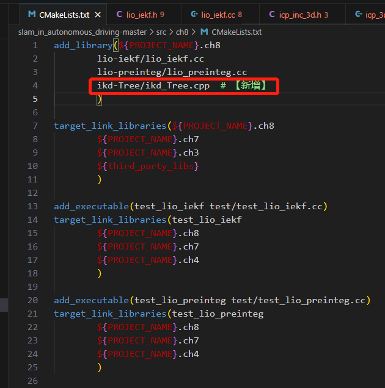
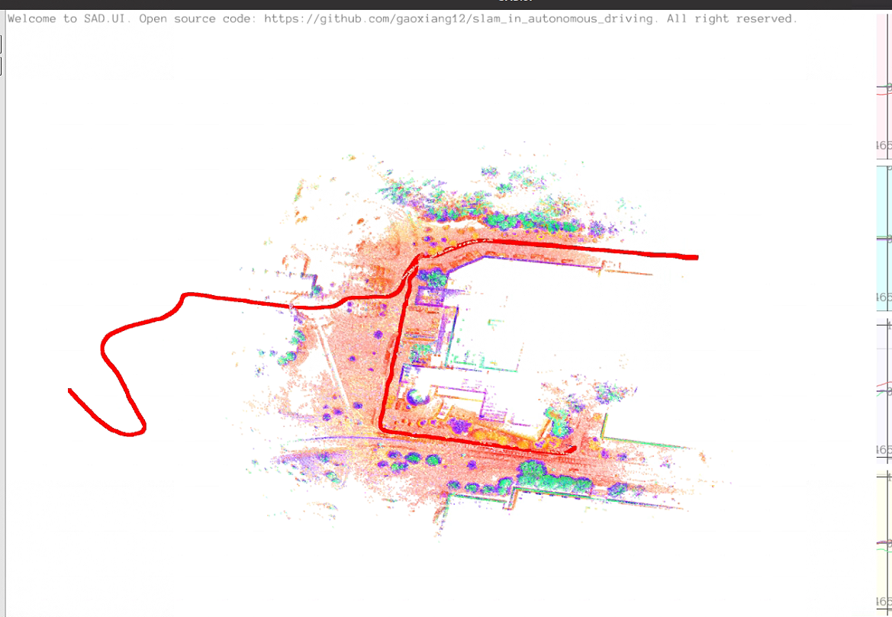
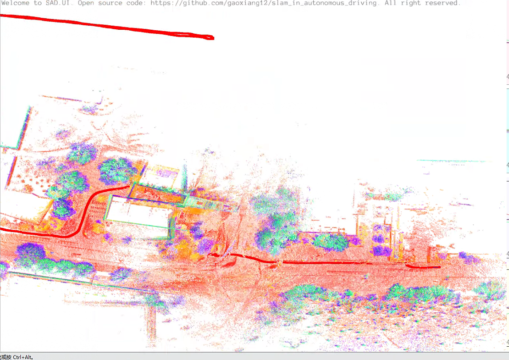

[TOC]

# 1. 如果在IEKF中引入点面ICP作为观测方程，请说明观测方程的具体处理方式，以及IEKF和纯激光ICP之间的关系。

**答：**

**将点面ICP替换掉增量式NDT，残差计算也相应地需要改为点面距离**。

假设两个点云$S_1,S_2$之间的变换$\boldsymbol{R,t}$。对于某个点$\boldsymbol q_i$进行变换后，寻找一些最近邻点，将它们拟合成一个平面。再假设拟合出的平面参数为$(\boldsymbol n, d)\in \mathbb R^4$，其中$\boldsymbol n$为单位长度法线，$d$为截距。对于平面外的点$\boldsymbol p$，其到平面的距离为$\boldsymbol n^\top \boldsymbol p + d$，那么可以建立点$\boldsymbol q_i$到它变换后点的几个**最近邻点构成的平面之间的误差函数**为：

$$
\boldsymbol e_i = \boldsymbol n^\top (\boldsymbol R \boldsymbol q_i + \boldsymbol t) + d
$$

其中$|\boldsymbol n| = 1$为单位法向量。

那么，观测方程为：

$$
h(\boldsymbol x) = \boldsymbol n^\top (\boldsymbol R \boldsymbol q_i + \boldsymbol t) + d
$$

在$\delta \boldsymbol x=0$处进行一阶泰勒展开，得到：

$$
h(\boldsymbol x) = h(\hat{\boldsymbol x}+\delta\boldsymbol x) \approx h(\hat{\boldsymbol x}) + \boldsymbol H \delta \boldsymbol x + \boldsymbol v
$$

$\boldsymbol v$是激光观测噪声，服从均值为0，协方差为$\boldsymbol V_{M\times M}$的高斯分布$\boldsymbol v\sim\mathcal N(0,\boldsymbol V)$，


由高斯分布概率密度函数的定义，**单次点面ICP的观测服从一维高斯分布**$\mathcal N(0,\sigma^2)$：

$$
P(\boldsymbol n^\top (\boldsymbol R \boldsymbol q_i + \boldsymbol t) + d) = \frac{1}{\sqrt{2\pi}\sigma}\exp\left(-\frac{1}{2}\frac{(\boldsymbol n^\top(\boldsymbol R \boldsymbol q_i + \boldsymbol t) + d)^2}{\sigma^2}\right)
$$

要取观测的最大似然估计，可以使用最小化负对数来求：

$$
-\ln(P(\boldsymbol n^\top (\boldsymbol R \boldsymbol q_i + \boldsymbol t) + d)) = \underbrace{\frac{1}{2}\ln\left(2\pi\sigma^2\right)}_{与\mathbf{R,t}无关，可略} + \frac{1}{2}\frac{(\boldsymbol n^\top(\boldsymbol R \boldsymbol q_i + \boldsymbol t) + d)^2}{\sigma^2}
$$

从上式可以发现，**对原始函数$P(\boldsymbol n^\top (\boldsymbol R \boldsymbol q_i + \boldsymbol t) + d)$求最大化，相当于对负对数求最小化，而第一项与$\mathbf{R,t}$无关，可以略去。因此，只需要最小化右侧的二次型项即可，就能得到对位姿状态的最大似然估计了**。

$$
\begin{align}
    (\mathbf{R,t})^* &= \arg\max_{\mathbf{R,t}} \prod_iP(\boldsymbol n^\top (\boldsymbol R \boldsymbol q_i + \boldsymbol t) + d) \notag\\
    &= \arg\min_{\mathbf{R,t}} \sum_i \left[\frac{(\boldsymbol n^\top(\boldsymbol R \boldsymbol q_i + \boldsymbol t) + d)^2}{\sigma^2}\right]\notag\\
    &= \arg\min_{\mathbf{R,t}} \sum_i \frac{\mathbf e_i^2}{\sigma^2}\notag\\
\end{align}
$$

对于上式的最小二乘问题的高斯牛顿解法为：

$$
\sum_i (\boldsymbol J_i^\top \frac{1}{\sigma^2}  \boldsymbol J_i) \Delta \boldsymbol x = -\sum_i \boldsymbol J_i^\top \frac{1}{\sigma^2} \boldsymbol e_i
$$


<!-- 而在$\boldsymbol x_k$的视角下，误差状态的先验分布为：

$$
\delta \boldsymbol x_k \sim \mathcal N(0,\boldsymbol P_k) = \mathcal N(0,\boldsymbol J_k \boldsymbol P_{pred}\boldsymbol J_k^\top)
$$

其中，$\boldsymbol J_k$描述了$\boldsymbol P_{pred}$与$\boldsymbol P_k$之间的关系。 -->
<!-- 
那么，相当于一致条件概率密度函数$\boldsymbol p(\delta \boldsymbol z|\delta \boldsymbol x)$和先验概率密度函数$\boldsymbol p(\delta\boldsymbol x)$，且条件概率分布和先验分布均服从高斯分布，那么可以得到后验概率密度函数为： -->


<!-- 对于IEKF的每次迭代都是在**求解带先验的最小二乘问题**：

$$
\delta\boldsymbol x_k = \arg\min_{\delta\boldsymbol x_k} \|\boldsymbol z     - \boldsymbol H_k(\boldsymbol x_k\boxplus\delta\boldsymbol x)\|_{\boldsymbol V}^2 + \|\delta\boldsymbol x_k\|_{\boldsymbol P_k}^2
$$

上式第一项为**点面ICP观测部分的残差**，第二项为**投影过来的先验残差**。 -->


由于点面ICP的残差就是距离值，那么其中$\Delta \boldsymbol x$是每一步的增量，$\boldsymbol J_i$是点面距离残差相对于状态量的雅可比。由**右扰动模型**的推导可知：

$$
\begin{align}
    \frac{\partial(\boldsymbol R \boldsymbol q_i + \boldsymbol t)}{\partial \boldsymbol R} &= \lim_{\boldsymbol\phi\rightarrow0}\frac{(\boldsymbol R\mathrm{Exp}(\boldsymbol\phi) \boldsymbol q_i + \boldsymbol t) -(\boldsymbol R \boldsymbol q_i + \boldsymbol t)}{\boldsymbol\phi} \notag\\ 
    &=  \lim_{\boldsymbol\phi\rightarrow0}\frac{\boldsymbol R(\boldsymbol I + \boldsymbol\phi^\wedge) \boldsymbol q_i - \boldsymbol R \boldsymbol q_i}{\boldsymbol\phi} \notag\\
    &=  \lim_{\boldsymbol\phi\rightarrow0}\frac{\boldsymbol R \boldsymbol\phi^\wedge \boldsymbol q_i}{\boldsymbol\phi} = \lim_{\boldsymbol\phi\rightarrow0}\frac{-\boldsymbol R \boldsymbol q_i^\wedge \boldsymbol\phi }{\boldsymbol\phi}= -\boldsymbol R \boldsymbol q_i^\wedge\notag
\end{align}
$$

那么：

$$
\begin{align}
\frac{\partial \boldsymbol e_i}{\partial \boldsymbol R} &= \boldsymbol n^\top \frac{\partial(\boldsymbol R \boldsymbol q_i + \boldsymbol t)}{\partial \boldsymbol R} = -\boldsymbol n^\top \boldsymbol R \boldsymbol q_i^\wedge\notag\\
\frac{\partial \boldsymbol e_i}{\partial \boldsymbol t} &= \boldsymbol n^\top \notag
\end{align}
$$

那么按照状态变量的定义顺序，**第$j$个点的残差相对于六个估计状态的雅克比矩阵**为：

$$
\begin{align}
    \boldsymbol J_j &= \begin{bmatrix}\frac{\partial \boldsymbol e_j}{\partial\boldsymbol t}&\boldsymbol 0_3&\frac{\partial \boldsymbol e_j}{\partial\boldsymbol R}&\boldsymbol 0_3&\boldsymbol 0_3&\boldsymbol 0_3\end{bmatrix} \notag\\&= \begin{bmatrix}\boldsymbol n^\top&\boldsymbol 0_3&-\boldsymbol n^\top \boldsymbol R \boldsymbol q_j^\wedge&\boldsymbol 0_3&\boldsymbol 0_3&\boldsymbol 0_3\end{bmatrix}_{1\times 18}\notag
\end{align}
$$

此时，滤波器中的$\boldsymbol H_k$的第$j$行为$\boldsymbol J_j$：

$$\boldsymbol H_k = \begin{bmatrix}
    \cdots\\\boldsymbol J_j\\\cdots
\end{bmatrix}_{M\times 18}
$$

由于噪声协方差矩阵$\boldsymbol V$是一个$M\times M$的对角矩阵，**对角线上的值**为$\frac{1}{\sigma^2}$，于是卡尔曼增益公式中的$\boldsymbol H_k^T\boldsymbol V^{-1}\boldsymbol H_k$可以写成**求和形式**：

$$
\boldsymbol H_k^T\boldsymbol V^{-1}\boldsymbol H_k = \sum_j \boldsymbol J_j^\top \frac{1}{\sigma^2}\boldsymbol J_j
$$

而右侧的$\boldsymbol H_k^T\boldsymbol V^{-1}$再乘以$(\boldsymbol z-\boldsymbol h(\boldsymbol x_k))$，可得：

$$
\boldsymbol H_k^T\boldsymbol V^{-1}(\boldsymbol z-\boldsymbol h(\boldsymbol x_k)) = [\cdots,\boldsymbol J_j^\top,\cdots] \mathrm{diag}(\cdots,\frac{1}{\sigma^2},\cdots)\begin{bmatrix}
    \cdots\\\boldsymbol e_j\\\cdots
\end{bmatrix}= \sum_j \boldsymbol J_j^\top \frac{1}{\sigma^2}\boldsymbol e_j
$$

因此，中间部分的$\boldsymbol H_k^T\boldsymbol V^{-1}\boldsymbol H_k$可以**在点面ICP内部的求和代入**。这样，**整个IESKF滤波器的解算有ICP联系起来了**。在这种程度上，完全可以**将紧耦合系统看出带IMU预测的高维ICP**，并且这些预测分布还会被推导至下一时刻。


# 2. 实现基于点面ICP的IEKF LIO系统，给出实现代码和实验展示（注意local map的处理方式和NDT有所不同）。

**答：**

通过这几天现学并阅读fast-lio与faster-lio的代码实现，由于需要用到点面ICP，平面拟合部分仍然可以使用```src/common/math_utils.h```中的函数```math::FitPlane()```，但第5章中实现的kdtree无法用于IEKF中增量式的更新，因此这里采用fast-lio中的ikdtree，或者faster-lio中的ivox。下面以ikdtree为例，介绍具体实现过程。ikdtree共有两个文件，一个h头文件，一个cpp实现，只需要将ikd_Tree加入SAD项目的ch8目录下。

<center>
    
    <div>
    idk-Tree
    </div>
</center>

然后在```ch8```目录下的CMakeLists.txt中添加：

<center>
    
    <div>
    idk-Tree
    </div>
</center>

此外，模仿ndt_inc的实现，在```ch7```目录下增加一个增量式icp_inc的头文件以及对应实现。在其中主要完成增量式kdtree构建，以及、计算点面残差和雅可比函数。


```c++
#ifndef SLAM_IN_AUTO_DRIVING_ICP_INC_3D_H
#define SLAM_IN_AUTO_DRIVING_ICP_INC_3D_H

// #include "ch5/kdtree.h"
#include "common/eigen_types.h"
#include "common/point_types.h"
#include "ch8/ikd-Tree/ikd_Tree.h"    // 【新增】用于构建增量式kd-tree，来自fast-lio

#include <glog/logging.h>

namespace sad {

class IncIcp3d {
   public:
    struct Options {
        int max_iteration_ = 20;                // 最大迭代次数
        double max_plane_distance_ = 0.05;      // 平面最近邻查找时阈值
        int min_effective_pts_ = 10;            // 最近邻点数阈值
        double eps_ = 1e-2;                     // 收敛判定条件
        bool use_initial_translation_ = false;  // 是否使用初始位姿中的平移估计
    };

    IncIcp3d() {}
    IncIcp3d(Options options) : options_(options) {}

    /// 设置目标的Scan
    void SetTarget(CloudPtr target) {
        target_ = target;
        BuildTargetKdTree();

        // 计算点云中心
        target_center_ = std::accumulate(target->points.begin(), target_->points.end(), Vec3d::Zero().eval(),
                                         [](const Vec3d& c, const PointType& pt) -> Vec3d { return c + ToVec3d(pt); }) /
                         target_->size();
        LOG(INFO) << "target center: " << target_center_.transpose();
    }

    /// 设置被配准的Scan
    void SetSource(CloudPtr source) {
        source_ = source;
        source_center_ = std::accumulate(source_->points.begin(), source_->points.end(), Vec3d::Zero().eval(),
                                         [](const Vec3d& c, const PointType& pt) -> Vec3d { return c + ToVec3d(pt); }) /
                         source_->size();
        LOG(INFO) << "source center: " << source_center_.transpose();
    }

    void ComputeResidualAndJacobians_P2Plane(const SE3& input_pose, Mat18d& HTVH, Vec18d& HTVr);

private:
    // 建立目标点云的Kdtree
    void BuildTargetKdTree();

    // std::shared_ptr<KdTree> kdtree_ = nullptr;  // 第5章的kd树
    std::shared_ptr<KD_TREE<PointType>> ikdtreePtr = nullptr;  // fast-lio中的增量式kd树

    CloudPtr target_ = nullptr;
    CloudPtr source_ = nullptr;

    Vec3d target_center_ = Vec3d::Zero();
    Vec3d source_center_ = Vec3d::Zero();

    Options options_;
};

}  // namespace sad

#endif  // SLAM_IN_AUTO_DRIVING_ICP_INC_3D_H
```

在cpp实现中：

```c++
#include "icp_inc_3d.h"
#include "common/math_utils.h"

#include <execution>

namespace sad {

void IncIcp3d::BuildTargetKdTree() {
    if (ikdtreePtr == nullptr) {    // 第一次调用，构建kd树
        ikdtreePtr = std::make_shared<KD_TREE<PointType>>();
        ikdtreePtr->Build(target_->points);
    } else {    // 后续调用，添加新的点云
        ikdtreePtr->Add_Points(target_->points, false);
    }
}

/**
 * @description: 计算残差和雅克比矩阵【新增】
 * @param {SE3&} input_pose
 * @param {Mat18d&} HTVH
 * @param {Vec18d&} HTVr
 * @return {*}
 */
void IncIcp3d::ComputeResidualAndJacobians_P2Plane(const SE3& input_pose, Mat18d& HTVH, Vec18d& HTVr) {
    LOG(INFO) << "aligning with point to plane";
    
    assert(target_ != nullptr && source_ != nullptr);

    // 大部分流程和前面的AlignP2Plane()是一样的，只是会把z, H, R三者抛出去，而非自己处理
    // 输入位姿，来自ESKF的Predict()函数预测得到的名义旋转R_、名义位移T_
    SE3 pose = input_pose;
    // if (!options_.use_initial_translation_) 
    //     pose.translation() = target_center_ - source_center_;  // 设置平移初始值

    // 初始化索引，0，1，2，3，4。。。
    int cnt_pts = source_->points.size();
    std::vector<int> index(cnt_pts);
    for (int i = 0; i < index.size(); ++i) 
        index[i] = i;
    std::vector<bool> effect_pts(index.size(), false);                    // 用于标记有效点
    std::vector<Eigen::Matrix<double, 1, 18>> jacobians(index.size());    // 用于存储雅可比矩阵
    std::vector<double> errors(index.size());                             // 用于存储残差
    // gauss-newton 迭代
    // 最近邻，可以并发
    std::for_each(  std::execution::par_unseq, 
                    index.begin(), index.end(), 
                    [&](int idx) {
                        // 并发遍历到点云中的某个点，不是按顺序遍历的
                        auto q = ToVec3d(source_->points[idx]);
                        Vec3d qs = pose * q;  // 雷达系转换到IMU系：P_I = R_IL * P_L + T_IL

                        // kd树中查找转换后点的5个最近邻
                        // std::vector<int> nn;
                        // kdtree_->GetClosestPoint(ToPointType(qs), nn, 5);  
                        
                        // [新增]kdtree search五个近邻点，存在nearest_points_[i]中
                        PointVec points_near;
                        // ivox_->GetClosestPoint(ToPointType(qs), points_near, 5);

                        vector<float> pointSearchSqDis(5);
                        ikdtreePtr->Nearest_Search(ToPointType(qs), 5, points_near, pointSearchSqDis);
                        // LOG(INFO) << "points_near.size(): " << points_near.size();
                        // 判断查找到近邻点数是否多于3个，平面方程拟合，a*x+b*y+c*z+d=0，最少需要4个点才能拟合出平面系数
                        if (points_near.size() > 3) {
                            std::vector<Vec3d> nn_eigen;
                            // 遍历近邻点集
                            for (int i = 0; i < points_near.size(); ++i) 
                                // 将近邻点转换为Vec3d类型存储
                                nn_eigen.emplace_back(ToVec3d(points_near[i]));
                            
                            Vec4d n;
                            // 对这几个近邻点执行平面拟合，平面系数a,b,c,d存储在四维向量n中
                            if (!math::FitPlane(nn_eigen, n)) {
                                effect_pts[idx] = false; // 平面拟合失败，标记为无效点
                                return;
                            }

                            // 计算点到平面的距离
                            double dis = n.head<3>().dot(qs) + n[3]; 
                            // 添加阈值检查判断拟合出的平面是否合理
                            if (fabs(dis) > options_.max_plane_distance_) {
                                // 点离的太远了不要
                                effect_pts[idx] = false;
                                return;
                            }

                            // 构建雅可比矩阵，对应公式（7.7）
                            Eigen::Matrix<double, 1, 18> J;
                            J.setZero(); // 其它四项1x3的块矩阵均为零矩阵
                            J.block<1, 3>(0, 0) = n.head<3>().transpose();
                            J.block<1, 3>(0, 6) = -n.head<3>().transpose() * pose.so3().matrix() * SO3::hat(q);

                            jacobians[idx] = J;
                            errors[idx] = dis;
                            effect_pts[idx] = true; // 标记为有效点
                        } else 
                            effect_pts[idx] = false;
                    });

    // 累加Hessian和error,计算dx
    double total_res = 0;
    int effective_num = 0;

    HTVH.setZero();
    HTVr.setZero();

    // 每个点反馈的info信息矩阵因子
    // 由于NDT点数明显多于预测方程，可能导致估计结果向NDT倾斜，
    // 给信息矩阵添加一个乘积因子0.01，让更新部分更加平滑一些。
    const double info_ratio = 1;//0.01;  

    for (int idx = 0; idx < effect_pts.size(); ++idx) {
        if (!effect_pts[idx]) 
            continue;

        total_res += errors[idx] * errors[idx];
        effective_num++;

        HTVH += jacobians[idx].transpose() * jacobians[idx] * info_ratio;    // 18x18
        HTVr += -jacobians[idx].transpose() * errors[idx] * info_ratio;      // 18x1
    }

    LOG(INFO) << "effective: " << effective_num;
}

}  // namespace sad
```

上面计算点面ICP的残差和雅可比矩阵的累加形式与NDT中的实现非常相似，理论部分与第一题中对应，最近邻搜索采用的是添加的增量式ikdtree。

然后在lio_iekf.h中增加一个IncIcp3d对象，并新增一个点面ICP配准的函数```AlignICP_ikdtree()```。

```c++
/**
 * @description: 仿照增量式NDT，新建一个icp_inc_3d.cc文件，实现增量式ICP
 * @return {*}
 */
void LioIEKF::AlignICP_ikdtree() {
    FullCloudPtr scan_undistort_trans(new FullPointCloudType);
    pcl::transformPointCloud(*scan_undistort_fullcloud_, *scan_undistort_trans, TIL_.matrix().cast<float>());
    scan_undistort_fullcloud_ = scan_undistort_trans;

    scan_undistort_ = ConvertToCloud<FullPointType>(scan_undistort_fullcloud_);

    // 点云降采样
    pcl::VoxelGrid<PointType> voxel;
    voxel.setLeafSize(0.5, 0.5, 0.5);
    voxel.setInputCloud(scan_undistort_);
    voxel.filter(*scan_down_body_); // 体素滤波，降采样

    /// the first scan
    if (flg_first_scan_) {
        // ndt_.AddCloud(scan_undistort_);
        icp_.SetTarget(scan_undistort_);  // 【新增】

        first_lidar_time_ = measures_.lidar_begin_time_;
        flg_first_scan_ = false;
        return;
    }

    // 后续的scan，使用NDT配合pose进行更新
    LOG(INFO) << "=== frame " << frame_num_;

    int cur_pts = scan_down_body_->size(); // 降采样后的去畸变点云数量

    // ndt_.SetSource(scan_down_body_);
    icp_.SetSource(scan_down_body_); // 【新增】为点面icp中的ikdtree设置原始点云
    ieskf_.UpdateUsingCustomObserve([this](const SE3 &input_pose, Mat18d &HTVH, Vec18d &HTVr) {
                                        // ndt_.ComputeResidualAndJacobians(input_pose, HTVH, HTVr);
                                        icp_.ComputeResidualAndJacobians_P2Plane(input_pose, HTVH, HTVr); // 【新增】计算点面残差和雅可比
                                    });

    auto current_nav_state = ieskf_.GetNominalState();

    // 若运动了一定范围，则把点云放入地图中
    SE3 current_pose = ieskf_.GetNominalSE3();
    SE3 delta_pose = last_pose_.inverse() * current_pose;

    if (delta_pose.translation().norm() > 1.0 || delta_pose.so3().log().norm() > math::deg2rad(10.0)) {
        // 将地图合入NDT中
        CloudPtr scan_down_world_2(new PointCloudType);
        pcl::transformPointCloud(*scan_down_body_, *scan_down_world_2, current_pose.matrix());
        // ndt_.AddCloud(scan_down_world_2);
        icp_.SetTarget(scan_down_world_2); // 【新增】为点面icp中的ikdtree设置目标点云，内部际是添加新的点云到ikdtree中
        last_pose_ = current_pose;
    }

    // 放入UI
    if (ui_) {
        ui_->UpdateScan(scan_undistort_, current_nav_state.GetSE3());  // 转成Lidar Pose传给UI
        ui_->UpdateNavState(current_nav_state);
    }

    frame_num_++;
    return;
}
```

然后，借鉴fastlio中的局部地图处理并增加函数```MapIncremental()```，

```c++
/**
 * @description: 局部地图处理
 * @return {*}
 */
void LioIEKF::MapIncremental() {
    PointVec points_to_add;
    PointVec point_no_need_downsample;

    int cur_pts = scan_down_body_->size();
    points_to_add.reserve(cur_pts);
    point_no_need_downsample.reserve(cur_pts);

    std::vector<size_t> index(cur_pts);
    for (size_t i = 0; i < cur_pts; ++i) 
        index[i] = i;

    // 并发处理
    std::for_each(  std::execution::unseq, 
                    index.begin(), index.end(), 
                    [&](const size_t &i) {
                        /* transform to world frame */
                        // 雷达系转换到世界系
                        // PointBodyToWorld(&(scan_down_body_->points[i]), &(scan_down_world_->points[i]));

                        /* decide if need add to map */
                        // 判断是否需要加入到局部地图中
                        PointType &point_world = scan_down_world_->points[i];

                        // 判断第i个点的近邻点集是否为空
                        if (!nearest_points_[i].empty() && flg_ESKF_inited_) {
                            // 取出第i个点的近邻点集
                            const PointVec &points_near = nearest_points_[i];

                            // 计算中心坐标
                            Eigen::Vector3f center = ((point_world.getVector3fMap() / filter_size_map_min_).array().floor() + 0.5) * filter_size_map_min_;

                            // 计算第i个点到中心点的L1距离
                            Eigen::Vector3f dis_2_center = points_near[0].getVector3fMap() - center;

                            // 判断距离是否大于阈值
                            if (fabs(dis_2_center.x()) > 0.5 * filter_size_map_min_ &&
                                fabs(dis_2_center.y()) > 0.5 * filter_size_map_min_ &&
                                fabs(dis_2_center.z()) > 0.5 * filter_size_map_min_) {
                                // 若是，则加入到无需降采样点集中
                                point_no_need_downsample.emplace_back(point_world);
                                return; // 程序返回？因为这里是lambda函数内部，所以返回的是lambda函数，而不是MapIncremental函数
                            }

                            // 此时，标记改为需要增加
                            bool need_add = true;
                            // 计算第i个点到中心点的L2距离
                            float dist = math::calc_dist(point_world.getVector3fMap(), center); // 【在math_utils.h】中添加了两个函数实现
                            // 判断近邻点数是否多于5个
                            if (points_near.size() >= options_.NUM_MATCH_POINTS) {
                                // 遍历所有近邻点
                                for (int readd_i = 0; readd_i < options_.NUM_MATCH_POINTS; readd_i++) {
                                    // 判断这些近邻点距离中心点的距离是否小于阈值
                                    if (math::calc_dist(points_near[readd_i].getVector3fMap(), center) < dist + 1e-6) {
                                        need_add = false; // 只要有一个距离很小的，就不需要增加了，直接跳出循环
                                        break;
                                    }
                                }
                            }
                            // 判断是否需要增加
                            if (need_add) 
                                // 加入到需要增加的点集中
                                points_to_add.emplace_back(point_world);
                        } else 
                            points_to_add.emplace_back(point_world);
                    });

    LOG(INFO) << "points_to_add.size: " << points_to_add.size() << " point_no_need_downsample.size: " << point_no_need_downsample.size();
    icp_.SetTarget(points_to_add);            // 【新增】为点面icp中的ikdtree设置目标点云，内部际是添加新的点云到ikdtree中
    icp_.SetTarget(point_no_need_downsample); // 【新增】为点面icp中的ikdtree设置目标点云，内部际是添加新的点云到ikdtree中
}
```

编译后，使用```nclt/20130110.bag```数据，效果如下图所示：

<center>
    
    <div>
    点面ICP的IEKF LIO的效果
    </div>
</center>

<center>
    
    <div>
    点面ICP的IEKF LIO的效果
    </div>
</center>


# 3. 参考资料

1. **《自动驾驶与机器人中的SLAM技术》**
2. [**Fast-lio: A fast, robust lidar-inertial odometry package by tightly-coupled iterated kalman filter**](https://arxiv.org/pdf/2010.08196.pdf)
3. [**Faster-LIO: Lightweight tightly coupled LiDAR-inertial odometry using parallel sparse incremental voxels**](https://ieeexplore.ieee.org/stamp/stamp.jsp?arnumber=9718203)
4. **https://github.com/gaoxiang12/slam_in_autonomous_driving**
5. **https://github.com/hku-mars/FAST_LIO**
6. **https://github.com/gaoxiang12/faster-lio**