[TOC]

# 1. 为本书的NDT设计一个匹配度评估指标，利用该指标可以判断NDT匹配的好坏。可以参考PCL NDT的transprobability值。也可以自己设计。

**答：**

通过学习PCL官网，可以发现PCL中的NDT实现是基于2009年Magnusson的博士论文《**The Three-Dimensional Normal-Distributions Transform — an Efficient Representation for Registration, Surface Analysis, and Loop Detection**》，于是下载了该论文，通过阅读**第6.2小节中关于NDT scan registration**的内容，特别是其中关于NDT匹配得分计算部分的理论与公式，现整理摘录如下所示。
<center>
    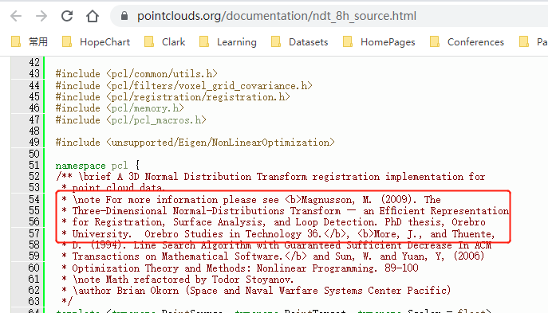
</center>

## 1.1 NDT匹配得分探究

当使用NDT进行扫描配准时，目标是找到当前扫描的姿态，使当前扫描的点位于参考扫描表面上的可能性最大化。要优化的参数是当前扫描scan的姿态估计的旋转和平移，可以用一个向量来进行编码。当前帧扫描可以表示为点云$\mathcal X = \{\vec x_1, \cdots, \vec x_n\}$。假设有一个空间变换函数$T(\vec p,\vec x)$，在空间中通过姿态$\vec p$移动点$\vec x$。给定扫描点的一些概率密度函数$p(\vec x)$，例如公式（6.1），最佳位姿$\vec p$应该是使似然函数最大化的位姿。

$$
\Psi = \prod_{k=1}^n p(T(\vec p,\vec x_k))\tag{6.5}
$$

或者，等价地，最小化$\Psi$的负对数似然函数：

$$
-\log\Psi = -\sum_{k=1}^n \log(p(T(\vec p,\vec x_k)))\tag{6.6}
$$

PDF并不一定局限于一个正态分布。任何能够局部捕获表面点的结构并对异常值具有鲁棒性的PDF都是合适的。对于远离均值的点，正态分布的负对数似然值呈无界增长。因此，scan扫描数据中的异常值可能对结果有很大的影响。在这项工作中（如在Biber，Fleck，和Straßer[8]的论文中）使用了正态分布和均匀分布的混合物：

$$
\bar p(\vec x) = c_1\exp\left(-\frac{(\vec x-\vec\mu)^T\Sigma^{-1}(\vec x-\vec\mu)}{2}\right) + c_2 p_0\tag{6.7}
$$

其中$p_0$是外点的期望比例。使用该函数，外点的影响是有界的。这一点如图6.5所示。常数$c_1$和$c_2$可以通过要求单元栅格所跨越的空间内$\bar p(\vec x)$的概率质量等于1来确定。

待优化的对数似然能量函数的和由具有以下形式的项组成：$-\log(c_1\exp(-((\vec x-\vec\mu)^\top\Sigma^{-1}(\vec x-\vec\mu))/2)+c_2)$。这些项没有简单的一阶和二阶导数。但是对数似然函数可以用高斯函数来近似，如下图所示。
<center>
    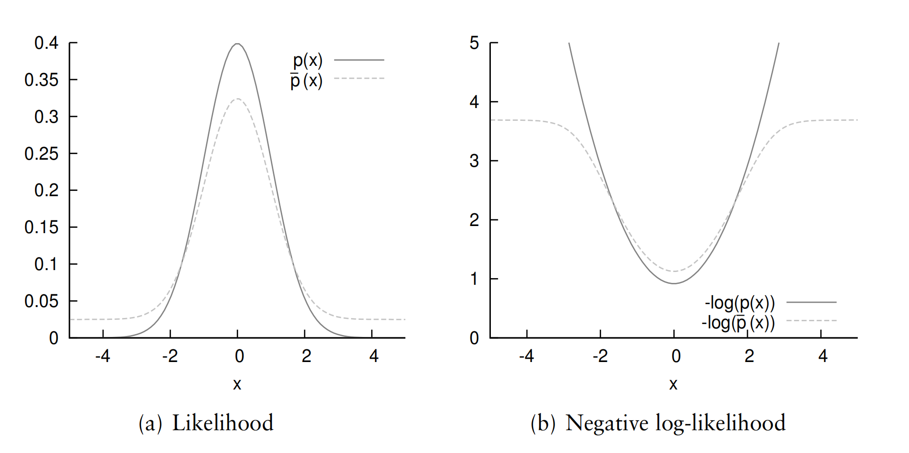
    <div>
    对数似然函数可近似为高斯函数
    </div>
</center>

例如，形如$\bar p(x) = -log(c_1\exp(-x^2/(2\sigma^2))+d_3)$的函数可以被近似为形如$\tilde p(x)=d_1\exp(-d_2 x^2/(2\sigma^2))+d_3$的高斯函数，通过要求$\tilde p(x)$应该类似于$x=0,x=\sigma,x=\infty$来拟合参数$d_i$：

$$
\begin{align}
    d_3 &= -\log(c_2)\notag\\
    d_1 &= -\log(c_1+c_2)-d_3\notag\\
    d_2 &= -2\log((-\log(c_1\exp(-1/2)+c_2)-d_3)/d_1)\notag
\end{align}\tag{6.8}
$$

使用这样一个高斯近似，当前帧扫描点云中的一个点对NDT评分函数的影响为：

$$
\tilde p(\vec x_k) = -d_1\exp\left(-\frac{d_2}{2}(\vec x_k - \vec\mu_k)^\top\Sigma_k^{-1}(\vec x_k-\vec\mu_k)\right)\tag{6.9}
$$

其中，$\vec\mu_k, \Sigma_k$分别是扫描点所处NDT栅格中的均值与协方差矩阵。NDT得分函数比公式（6.7）中的对数形式有更简单的导数，但在优化中使用时仍然显示出相同的一般性质。需要注意$d_3$项已经从公式（6.9）中略去。当NDT用于扫描配准时，不需要用到，这是因为它只向评分函数添加了一个常量便宜，而不改变它的形状或者优化的参数。

因此，给定一组点云$\mathcal X = \{\vec x_1,\cdots,\vec x_n\}$，一个位姿$\vec p$，以及一个在空间中利用位姿$\vec p$变换点$\vec x$坐标的函数$T(\vec p,\vec x)$，那么NDT匹配得分可以计算为：

$$
s(\vec p) = -\sum_{k=1}^n \tilde p(T(\vec p,\vec x_k))\tag{6.10}
$$

上式表示，通过位姿$\vec p$进行变换后的点$\vec x_k$位于参考帧扫描点云上的可能性有多大，也就是**NDT匹配的好坏程度**。

## 1.2 PCL中NDT匹配得分计算源码解析

找到```pcl/registration/include/pcl/registration/ndt.h```和```pcl/registration/include/pcl/registration/impl/ndt.hpp```中的函数声明与定义

在构造函数```NormalDistributionsTransform()```中可以发现上面 **公式(6.8)** 对应的参数$c_1,c_2,d_1,d_2,d_3$的计算过程。

```c++
// Initializes the gaussian fitting parameters (eq. 6.8) [Magnusson 2009]
const double gauss_c1 = 10.0 * (1 - outlier_ratio_);
const double gauss_c2 = outlier_ratio_ / pow(resolution_, 3);
const double gauss_d3 = -std::log(gauss_c2);
gauss_d1_ = -std::log(gauss_c1 + gauss_c2) - gauss_d3;
gauss_d2_ = -2 * std::log((-std::log(gauss_c1 * std::exp(-0.5) + gauss_c2) - gauss_d3) / gauss_d1_);
```
而其中```outlier_ratio_```是外点的期望比例，默认值为0.55；```resolution_```是NDT栅格的分辨率，默认值为1.0米。

计算得到这五个参数后，通过```computeDerivatives()```函数找到计算NDT匹配得分累加和的整个过程（这里我仅关注匹配得分的计算，忽略掉雅可比与海森矩阵的计算过程）：

```c++
NormalDistributionsTransform<PointSource, PointTarget, Scalar>::computeDerivatives(
    Eigen::Matrix<double, 6, 1>& score_gradient,
    Eigen::Matrix<double, 6, 6>& hessian,
    const PointCloudSource& trans_cloud,
    const Eigen::Matrix<double, 6, 1>& transform,
    bool compute_hessian)
{
    double score = 0;
    // Update gradient and hessian for each point, line 17 in Algorithm 2 [Magnusson 2009]
    for (std::size_t idx = 0; idx < input_->size(); idx++) {
        // Transformed Point
        const auto& x_trans_pt = trans_cloud[idx];

        // 忽略梯度与海森矩阵的计算
        // 。。。

        for (const auto& cell : neighborhood) {
            // Original Point
            const auto& x_pt = (*input_)[idx];
            const Eigen::Vector3d x = x_pt.getVector3fMap().template cast<double>();

            // Denorm point, x_k' in Equations 6.12 and 6.13 [Magnusson 2009]
            const Eigen::Vector3d x_trans = x_trans_pt.getVector3fMap().template cast<double>() - cell->getMean();
            // Inverse Covariance of Occupied Voxel
            // Uses precomputed covariance for speed.
            const Eigen::Matrix3d c_inv = cell->getInverseCov();

            // 忽略梯度与海森矩阵的计算
            // 。。。

            // Update score, gradient and hessian, lines 19-21 in Algorithm 2, according to
            // Equations 6.10, 6.12 and 6.13, respectively [Magnusson 2009]
            score += updateDerivatives(score_gradient, hessian, x_trans, c_inv, compute_hessian);
        }
    }
    return score;
}
```
可以发现单个点的匹配得分计算是在函数```updateDerivatives()```中完成的，同样忽略梯度与海森矩阵的计算：

```c++
template <typename PointSource, typename PointTarget, typename Scalar>
double
NormalDistributionsTransform<PointSource, PointTarget, Scalar>::updateDerivatives(
    Eigen::Matrix<double, 6, 1>& score_gradient,
    Eigen::Matrix<double, 6, 6>& hessian,
    const Eigen::Vector3d& x_trans,
    const Eigen::Matrix3d& c_inv,
    bool compute_hessian) const
{
    // e^(-d_2/2 * (x_k - mu_k)^T Sigma_k^-1 (x_k - mu_k)) Equation 6.9 [Magnusson 2009]
    double e_x_cov_x = std::exp(-gauss_d2_ * x_trans.dot(c_inv * x_trans) / 2);

    // Calculate likelihood of transformed points existence, Equation 6.9 [Magnusson 2009]
    const double score_inc = -gauss_d1_ * e_x_cov_x;

    // 忽略梯度与海森矩阵的计算
    // 。。。

    return score_inc;
}
```

整个计算匹配得分的过程与**公式（6.9）、（6.10）** 完全一致。因此可以将上面的实现思路作为NDT匹配度评估指标，融合到SAD第7章ndt_3d的代码中。接下来，在第2题中将会实现这一指标，然后利用该指标判断回环检测是否有效。

## 1.3 模仿PCL简单设计一个NDT匹配得分计算指标

现在，已知**1.1，1.3小节**中PCL内部NDT匹配得分计算的原理与代码实现后，结合原先第7章中的ndt_3d的代码的已有实现，可以设计出如下的NDT匹配度评估指标，用于判断NDT匹配的好坏，原则之一就是利用概率越大，匹配得分越高，则说明NDT匹配的越好。

又由于高博书上说，关于NDT的推导与原论文Magnusson 2009博士论文中有较大差异，省略了原始混合在NDT中的均匀分布，因此这里的NDT匹配度评估指标的设计，是基于高博书上的推导，而不必完全按照PCL的NDT匹配得分计算的原理与代码来实现。


<center>
    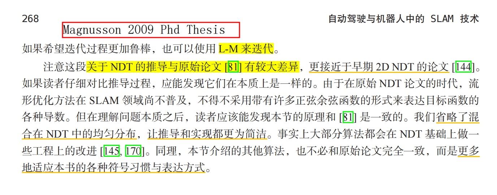
    <div>
    高博书上NDT的推导与原论文Magnusson 2009博士论文中有较大差异
    </div>
</center>

由高博书上公式（7.14）最大似然估计可知，求解加权最小二乘问题中的最优$\boldsymbol{R,t}$，相当于最大化每个source点云中的点落在由target点云构建的所在体素栅格的概率分布，也就是说，既然目标栅格中的点云符合某个统计形状，那么在正确位姿估计下，落在其中的点也应当符合这个分布。

$$
(\boldsymbol{R,t})^* = \arg\max_{\boldsymbol{R,t}} \prod_i P(\boldsymbol R\boldsymbol q_i+\boldsymbol t)\tag{7.14}
$$

由高斯分布概率密度函数的定义，单次观测为：

$$
P(\mathbf {Rq}_i +\mathbf t) = \frac{1}{\sqrt{(2\pi)^N\mathrm{det}(\Sigma_i)}}\exp\left(-\frac{1}{2}(\mathbf {Rq}_i +\mathbf t-\mu_i)^\top\Sigma_i^{-1}(\mathbf {Rq}_i +\mathbf t-\mu_i)\right)
$$

那么，可以直接利用右边部分的$\exp\left(-\frac{1}{2}(\mathbf {Rq}_i +\mathbf t-\mu_i)^\top\Sigma_i^{-1}(\mathbf {Rq}_i +\mathbf t-\mu_i)\right)$，对应于SAD代码中的：

```c++
double res = errors[idx].transpose() * infos[idx] * errors[idx];
double score = std::exp(-res/2.0);
```

这与pcl中NDT匹配得分的计算方式很接近了，只不过**没有计算系数d1，d2，这里仅简单地计算为残差的卡方除以2再取对数**：

```c++
double score_inc = -gauss_d1_ * std::exp(-gauss_d2_ * x_trans.dot(c_inv * x_trans) / 2);
```

最后只需要将该得分累加起来，但是值得注意的是，**PCL中最后的累加得分除以的是source点云中点的总数目，而不是所有的有效点数**：

```c++
trans_likelihood_ = score / static_cast<double>(input_->size());
```

至此，关于NDT匹配得分的理论、PCL中实现以及简单自定义指标设计的过程已经完成，接下来就是实现该指标并利用设计的这个简单指标来判断建图中回环检测是否有效。

# 2. 利用第1题的指标，修改程序，实现mapping部分的回环检测。注意要利用分值好坏来判断回环检测是否有效。

**答：**

## 2.1 NDT匹配得分计算实现与test_icp测试
模仿PCL中匹配得分的计算思路，

首先，在```ndt3d.h```中增加一个NDT匹配得分的成员变量，以及获取该匹配得分的函数：

```c++
// 【新增】获取NDT匹配得分
double GetNDTMatchingScore() {
    return ndt_matching_score_;
}
```

根据第1.3小节中设计的简易版NDT匹配得分计算方式，找到```ndt_3d.cpp```中的```Ndt3d::AlignNdt(SE3& init_pose)```函数，将NDT匹配得分计算的过程融合进去，累加求和的地方位于最近邻并发for_each遍历之后，：

```c++
// 原则上可以用reduce并发，写起来比较麻烦，这里写成accumulate
double total_res = 0;
int effective_num = 0;

// 【新增】计算NDT匹配得分累加和
double score = 0;

Mat6d H = Mat6d::Zero();
Vec6d err = Vec6d::Zero();

for (int idx = 0; idx < effect_pts.size(); ++idx) {
    if (!effect_pts[idx]) 
        continue;

    // 先用临时变量res存储残差的卡方值，对应高斯分布概率密度函数的指数部分的内容
    double res = errors[idx].transpose() * infos[idx] * errors[idx];
    total_res += res;

    // 【新增】对应于1.3小节中设计的简易版NDT匹配得分计算方式，并完成匹配得分的累加
    score += std::exp(-res/2.0);

    effective_num++;

    H += jacobians[idx].transpose() * infos[idx] * jacobians[idx];
    err += -jacobians[idx].transpose() * infos[idx] * errors[idx];
}
```
每完成一次迭代之后，将NDT累加匹配得分按照论文公式除以输入点云的点数，得到平均匹配得分：

```c++
ndt_matching_score_ = score / index.size();
```
最后在外部通过调用```GetNDTMatchingScore()```函数获取到平均匹配得分，用于判断回环检测是否有效。

## 2.2 mapping部分回环检测实现

再来修改第九章中回环检测中多分辨率NDT实现替换掉原本使用的PCL版本NDT

首先在```loopclousure.cc```文件中的```ComputeForCandidate()```函数中增加第7章中的Ndt3d对象，

```c++
    // 创建一个NDT高斯分布变换对象
    pcl::NormalDistributionsTransform<PointType, PointType> ndt_pcl;

    ndt_pcl.setTransformationEpsilon(0.05);     
    ndt_pcl.setStepSize(0.7);   // 设置线搜索允许的最大步长
    ndt_pcl.setMaximumIterations(40);

    Ndt3d ndt;  // 【新增】自己实现的3D NDT

    // 第一轮优化得到的SE3位姿转换为Eigen::Matrix4f类型
    Mat4f Tw2 = kf2->opti_pose_1_.matrix().cast<float>();
    SE3 Tw2_se3 = kf2->opti_pose_1_;

    /// 不同分辨率下的匹配
    CloudPtr output(new PointCloudType);
    std::vector<double> res{10.0, 5.0, 4.0, 3.0}; // 分辨率由大到小
    // 多分辨率NDT，由粗到精的配准过程
    for (auto& r : res) {
        // 指定不同分辨率，对点云进行体素滤波voxel filter
        auto rough_map1 = VoxelCloud(submap_kf1, r * 0.1); // 滤波后的子地图1
        auto rough_map2 = VoxelCloud(submap_kf2, r * 0.1); // 滤波后的子地图2

        // 【新增】切换是否使用PCL版本的NDT 还是 第七章中的Ndt3d
        if(use_pcl_ndt_) {
            // LOG(INFO) << "pcl ndt: ";
            ndt_pcl.setResolution(r);   // 设置内部NDT网格结构的体素分辨率
            ndt_pcl.setInputTarget(rough_map1);
            ndt_pcl.setInputSource(rough_map2);
            ndt_pcl.align(*output, Tw2);
            Tw2 = ndt_pcl.getFinalTransformation();
        } else {
            // LOG(INFO) << "7th chapter ndt: ";
            ndt.SetResolution(r);       // 【新增】设置自己实现的3D NDT的分辨率
            ndt.SetTarget(rough_map1);  // 【新增】设置自己实现的3D NDT的目标点云
            ndt.SetSource(rough_map2);  // 【新增】设置自己实现的3D NDT的源点云
            ndt.AlignNdt(Tw2_se3);
        }        
    }

    if(use_pcl_ndt_) {
        Mat4d T = Tw2.cast<double>();
        Quatd q(T.block<3, 3>(0, 0));
        q.normalize();
        Vec3d t = T.block<3, 1>(0, 3);
        c.Tij_ = kf1->opti_pose_1_.inverse() * SE3(q, t);
        c.ndt_score_ = ndt_pcl.getTransformationProbability();
        LOG(INFO) << "ndt_pcl_score_: "<<ndt_pcl.getTransformationProbability();
    }
    else {
        Mat4d T = Tw2_se3.matrix().cast<double>();
        Quatd q(T.block<3, 3>(0, 0));
        q.normalize();
        Vec3d t = T.block<3, 1>(0, 3);
        c.Tij_ = kf1->opti_pose_1_.inverse() * SE3(q, t);
        c.ndt_score_ = ndt.GetNDTMatchingScore();  // 【新增】
        LOG(INFO) << "ndt_score_: "<<ndt.GetNDTMatchingScore();
    }      
```
为了便于切换pcl版本NDT和第七章实现的Ndt3d，在mapping.yaml配置文件中增加一个bool类型的参数```use_pcl_ndt```，默认为true，即使用pcl版本的NDT，若设置为false，则使用第七章实现的Ndt3d。此外由于匹配得分阈值PCL中NDT使用的默认值为4.5：

```yaml
loop_closing:
  ndt_score_th: 4.5
  min_id_interval: 100
  skip_id: 5
  min_distance: 30
use_pcl_ndt: false # 【新增】
```
然后将其作为成员遍历，并在```Init()```函数中增加该参数加载

```c++
use_pcl_ndt_ = yaml["use_pcl_ndt"].as<bool>(); // 是否使用PCL NDT库
```

使用PCL版本NDT运行run_loopclosure.cc：

<center>
    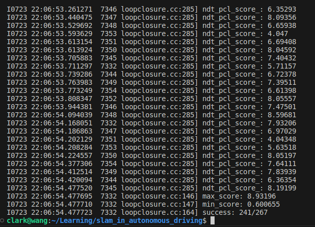
    <div>
    NDT匹配得分阈值为4.5时，使用PCL版本NDT
    </div>
</center>

可以发现阈值```ndt_score_th```均为**4.5**时，PCL版本的NDT的成功率为**241/267=90.26%**。因此对于Ndt3d**可以适当调低阈值**，使其能够达到与PCL版本NDT相同的成功率。经测试发现，ndt3d匹配得分的范围为0.027061到0.3478，当阈值```ndt_score_th```修改为**0.16**时，**Ndt3d的成功率为243/267=91%，与默认阈值4.5时的PCL版本NDT的成功率相当。**

<center>
    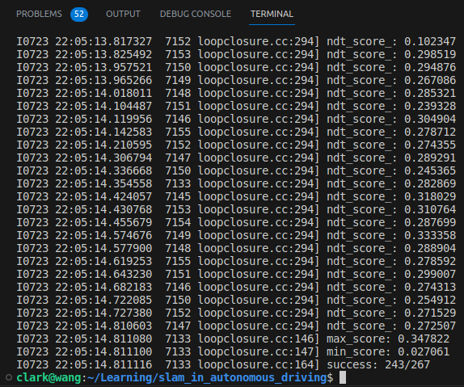
    <div>
    NDT匹配得分阈值调低为0.16时，使用第七章实现的Ndt3d时，成功率为243/267=91%，与PCL的NDT相当
    </div>
</center>

# 3. 将建图结果导出为NDT map，即将NDT体素内的均值和协方差都存储成文件。同样建议分块存储。

**答：**

地图切分程序主要学习参考基于第9章中的split_map.cc程序的主框架，因为需要将NDT体素内的均值和协方差都存储成文件，关键帧点云处理、以及100x100米的地图区块划分等部分都可以继续使用，但需要考虑NDT的分辨率设置问题，由于后面fusion离线融合定位中需要在RTK初始搜索中用到多分辨率的NDT点云配准来进行最优角度搜索，原本使用的是PCL版本的NDT，共设置了四档分辨率：由粗到细为10.0米，5.0米，4.0米，3.0米。

```c++
CloudPtr output(new PointCloudType);
// 分别在10m, 5m, 4m, 3m的分辨率下进行NDT配准
std::vector<double> res{10.0, 5.0, 4.0, 3.0}; // 四种体素分辨率
Mat4f T = gr.pose_.matrix().cast<float>();
for (auto& r : res) {
    auto rough_map = VoxelCloud(map, r * 0.1);
    ndt_pcl.setInputTarget(rough_map);
    ndt_pcl.setResolution(r);
    ndt_pcl.align(*output, T);
    // 将上一个粗配准结果代入下一次配准中
    T = ndt_pcl.getFinalTransformation(); 
}
// 最后获取3米栅格分辨率下的的NDT匹配结果作为分值判定
gr.score_ = ndt_pcl.getTransformationProbability();
// 获取最后一次配准得到的位姿
gr.result_pose_ = Mat4ToSE3(ndt_pcl.getFinalTransformation());
```

其次在激光点云定位时也需要用到NDT点云匹配（体素分辨率设为了1.0米）。

因此**可以考虑对100x100地图区块内的点云构建指定分辨率的NDT体素，计算每个体素栅格块的均值、协方差矩阵与信息矩阵**。构建NDT体素的过程以借鉴第7章```ndt_3d.cc```中的```BuildVoxels()```函数，稍作修改，如下所示：

```c++
/**
 * @description: 构建NDT体素
 * @param target_ 目标点云
 * @return {*}
 */
void BuildNdtMapVoxels(CloudPtr target_, std::unordered_map<KeyType, Ndt3d::VoxelData, hash_vec<3>>& grids_, double voxel_size) {
    assert(target_ != nullptr); // 目标点云指针不能为空
    assert(target_->empty() == false);  // 目标点云不能为空
    grids_.clear(); // 清空体素栅格

    double inv_voxel_size = 1.0 / voxel_size;

    /// 分配体素索引
    std::vector<size_t> index(target_->size());
    std::for_each(index.begin(), index.end(), [idx = 0](size_t& i) mutable { i = idx++; });

    // 生成体素栅格
    std::for_each(index.begin(), index.end(), [&](const size_t& idx) {
        auto pt = ToVec3d(target_->points[idx]);
        // 对目标点云中的每个点，计算它所在的体素栅格ID
        auto key = (pt * inv_voxel_size).cast<int>(); 

        // 查看该栅格是否已存在
        if (grids_.find(key) == grids_.end()) 
            grids_.insert({key, {idx}}); // 若不存在，则插入该栅格
        else 
            grids_[key].idx_.emplace_back(idx); // 若存在，则将该点的索引插入到该体素栅格中
    });

    // 并发遍历所有体素栅格
    std::for_each(std::execution::par_unseq, 
                grids_.begin(), grids_.end(), 
                [&](auto& v) {
                    // 判断体素中的点数是否大于阈值3个
                    if (v.second.idx_.size() > 3) {
                        // 要求至少有３个点，才会计算每个体素中的均值和协方差
                        math::ComputeMeanAndCov(v.second.idx_, 
                                                v.second.mu_, v.second.sigma_,
                                                [&](const size_t& idx) { 
                                                    return ToVec3d(target_->points[idx]); 
                                                });
                        // SVD 检查最大与最小奇异值，限制最小奇异值
                        Eigen::JacobiSVD svd(v.second.sigma_, Eigen::ComputeFullU | Eigen::ComputeFullV);
                        Vec3d lambda = svd.singularValues();
                        if (lambda[1] < lambda[0] * 1e-3) 
                            lambda[1] = lambda[0] * 1e-3;

                        if (lambda[2] < lambda[0] * 1e-3) 
                            lambda[2] = lambda[0] * 1e-3;

                        Mat3d inv_lambda = Vec3d(1.0 / lambda[0], 1.0 / lambda[1], 1.0 / lambda[2]).asDiagonal();
                        v.second.info_ = svd.matrixV() * inv_lambda * svd.matrixU().transpose(); // 信息矩阵
                    }
                });

    // 遍历所有体素栅格
    for (auto iter = grids_.begin(); iter != grids_.end();) {
        if (iter->second.idx_.size() > 3) 
            iter++;
        else 
            iter = grids_.erase(iter); // 删除点数不够3个的栅格
    }
}
```

在split_map.cc中的主函数中，**添加NDT体素地图文件保存路径相关的设置，不同分辨率的NDT体素地图文件保存在不同的文件夹中**，用```std::unordered_map<KeyType, Ndt3d::VoxelData, hash_vec<3>>```容器来**存储每个地图区块内的所有NDT体素的均值和信息矩阵信息，以体素的空间位置为key键**：

```c++
// 【新增】存储NDT体素均值与协方差，以及索引文件
std::system("mkdir -p ./data/ch9/ndt_map_data_10/");
std::system("mkdir -p ./data/ch9/ndt_map_data_5/");
std::system("mkdir -p ./data/ch9/ndt_map_data_2/");
std::system("rm -rf ./data/ch9/ndt_map_data_10/*");  // 清理一下文件夹
std::system("rm -rf ./data/ch9/ndt_map_data_5/*");  
std::system("rm -rf ./data/ch9/ndt_map_data_2/*");  

std::ofstream fout_ndt_map_10("./data/ch9/ndt_map_data_10/ndt_map_index.txt");
std::ofstream fout_ndt_map_5("./data/ch9/ndt_map_data_5/ndt_map_index.txt");
std::ofstream fout_ndt_map_2("./data/ch9/ndt_map_data_2/ndt_map_index.txt");

//【新增】grids中保存了当前地图区块下所有体素格子的均值和协方差，需要将体素所在格子的三维空间坐标
std::unordered_map<KeyType, Ndt3d::VoxelData, hash_vec<3>> grids_10;
std::unordered_map<KeyType, Ndt3d::VoxelData, hash_vec<3>> grids_5;
std::unordered_map<KeyType, Ndt3d::VoxelData, hash_vec<3>> grids_2;
```

然后在遍历所有地图区块的循环中，添加构建NDT体素的逻辑代码，这里设计为**构建三种分辨率的NDT 体素地图：10.0米，5.0米，2.0米，1.0米**（**去掉了3.0米的分辨率，是因为100无法被3整除，会导致地图区块内NDT体素块划分不均匀**），其中前三种分辨率的NDT体素地图用于RTK初始搜索，最后1米分辨率的NDT体素地图用于激光定位。

```c++
// 遍历所有地图区块
for (auto& dp : pts_map_data) {
    // 将索引文件以文本格式存储在map_index.txt中，方便快速读取到地图区块的位置
    fout_pts_map << dp.first[0] << " " << dp.first[1] << std::endl;
    
    // 获取该地图区块的点云数量
    dp.second->width = dp.second->size();

    // 函数内部通过swap交换指针，将滤波后的点云赋值回dp.second
    sad::VoxelGrid(dp.second, 0.1); // 体素滤波分辨率为0.1米

    // 将该地图区块的点云保存到指定pcd文件中
    sad::SaveCloudToFile("./data/ch9/pts_map_data/" + std::to_string(dp.first[0]) + "_" + std::to_string(dp.first[1]) + ".pcd", *dp.second);
    
    // 容器清空
    grids_10.clear();
    grids_5.clear();
    grids_2.clear();
    grids_1.clear();

    // 构建三种不同分辨率的NDT体素
    BuildNdtMapVoxels(dp.second, grids_10, 10.0);   // 体素分辨率为10米
    BuildNdtMapVoxels(dp.second, grids_5, 5.0);     // 体素分辨率为5米 
    BuildNdtMapVoxels(dp.second, grids_2, 2.0);     // 体素分辨率为2米
    BuildNdtMapVoxels(dp.second, grids_1, 1.0);     // 体素分辨率为2米

    if(grids_10.size() != 0){
        fout_ndt_map_10 << dp.first[0] << " " << dp.first[1] << std::endl;
        // 将每个地图区块（xy方向上：100x100 m^2）内的所有NDT体素块（分辨率为 10x10x10 m^3）保存逐行保存在txt文件中，后续修改为二进制保存减少文件内存大小
        SaveNDTVoxelToFile("./data/ch9/ndt_map_data_10/" + std::to_string(dp.first[0]) + "_" + std::to_string(dp.first[1]) + ".txt", grids_10);
    }

    if(grids_5.size() != 0){
        fout_ndt_map_5 << dp.first[0] << " " << dp.first[1] << std::endl;
        // 将每个地图区块（xy方向上：100x100 m^2）内的所有NDT体素块（分辨率为 5x5x5 m^3）保存逐行保存在txt文件中，后续修改为二进制保存减少文件内存大小
        SaveNDTVoxelToFile("./data/ch9/ndt_map_data_5/" + std::to_string(dp.first[0]) + "_" + std::to_string(dp.first[1]) + ".txt", grids_5);
    }

    if(grids_2.size() != 0) {
        fout_ndt_map_2 << dp.first[0] << " " << dp.first[1] << std::endl;
        // 将每个地图区块（xy方向上：100x100 m^2）内的所有NDT体素块（分辨率默认为 2x2x2 m^3）保存逐行保存在txt文件中，后续修改为二进制保存减少文件内存大小
        SaveNDTVoxelToFile("./data/ch9/ndt_map_data_2/" + std::to_string(dp.first[0]) + "_" + std::to_string(dp.first[1]) + ".txt", grids_2);
    }

    if(grids_1.size() != 0) {
        fout_ndt_map_1 << dp.first[0] << " " << dp.first[1] << std::endl;
        // 将每个地图区块（xy方向上：100x100 m^2）内的所有NDT体素块（分辨率默认为 1x1x1 m^3）保存逐行保存在txt文件中，后续修改为二进制保存减少文件内存大小
        SaveNDTVoxelToFile("./data/ch9/ndt_map_data_1/" + std::to_string(dp.first[0]) + "_" + std::to_string(dp.first[1]) + ".txt", grids_1);
    }
}
```

保存NDT体素的函数```SaveNDTVoxelToFile()```如下所示：

```c++
// 【新增】将局部地图区块内的NDT体素保存到指定txt文件中
void SaveNDTVoxelToFile(const std::string &filePath, std::unordered_map<KeyType, Ndt3d::VoxelData, hash_vec<3>> grids) {
    // std::ofstream fout_ndt_map(filePath, std::ios::binary);
    std::ofstream fout_ndt_map(filePath);
    
    if (fout_ndt_map.is_open()) {
        // 遍历所有体素栅格
        for (const auto& voxel : grids) {
            // 将矩阵的数据拷贝到行向量中
            Eigen::VectorXd rowVector(9);
            Mat3d mat = voxel.second.info_;
            Eigen::Map<Eigen::VectorXd>(rowVector.data(), rowVector.size()) = Eigen::Map<Eigen::VectorXd>(mat.data(), mat.size());
            // 将体素索引、均值和协方差矩阵写入文件的一行
            fout_ndt_map << voxel.first.transpose() << " " << voxel.second.idx_.size()<< " " << voxel.second.mu_.transpose() << " " << rowVector.transpose() << std::endl;
        }
    } 
    else 
        LOG(INFO) << "Failed to open the file.";
}
```

保存的结果是以地图区块索引号命名的txt文件，每个文件中每一行表示一个体素，分别存储了体素的索引（3维）、体素内点数（1维），均值（3维）、信息矩阵（9维），共16维数据，如下所示：

<center>
    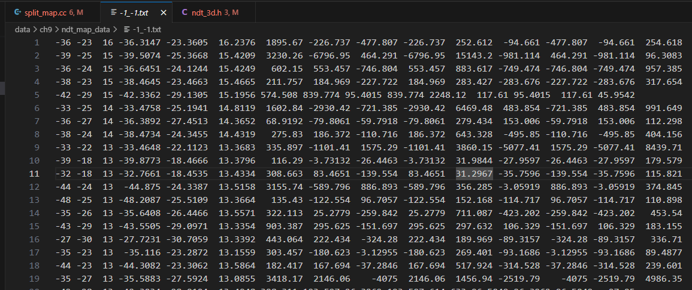
    <div>
    地图区块内所有NDT体素的均值与信息矩阵
    </div>
</center>


# 4. 实现基于NDT map的激光定位。根据车辆实时位姿，加载所需的NDT体素并完成定位。同样，要根据初始的RTK位置进行角度搜索。为了方便可视化，也可以保留点云地图以作对比。

**答：**

实现基于NDT map的激光定位这里需要用到并修改的文件主要为：```fusion.cc，fusion.h，mapping.yaml```，以及前面经过```split_map.cc```保存的按照地图区块索引存储的多分辨率NDT体素地图文件。

可以发现，原先基于点云地图的激光定位使用的是PCL版本NDT，因此只需要增加Ndt3d的使用，通过```use_pcl_ndt```参数来控制是否使用PCL版本的NDT，若为false，则使用第七章实现的Ndt3d。此外，在RTK角度搜索和激光定位中分别使用了两个NDT3d对象，RTK角度搜索中用到了10米，5米，2米的多分辨率NDT匹配来确定RTK的朝向，激光定位中用到了1米的NDT体素地图。

因此，首先在```fusion.h```中增加一个NDt3d的对象作为成员变量，并修改最小RTK匹配得分值为0.17

```c++
// PCL NDT
pcl::NormalDistributionsTransform<PointType, PointType> ndt_pcl_;

Ndt3d ndt_; // 【新增】换成自己实现的3D NDT，需要实现多分辨率NDT，以及匹配得分的计算

bool use_pcl_ndt_ = false;   // 【新增】是否使用PCL NDT库

/// 参数，最小得分需修改为合适的，适配ndt3d中的NDT匹配得分
double rtk_search_min_score_ = 0.16; //4.5
```

## 4.1 加载NDT体素地图区块索引以及体素块内数据

同样在```fusion.h```中增加不同分辨率ndt体素地图的文件路径、体素栅格所在索引、九领域内地图区块内NDT数据集合等：

```c++
//【新增】NDT地图数据目录
std::string ndt_map_path_10_, ndt_map_path_5_, 
            ndt_map_path_2_, ndt_map_path_1_;                        
//【新增】哪些格子存在NDT地图数据
std::set<Vec2i, less_vec<2>> ndt_map_data_index_10_, ndt_map_data_index_5_,     
                             ndt_map_data_index_2_, ndt_map_data_index_1_; 

//【新增】不同分辨率的NDT体素地图数据（均值、信息矩阵）
using NdtmapVoxel = std::unordered_map<KeyType, Ndt3d::VoxelData, hash_vec<3>>; 
NdtmapVoxel ndt_map_grids_10_, ndt_map_grids_5_,
            ndt_map_grids_2_, ndt_map_grids_1_;   

// 【新增】以网格ID为索引的地图数据
std::map<Vec2i, NdtmapVoxel, less_vec<2>> ndt_map_data_10_, ndt_map_data_5_,
                                          ndt_map_data_2_, ndt_map_data_1_;  
```

添加一个LoadMapIndex()函数，用来加载10米、5米、2米、1米分辨率NDT体素地图区块索引文件：

```c++
void Fusion::LoadMapIndex() {
    // 点云地图区块
    std::ifstream fin_pts(pts_map_path_ + "/pts_map_index.txt");
    // 【新增】读取NDT地图区块索引，与上面点云地图的区块类似，但可能不完全一样
    // 由于NDT体素块内至少需要3个点，因此，可能存在某些区块点数过少导致没有NDT体素块
    std::ifstream fin_ndt_10(ndt_map_path_10_ + "/ndt_map_index.txt");
    std::ifstream fin_ndt_5(ndt_map_path_5_ + "/ndt_map_index.txt");
    std::ifstream fin_ndt_2(ndt_map_path_2_ + "/ndt_map_index.txt");
    std::ifstream fin_ndt_1(ndt_map_path_1_ + "/ndt_map_index.txt");
    while (!fin_pts.eof()) {
        int x, y;   // 块地图的索引
        fin_pts >> x >> y;
        pts_map_data_index_.emplace(Vec2i(x, y));
    }
    while (!fin_ndt_10.eof()) {
        int x, y;   // 块地图的索引
        fin_ndt_10 >> x >> y;
        ndt_map_data_index_10_.emplace(Vec2i(x, y));
    }
    while (!fin_ndt_5.eof()) {
        int x, y;   // 块地图的索引
        fin_ndt_5 >> x >> y;
        ndt_map_data_index_5_.emplace(Vec2i(x, y));
    }
    while (!fin_ndt_2.eof()) {
        int x, y;   // 块地图的索引
        fin_ndt_2 >> x >> y;
        ndt_map_data_index_2_.emplace(Vec2i(x, y));
    }
    while (!fin_ndt_1.eof()) {
        int x, y;   // 块地图的索引
        fin_ndt_1 >> x >> y;
        ndt_map_data_index_1_.emplace(Vec2i(x, y));
    }
    fin_pts.close();
    fin_ndt_10.close();
    fin_ndt_5.close();
    fin_ndt_2.close();
    fin_ndt_1.close();
}
```

然后，仿造```LoadMap()```函数新增一个加载NDT体素地图的函数```LoadNdtMap(const SE3& pose)```，传入RTK给定的SE3位姿后，也是转换为100x100地图区块索引，并计算包含当前地图区块在内的9块相邻地图区块索引值。**在遍历这些相邻地图区块索引之前，我先定义了了一个lambda表达式用来加载存于以指定地图区块索引命名的txt文件中的NDT体素，空间位置、均值以及信息矩阵**，当然为了方便定位可视化效果的对比，仍然保留了点云地图数据的加载：

```c++
// lambda表达式
auto load_ndt_map_k = [](std::string ndt_map_path, Vec2i k, std::map<Vec2i, NdtmapVoxel, less_vec<2>> &ndt_map_data, bool &changed){
    std::ifstream fin(ndt_map_path + std::to_string(k[0]) + "_" + std::to_string(k[1]) + ".txt");
    if (ndt_map_data.find(k) == ndt_map_data.end()) {
        LOG(INFO) << "clark";
        NdtmapVoxel ndt_map_grids;      
        // 【新增】临时变量
        int x, y, z;
        double mu_x, mu_y, mu_z;
        double info_00, info_01, info_02, info_10, info_11, info_12, info_20, info_21, info_22;
        Eigen::Matrix<int, 3, 1> key_ndt;
        Vec3d mu;
        Mat3d info;
        while (!fin.eof()) {
            fin  >> x >> y >> z >> mu_x >> mu_y >> mu_z 
                >> info_00 >> info_01 >> info_02 
                >> info_10 >> info_11 >> info_12 
                >> info_20 >> info_21 >> info_22;
            key_ndt << x, y, z; 
            mu = Vec3d(mu_x, mu_y, mu_z);
            info << info_00, info_01, info_02, info_10, info_11, info_12, info_20, info_21, info_22;
            if (ndt_map_grids.find(key_ndt) == ndt_map_grids.end()) {
                Ndt3d::VoxelData voxelData;
                voxelData.mu_ = mu;
                voxelData.info_ = info;
                // LOG(INFO) << "insert one ndt voxel";
                ndt_map_grids.insert(std::make_pair(key_ndt, voxelData)); // 若不存在，则插入该栅格
            }
        }   
        ndt_map_data.emplace(k, ndt_map_grids);  
        changed = true;        // 标记地图数据已经改变
    }
    fin.close();
};

// 加载包含给定位置在内的9个相邻地图区块
for (auto& k : surrounding_index) {
    if (pts_map_data_index_.find(k) != pts_map_data_index_.end()) {
        // 通过地图索引从map_data_中查找是否已经加载了这个区块
        if (map_data_.find(k) == map_data_.end()) {
            // 还未加载过，则加载该地图区块
            CloudPtr cloud(new PointCloudType);
            // 读取以地图区块索引命名的pcd点云数据
            pcl::io::loadPCDFile(pts_map_path_ + std::to_string(k[0]) + "_" + std::to_string(k[1]) + ".pcd", *cloud);
            
            // 将该地图区块的索引以及点云数据加入到map_data_容器中
            map_data_.emplace(k, cloud);    
            // 标记地图数据已经改变
            map_data_changed = true;        
        }
    }
        
    //【新增】加载每个地图区块内所有NDT体素块的均值和协方差信息
    if (ndt_map_data_index_10_.find(k) != ndt_map_data_index_10_.end()) 
        load_ndt_map_k(ndt_map_path_10_, k, ndt_map_data_10_, ndt_map_data_changed_10);

    if (ndt_map_data_index_5_.find(k) != ndt_map_data_index_5_.end()) 
        load_ndt_map_k(ndt_map_path_5_, k, ndt_map_data_5_, ndt_map_data_changed_5);
    
    if (ndt_map_data_index_2_.find(k) != ndt_map_data_index_2_.end())
        load_ndt_map_k(ndt_map_path_2_, k, ndt_map_data_2_, ndt_map_data_changed_2);

    if (ndt_map_data_index_1_.find(k) != ndt_map_data_index_1_.end())
        load_ndt_map_k(ndt_map_path_1_, k, ndt_map_data_1_, ndt_map_data_changed_1);
}
```

然后，再定义一个lambda表达式用于卸载不需要的区域

```c++
auto iterate_Erase_NdtVoxel = [](std::map<Vec2i, NdtmapVoxel, less_vec<2>> &ndt_map_data, Vec2i k, bool &changed){
    for (auto iter = ndt_map_data.begin(); iter != ndt_map_data.end();) {
        // 判断当前地图区块与给定RTK位置的距离是否大于3米
        if ((iter->first - k).cast<float>().norm() > 3.0) {
            // 若超过3米，太远了，则从ndt map容器中卸载该地图区块内所有的ndt体素信息
            iter = ndt_map_data.erase(iter);
            changed = true;
        } else 
            iter++; // 取下一个
    }   
};

// 遍历ndt_map_grids_容器内的地图区块
// 卸载不需要的区域，这个稍微加大一点，不需要频繁卸载
iterate_Erase_NdtVoxel(ndt_map_data_10_, key, ndt_map_data_changed_10);
iterate_Erase_NdtVoxel(ndt_map_data_5_, key, ndt_map_data_changed_5);
iterate_Erase_NdtVoxel(ndt_map_data_2_, key, ndt_map_data_changed_2);
iterate_Erase_NdtVoxel(ndt_map_data_1_, key, ndt_map_data_changed_1);
```

当多分辨率NDT体素地图发生变化时，将相邻地图区块内的所有NDT体素块的均值和协方差信息加载到```ndt_map_grids_```容器中

```c++
// 若地图数据发生改变
if (ndt_map_data_changed_10) {
    for (auto& nmp : ndt_map_data_10_) 
        ndt_map_grids_10_.insert(nmp.second.begin(), nmp.second.end());
}

if (ndt_map_data_changed_5) {
    for (auto& nmp : ndt_map_data_5_)
        ndt_map_grids_5_.insert(nmp.second.begin(), nmp.second.end());
}

if (ndt_map_data_changed_2) {
    for (auto& nmp : ndt_map_data_2_)
        ndt_map_grids_2_.insert(nmp.second.begin(), nmp.second.end());
}

if (ndt_map_data_changed_1) {
    for (auto& nmp : ndt_map_data_1_)
        ndt_map_grids_1_.insert(nmp.second.begin(), nmp.second.end());
    ndt_.SetNdtVoxel(ndt_map_grids_1_);
}
```
上面仅将1米体素栅格数据设置到成员变量ndt_中，用到的```SetNdtVoxel()```函数是在ndt3d.h中新增的，用于设置给定分辨率的NDT体素栅格数据，而不需要像之前那样在```SetTarget()```函数中调用```BuildVoxels()```从目标点云中构建体素栅格了：

```c++
// 【新增】为NDT设置新的体素栅格 
void SetNdtVoxel(std::unordered_map<KeyType, VoxelData, hash_vec<3>> grids) {
    grids_.clear(); // 清空体素栅格容器
    grids_.swap(grids); // 通过swap()函数交换指针，将grids_指向给定的体素栅格数据
}
```

对于点云显示来说，只需要有map_data_数据给ui使用就够了，不需要将相邻地图区块的点云拼接在一起得到ref_cloud_了，因此在LoadNdtMap()最后可以舍去：

```c++
// 若地图数据发生改变
// if (map_data_changed) {
//     // 重置目标点云 rebuild ndt target map
//     ref_cloud_.reset(new PointCloudType);
//     // 将map_data_容器内的所有地图区块拼接到ref_cloud_参考目标点云中
//     for (auto& mp : map_data_) 
//         *ref_cloud_ += *mp.second;

//     LOG(INFO) << "rebuild global cloud, grids: " << map_data_.size();

//     // 将拼接完成地图区块点云设置NDT的目标点云
//     // ndt_pcl_.setInputTarget(ref_cloud_); 
//     // ndt_.SetTarget(ref_cloud_);
// }

// 动态更新地图区块的点云显示
ui_->UpdatePointCloudGlobal(map_data_);
```

至此，多分辨率NDT体素栅格地图的加载就完成了。

## 4.2 基于NDT3d的RTK角度搜索

找到```SearchRTK()```函数，增加刚才定义的体素地图加载函数```LoadNdtMap()```。

```c++
if (use_pcl_ndt_) 
    // 加载上一个RTK位置附近的地图
    LoadMap(last_gnss_->utm_pose_);
else
    // TODO: 加载上一个RTK位置附近的NDT 体素地图
    LoadNdtMap(last_gnss_->utm_pose_);
```

然后，在```AlignForGrid(sad::Fusion::GridSearchResult& gr)```函数中，增加多分辨率的ndt3d匹配

```c++
if (use_pcl_ndt_) {
    /// 多分辨率
    pcl::NormalDistributionsTransform<PointType, PointType> ndt_pcl;
    ndt_pcl.setTransformationEpsilon(0.05);
    ndt_pcl.setStepSize(0.7);
    ndt_pcl.setMaximumIterations(40);
    ndt_pcl.setInputSource(current_scan_);

    auto map = ref_cloud_;

    CloudPtr output(new PointCloudType);
    // 分别在10m, 5m, 4m, 3m的分辨率下进行NDT配准
    std::vector<double> res{10.0, 5.0, 4.0, 3.0}; // 四种体素分辨率
    Mat4f T = gr.pose_.matrix().cast<float>();
    SE3 pose = gr.pose_;
    for (auto& r : res) {
        auto rough_map = VoxelCloud(map, r * 0.1);
        ndt_pcl.setInputTarget(rough_map);
        ndt_pcl.setResolution(r);
        ndt_pcl.align(*output, T);
        // 将上一个粗配准结果代入下一次配准中
        T = ndt_pcl.getFinalTransformation(); 

    }
    // 最后获取3米栅格分辨率下的的NDT匹配结果作为分值判定
    gr.score_ = ndt_pcl.getTransformationProbability();
    // 获取最后一次配准得到的位姿
    gr.result_pose_ = Mat4ToSE3(ndt_pcl.getFinalTransformation());
}
else {
    Ndt3d::Options options;
    Ndt3d ndt(options);
    ndt.SetSource(current_scan_); // 待检索的当前帧点云

    // // 分别在10m, 5m, 2m的三种分辨率下进行NDT配准
    std::vector<double> res{10.0, 5.0, 2.0}; // split_map划分的时候就按这三种分辨率来构建NDT地图
    SE3 pose = gr.pose_;
    for (auto& r : res) {
        LOG(INFO) << "r = " << r;
        if (r == 10.0) 
            ndt.SetNdtVoxel(ndt_map_grids_10_);
        else if (r == 5.0) 
            ndt.SetNdtVoxel(ndt_map_grids_5_);
        else 
            ndt.SetNdtVoxel(ndt_map_grids_2_);
        
        ndt.SetResolution(r);   // 设置分辨率 
        ndt.AlignNdt(pose);     // 将上一个粗配准结果代入下一次配准中
    }
    // 最后获取2米栅格分辨率下的的NDT匹配结果作为分值判定
    gr.score_ = ndt.GetNDTMatchingScore();
    // 获取最后一次配准得到的位姿
    gr.result_pose_ = pose;
}
```

## 4.3 基于NDT3d的激光定位

在```LidarLocalization()```函数中：

```c++
SE3 pose;
if (use_pcl_ndt_) {
    // 加载pred位置处周围相邻9个地图区块，拼接后形成局部地图，设置为NDT的目标点云
    LoadMap(pred);  
    ndt_pcl_.setInputCloud(current_scan_);
    CloudPtr output(new PointCloudType);
    ndt_pcl_.align(*output, pred.matrix().cast<float>());
    pose = Mat4ToSE3(ndt_pcl_.getFinalTransformation());

    LOG(INFO) << "ndt_pcl lidar loc score: " << ndt_pcl_.getTransformationProbability();
}
else {
    pose = pred; // 之前忘记给pose赋值了，导致定位时ui界面上在原地打转，调试很久才发现这个很蠢的错误！！！
    // 加载pred位置处周围相邻9个地图区块，拼接后形成局部地图，设置为NDT的目标点云
    // LoadMap(pred);  
    LoadNdtMap(pred); // 【新增】加载指定位姿处周围地图区块内所有体素的均值和协方差信息
    ndt_.SetSource(current_scan_);  //【新增】设置当前帧扫描点云为NDT的源点云
    ndt_.AlignNdt(pose);            //【新增】NDT配准，并计算匹配得分
    LOG(INFO) << "ndt pts map lidar loc score: " << ndt_.GetNDTMatchingScore();
}
```

# 5. 给出上述结果相比于PCL NDT的性能、存储空间等关键指标。

**答：**

完成上述第4题的实现后，开始验证基于ndt3d多分辨率体素地图的激光定位效果，通过控制mapping.yaml中的参数，即```use_pcl_ndt```，来动态选择PCL版本与SAD版本的NDT，而无需每次修改代码重新编译代码来测试。

首先，效果上来说，两者的定位效果基本一致，如下图所示：

<center>
    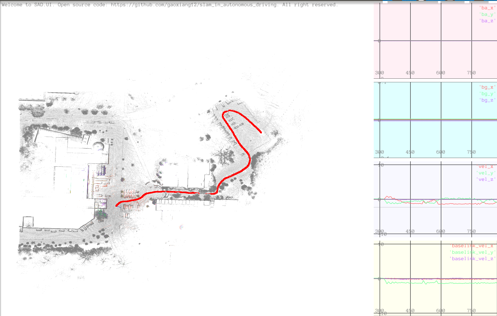
    <div>
    基于多分辨率NDT3d的激光定位效果
    </div>
</center>

<center>
    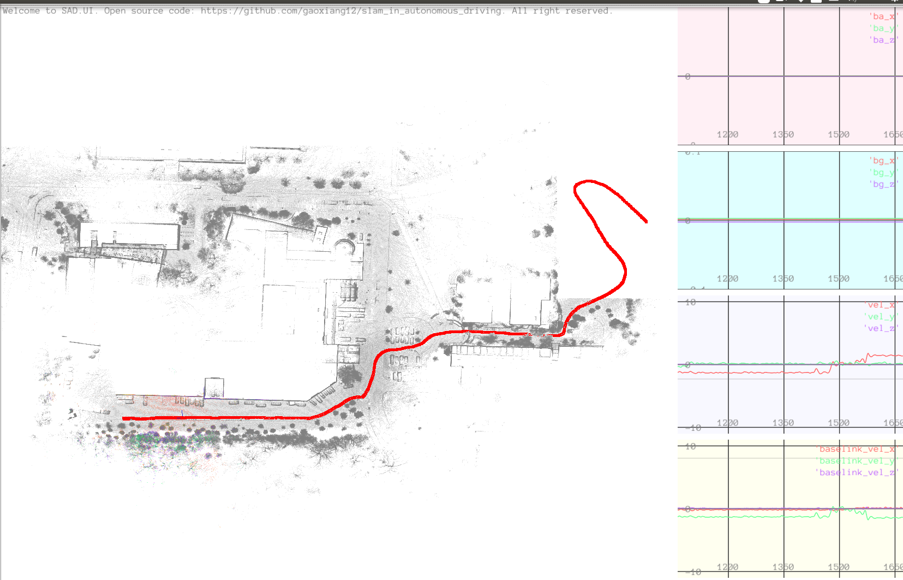
    <div>
    基于PCL NDT的激光定位效果
    </div>
</center>

但在NDT匹配耗时以及存储空间上，两者有着明显的差异。

## 5.1 Ndt3d与PCL NDT的耗时对比

在LidarLocalization()函数中添加chrono模块的耗时统计，统计PCL版本与SAD版本的地图加载、NDT匹配耗时，如下所示：

```c++
if (use_pcl_ndt_) {
    // 加载pred位置处周围相邻9个地图区块，拼接后形成局部地图，设置为NDT的目标点云
    auto t1 = std::chrono::steady_clock::now();
    LoadMap(pred);  
    auto t2 = std::chrono::steady_clock::now();
    auto time_used = std::chrono::duration_cast<std::chrono::duration<double>>(t2-t1).count() * 1000;
    LOG(INFO) << "time used of ndt_pcl.LoadMap() = " << time_used;

    ndt_pcl_.setInputCloud(current_scan_);
    CloudPtr output(new PointCloudType);

    auto t3 = std::chrono::steady_clock::now();
    ndt_pcl_.align(*output, pred.matrix().cast<float>());
    auto t4 = std::chrono::steady_clock::now();
    time_used = std::chrono::duration_cast<std::chrono::duration<double>>(t4-t3).count() * 1000;
    LOG(INFO) << "time used of ndt_pcl.align() = " << time_used;

    pose = Mat4ToSE3(ndt_pcl_.getFinalTransformation());

    LOG(INFO) << "ndt_pcl lidar loc score: " << ndt_pcl_.getTransformationProbability();
}
else {
    pose = pred;
    // 加载pred位置处周围相邻9个地图区块，拼接后形成局部地图，设置为NDT的目标点云
    auto t1 = std::chrono::steady_clock::now();
    LoadNdtMap(pred); // 【新增】加载指定位姿处周围地图区块内所有体素的均值和协方差信息
    auto t2 = std::chrono::steady_clock::now();
    auto time_used = std::chrono::duration_cast<std::chrono::duration<double>>(t2-t1).count() * 1000;
    LOG(INFO) << "time used of ndt3d.LoadMap() = " << time_used;

    ndt_.SetSource(current_scan_);  //【新增】设置当前帧扫描点云为NDT的源点云
    auto t3 = std::chrono::steady_clock::now();
    ndt_.AlignNdt(pose);            //【新增】NDT配准，并计算匹配得分
    auto t4 = std::chrono::steady_clock::now();
    time_used = std::chrono::duration_cast<std::chrono::duration<double>>(t4-t3).count() * 1000;
    LOG(INFO) << "time used of ndt3d.align() = " << time_used;
    
    LOG(INFO) << "ndt3d pts map lidar loc score: " << ndt_.GetNdtMatchingScore();
}
```

分别运行后得到如下耗时统计结果：

<center>
    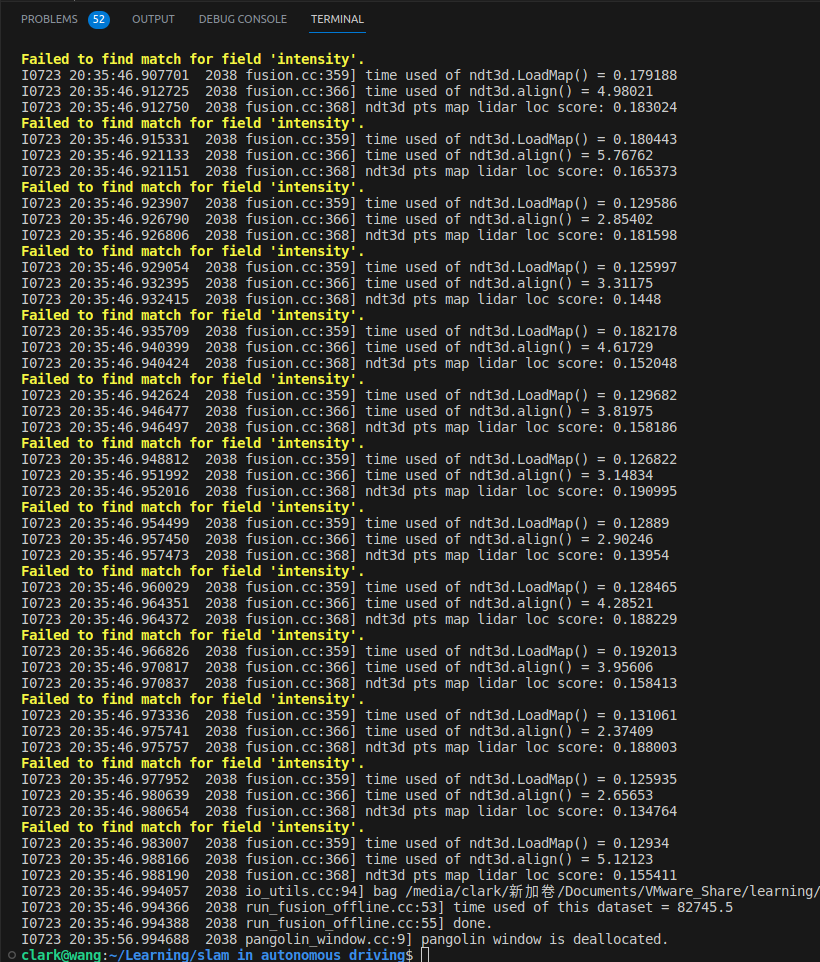
    <div>
    基于多分辨率NDT3d地图加载耗时、匹配耗时以及总耗时
    </div>
</center>

<center>
    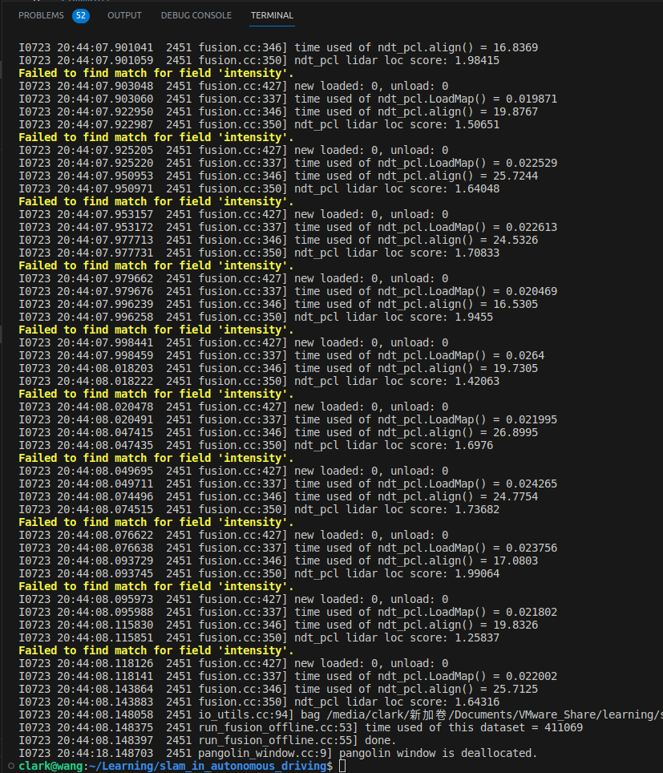
    <div>
    PCL中NDT的地图加载耗时、匹配耗时以及总耗时
    </div>
</center>

从上面两幅图可以发现，**在地图加载方面**，原始的LoadMap()函数中，仅加载了指定RTK位姿附近的9个地图区块的点云数据，然后拼接成一个大的点云地图，**耗时大概0.02毫秒左右**，而基于NDT3d的LoadNdtMap()函数中，除了需要加载指定RTK位姿附近的9个地图区块内的点云之外，还需要加载4种不同分辨率的NDT体素地图数据，**因此加载耗时较长，约为0.18毫秒左右**。

而在**NDT匹配方面**，PCL版本的NDT匹配耗时约为20毫秒左右，而基于NDT3d的匹配耗时约为4毫秒左右，因此，基于NDT3d的匹配耗时要明显比PCL版本的NDT匹配耗时少5倍左右。

运行完7个G大小的nclt数据包20130110.bag的总耗时对比中，PCL版本的NDT匹配耗时为**411069毫秒 = 411.069秒 = 6分51秒**，而基于NDT3d的AlignNDT耗时为**82745.5毫秒 = 82.7455秒 = 1分22秒**，因此，**基于NDT3d的耗时要明显比PCL版本的NDT耗时少5分半**！

## 5.2 Ndt3d与PCL NDT的存储空间对比

然后来对比一下两者的存储空间，原先加载的是以100x100大小地图区块索引命名的pcd格式点云数据，而现在需要加载4种不同分辨率的NDT体素地图数据中，仅存储了均值和协方差信息，因此，存储空间应该会比原先的点云数据要小很多，就算是将4种不同分辨率的NDT体素地图数据都加载进来，也不会比原先的点云数据大。通过如下几幅图来验证：

<center>
    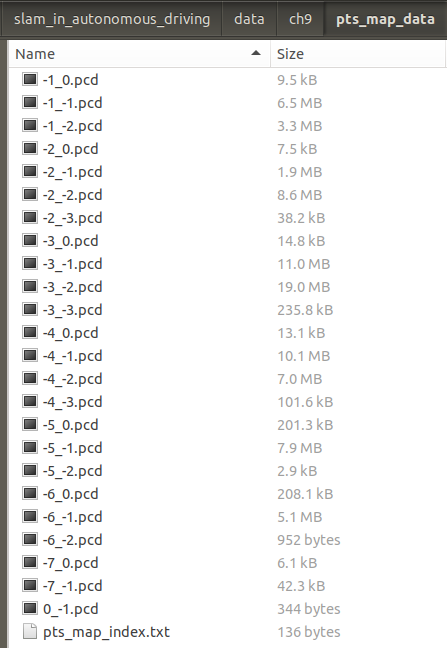
    <div>
    以地图区块索引命名的pcd格式点云数据
    </div>
</center>

<center>
    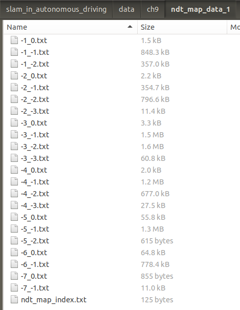
    <div>
    以地图区块索引命名的txt格式NDT体素地图数据，1米分辨率
    </div>
</center>

<center>
    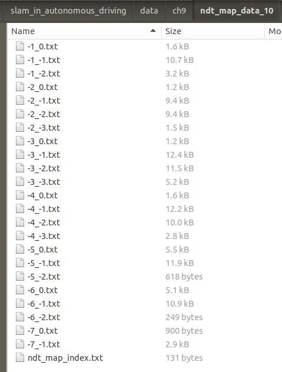
    <div>
    以地图区块索引命名的txt格式NDT体素地图数据，10米分辨率
    </div>
</center>

<center>
    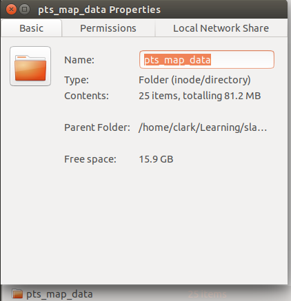
    <div>
    所有地图区块点云地图大小
    </div>
</center>

<center>
    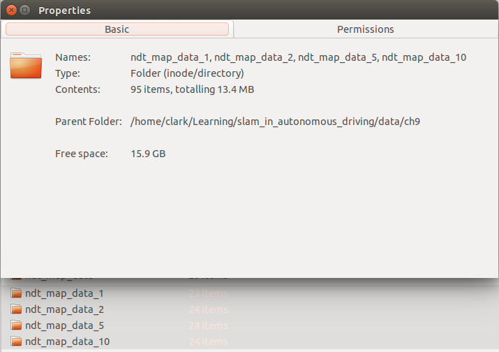
    <div>
    所有分辨率所有地图区块内NDT体素数据大小，5个文件夹
    </div>
</center>

可以发现，**地图区块点云数据文件夹总大小为81.2M**，而**把四种不同分辨率的NDT体素地图txt数据的文件夹都包含进来，总大小仅为13.4M**，因此，**基于NDT3d的存储空间要明显比PCL版本的NDT存储空间小很多**。

而且由于体素分辨率为1的时候，包含的体素块数量最多，因此，1米分辨率的NDT体素地图数据文件夹大小最大，约为9.5M，而最大的10米分辨率的NDT体素地图数据文件夹大小最小，约为132kb，容易知道，**随着体素分辨率的增大，NDT体素地图数据的存储空间也会随之减小**。

# 6. 参考资料

1. **《自动驾驶与机器人中的SLAM技术》**
2. **https://github.com/gaoxiang12/slam_in_autonomous_driving**
3. **https://github.com/PointCloudLibrary/pcl/blob/master/registration/include/pcl/registration/ndt.h**
4. **https://github.com/PointCloudLibrary/pcl/blob/master/registration/include/pcl/registration/impl/ndt.hpp**
5. [**The Three-Dimensional Normal-Distributions Transform — an Efficient Representation for Registration, Surface Analysis, and Loop Detection**](https://www.diva-portal.org/smash/get/diva2:276162/FULLTEXT02)